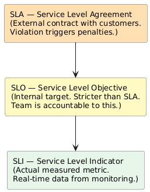
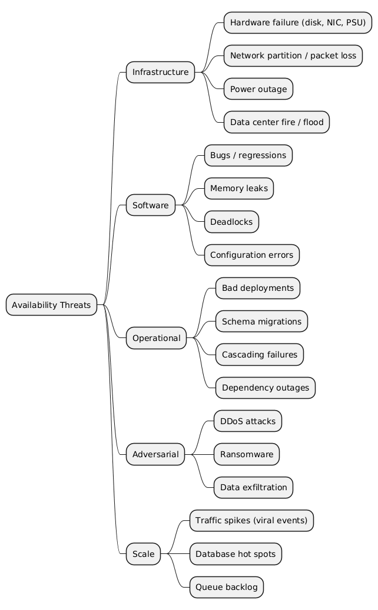
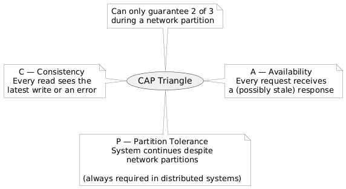

# 01 — Availability Fundamentals

## 1. What Is Availability?

Availability is the probability that a system is operational and correctly serving requests at any given moment.

```
Availability (%) = (Uptime / (Uptime + Downtime)) × 100
```

It is a composite property — it emerges from the reliability of every component in the system's critical path. A chain is only as available as its weakest link.

---

## 2. Types of Downtime

| Type | Definition | Examples |
|------|-----------|---------|
| **Planned** | Scheduled maintenance windows | Deployments, DB migrations, upgrades |
| **Unplanned** | Unexpected failures | Hardware crash, software bug, traffic spike |

> **Goal:** Eliminate unplanned downtime entirely; minimize planned downtime through rolling deploys and blue-green deployments.

---

## 3. Core Metrics

### 3.1 MTBF — Mean Time Between Failures

```
MTBF = Total operational time / Number of failures
```

- Measures **reliability** — how often does the system fail?
- Higher MTBF → more reliable system.
- Used to plan maintenance schedules and redundancy requirements.

### 3.2 MTTD — Mean Time To Detect

```
MTTD = Time from failure onset to detection
```

- Driven by monitoring quality, alerting thresholds, and on-call response time.
- Often the *hidden* cost of availability — many teams ignore it.

### 3.3 MTTR — Mean Time To Repair / Recover

```
MTTR = Total repair time / Number of failures
```

- Measures **recovery speed** — how fast do we bounce back?
- Lower MTTR → higher availability even with the same failure rate.
- Improved by runbooks, automated remediation, and chaos engineering.

### 3.4 Availability Formula (Full)

```
Availability = MTBF / (MTBF + MTTR)
```

**Key insight:** You can improve availability by either *increasing MTBF* (fewer failures) or *decreasing MTTR* (faster recovery). In practice, fast recovery is often more cost-effective.

### 3.5 Metrics Comparison Table

| Metric | What It Measures | Improved By |
|--------|-----------------|-------------|
| MTBF | How often failures happen | Better hardware, testing, canary deploys |
| MTTD | How fast failures are detected | Monitoring, alerting, anomaly detection |
| MTTR | How fast recovery happens | Runbooks, auto-healing, redundancy |

---

## 4. The Nines of Availability

| Nines | Availability | Downtime/Year | Downtime/Month | Downtime/Week |
|-------|-------------|---------------|----------------|---------------|
| 1 nine | 90% | 36.5 days | ~72 hours | ~16.8 hours |
| 2 nines | 99% | 3.65 days | ~7.2 hours | ~1.68 hours |
| 3 nines | 99.9% | 8.76 hours | ~43.8 minutes | ~10.1 minutes |
| 4 nines | 99.99% | 52.6 minutes | ~4.38 minutes | ~1.01 minutes |
| 5 nines | 99.999% | 5.26 minutes | ~26.3 seconds | ~6.05 seconds |
| 6 nines | 99.9999% | 31.5 seconds | ~2.6 seconds | ~0.6 seconds |

> **Practical benchmarks:**
> - Consumer apps (social media, streaming): **99.9%** is acceptable
> - E-commerce / SaaS: **99.95–99.99%**
> - Financial systems / payment rails: **99.999%**
> - Telephony / power infrastructure: **99.9999%**

---

## 5. SLA / SLO / SLI — The Service Reliability Hierarchy



| Term | Stands For | Example |
|------|-----------|---------|
| **SLI** | Service Level Indicator | 99.95% of requests in last 30 days returned 2xx |
| **SLO** | Service Level Objective | Target: 99.9% request success rate |
| **SLA** | Service Level Agreement | Contract: 99.5% uptime or 10% service credit |
| **Error Budget** | SLO headroom before SLA breach | 100% − 99.9% = 0.1% = 43.8 min/month to burn |

> **Interview tip:** SLOs should be *tighter* than SLAs. The buffer is your error budget — it funds risky deploys and experiments.

---

## 6. Factors That Degrade Availability



### 6.1 The Dependency Multiplication Problem

When services call other services, availability compounds **multiplicatively**:

| Scenario | Calculation | Result |
|----------|------------|--------|
| 1 service at 99.9% | 0.999 | 99.9% |
| 2 services at 99.9% | 0.999² | 99.8% |
| 3 services at 99.9% | 0.999³ | 99.7% |
| 5 services at 99.9% | 0.999⁵ | 99.5% |
| 10 services at 99.9% | 0.999¹⁰ | 99.0% |

> **Design implication:** Deep synchronous dependency chains are availability killers. Use async messaging, caching, and graceful degradation to break the chain.

---

## 7. Availability vs. Reliability vs. Durability

These three terms are often confused in interviews:

| Concept | Definition | Example |
|---------|-----------|---------|
| **Availability** | System is up and reachable | API returns 200 OK |
| **Reliability** | System behaves correctly over time | API returns correct data, not corrupted |
| **Durability** | Data persists and is not lost | Uploaded file survives a server crash |

> A system can be **available but unreliable** (returns errors but is reachable), or **reliable but unavailable** (correct when up, but down too often).

---

## 8. The CAP Theorem and Availability

Under a **network partition**, a distributed system must choose between:

- **CP** — Consistency + Partition Tolerance (sacrifice availability; return error rather than stale data)
- **AP** — Availability + Partition Tolerance (sacrifice strong consistency; serve potentially stale data)



> **Interview answer:** In practice, P is non-negotiable in any distributed system. The real choice is **C vs A** during a partition. High-availability systems typically choose AP (e.g., DNS, Cassandra, DynamoDB). Financial systems choose CP (e.g., HBase, Zookeeper).

---

*Next: [02-failover-patterns.md](02-failover-patterns.md)*
