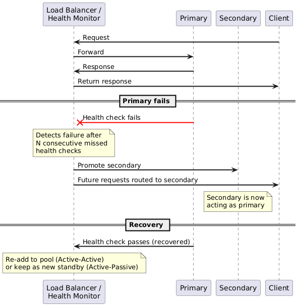
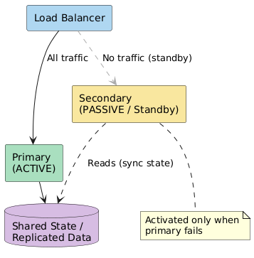
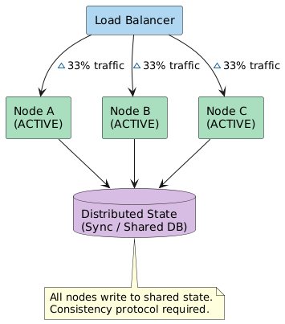
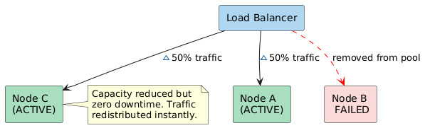
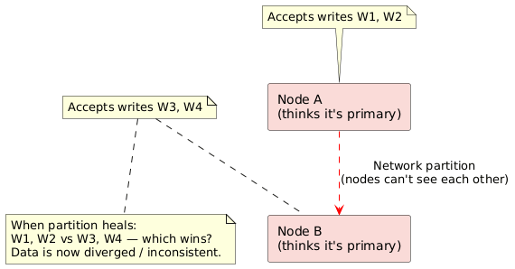

# 02 — Failover Patterns

Failover is the process of automatically switching to a redundant component when the primary component fails. It is the primary mechanism for achieving high availability in stateful systems.

---

## 1. The Core Failover Flow

---

## 2. Active-Passive (Hot Standby)

### Overview
One node (primary) handles **all traffic**. The secondary is idle, continuously receiving state/data replication from the primary, and waits for a failover signal.

### Variants by Standby Warmth

| Variant | Description | Failover Time | Cost |
|---------|------------|---------------|------|
| **Hot Standby** | Secondary is running, synced, ready to serve | Seconds | High (full duplicate infra) |
| **Warm Standby** | Secondary is running but not fully synced; needs catch-up | Minutes | Medium |
| **Cold Standby** | Secondary is offline; must be booted and restored from backup | Hours | Low |

### Failover Trigger Mechanisms

| Mechanism | Description |
|-----------|------------|
| **Heartbeat / Health check** | Primary sends periodic heartbeats; absence triggers failover |
| **Watchdog process** | External process monitors primary and initiates promotion |
| **Quorum-based** | Majority vote among nodes determines who should be primary (e.g., Raft, ZooKeeper) |
| **Manual** | Operator-initiated; used for planned maintenance |

### Trade-offs

| Dimension | Detail |
|-----------|--------|
| ✅ Simplicity | One active node — no split-brain, no write conflicts |
| ✅ Clear primary | Write ordering is deterministic |
| ❌ Wasted capacity | Secondary is idle in steady state |
| ❌ Failover latency | Seconds to minutes of downtime during switchover |
| ❌ Data loss window | Async replication may lag; last few writes can be lost |

> **Interview note:** Active-Passive is the right default answer for **stateful services** (databases, session stores) where write correctness matters more than failover speed.

---

## 3. Active-Active

### Overview
All nodes handle traffic simultaneously. A load balancer distributes requests across all healthy nodes. Any node failing reduces capacity but does **not** cause downtime.

### Failure Scenario

### Trade-offs

| Dimension | Detail |
|-----------|--------|
| ✅ No downtime on failure | Traffic instantly rerouted to surviving nodes |
| ✅ Full resource utilization | All nodes serve traffic in steady state |
| ✅ Horizontal scalability | Add nodes to increase capacity |
| ❌ Split-brain risk | Two nodes may accept conflicting writes during a partition |
| ❌ Consistency complexity | Requires distributed transactions, CRDTs, or last-write-wins |
| ❌ Higher operational cost | Conflict resolution logic, distributed consensus |

> **Interview note:** Active-Active is ideal for **stateless services** (API gateways, web servers) and eventually-consistent data stores (Cassandra, DynamoDB global tables). Avoid for systems requiring strict linearizability.

---

## 4. Active-Active vs. Active-Passive — Decision Table

| Factor | Active-Active | Active-Passive |
|--------|--------------|----------------|
| Downtime on failure | Near-zero | Seconds–minutes |
| Write conflicts | Possible (need resolution) | None (single writer) |
| Resource utilization | 100% | ~50% (standby idle) |
| Complexity | High | Low |
| Data consistency | Eventual (usually) | Strong (usually) |
| Scales horizontally | Yes | Limited |
| Cost | Higher | Lower |
| Best for | Stateless services, read-heavy DBs | Databases, session stores |

---

## 5. Split-Brain Problem

Split-brain occurs in Active-Active (or after a failover in Active-Passive) when two nodes both believe they are the primary and accept conflicting writes.

### Split-Brain Mitigations

| Technique | How It Works |
|-----------|-------------|
| **Quorum / Fencing** | Require majority vote (e.g., 2 of 3 nodes) before accepting writes |
| **Fencing tokens** | Monotonically increasing token; old primary's writes rejected by storage layer |
| **STONITH** ("Shoot The Other Node In The Head") | Force-kill the other node before promoting self |
| **Raft / Paxos consensus** | Leader election ensures exactly one primary at any time |

---

## 6. Failover in Practice — Real-World Examples

| System | Pattern | Notes |
|--------|---------|-------|
| MySQL with MHA | Active-Passive | Automatic promotion of replica on primary failure |
| PostgreSQL + Patroni | Active-Passive | Uses Etcd/ZooKeeper for distributed leader election |
| Redis Sentinel | Active-Passive | Sentinel processes vote to promote a replica |
| Redis Cluster | Active-Active (sharded) | Each shard has its own primary/replica pair |
| Elasticsearch | Active-Active | Shards replicated; master election via Raft-like protocol |
| AWS RDS Multi-AZ | Active-Passive | Synchronous standby in separate AZ; ~60s failover |
| AWS Aurora Global | Active-Active (read) | One writer region; read replicas globally; failover to read region |
| DNS round-robin | Active-Active | Simplest form; no health awareness — use with caution |

---

## 7. Designing Failover — Interview Checklist

When proposing failover in an interview, address all five dimensions:

1. **Detection** — How does the system know the primary failed? (heartbeat interval, health check endpoint, timeout threshold)
2. **Decision** — What triggers the promotion? (quorum vote, watchdog, manual alert)
3. **Promotion** — How does the secondary become primary? (DNS update, VIP reassignment, ZooKeeper leader flag)
4. **Data integrity** — What happens to in-flight writes? (acknowledge loss, replay WAL, idempotent clients)
5. **Fallback** — When the primary recovers, does it rejoin as replica or reclaim primary?

---

*Previous: [01-fundamentals.md](01-fundamentals.md) | Next: [03-replication-patterns.md](03-replication-patterns.md)*
