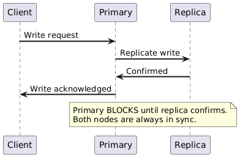
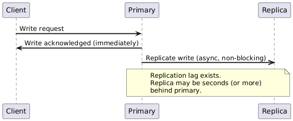
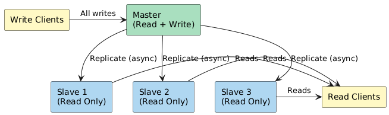
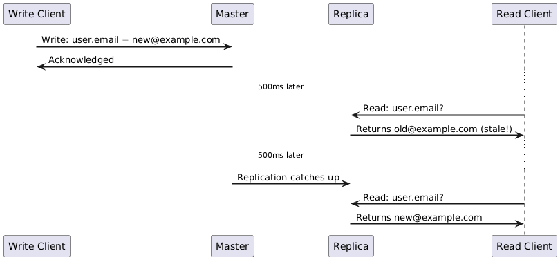
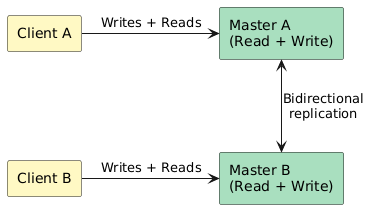
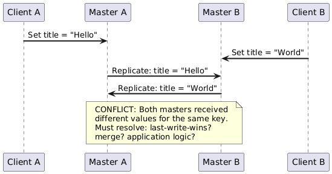
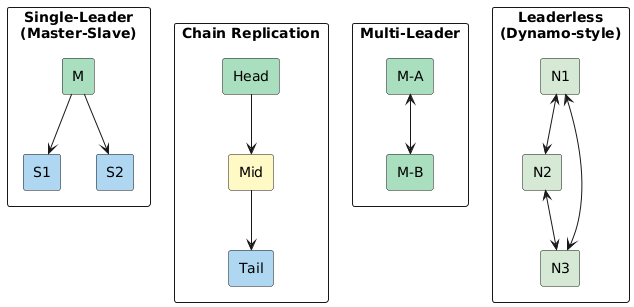

# 03 — Replication Patterns

Replication is the process of maintaining multiple copies of data across nodes to ensure durability, fault tolerance, and read scalability. It is the data-layer counterpart to failover — failover handles *routing*, replication handles *data*.

---

## 1. Why Replicate?

| Goal | How Replication Helps |
|------|-----------------------|
| **Durability** | Data survives single-node failure |
| **Availability** | Reads can continue from replicas if primary fails |
| **Read scalability** | Distribute read load across replicas |
| **Geographic latency** | Serve reads from the nearest replica |
| **Disaster recovery** | Cross-region replicas survive data center loss |

---

## 2. Synchronous vs. Asynchronous Replication

This is the most fundamental replication trade-off and a guaranteed interview topic.

### 2.1 Synchronous Replication

The primary waits for **at least one replica** to confirm the write before acknowledging success to the client.



### 2.2 Asynchronous Replication

The primary acknowledges the write immediately after writing locally. Replication to replicas happens in the background.



### 2.3 Comparison Table

| Dimension | Synchronous | Asynchronous |
|-----------|------------|-------------|
| Write latency | Higher (waits for replica ACK) | Lower (local write only) |
| Data loss on failure | None (replica has latest data) | Possible (replication lag) |
| Replica consistency | Always up to date | Eventually consistent |
| Write throughput | Lower | Higher |
| Network sensitivity | High (slow replica = slow writes) | Low |
| Use case | Financial ledgers, primary DBs | Analytics, read replicas, cross-region |

> **Interview rule:** Sync replication for **zero-data-loss requirements**. Async replication for **performance and geo-distribution**. Semi-sync (one sync replica + many async) is the practical middle ground (MySQL default).

---

## 3. Master-Slave (Single-Leader) Replication

One node is the **master** (primary/leader) and accepts all writes. Slaves (replicas/followers) replicate from the master and serve **read-only** queries.



### Replication Log Mechanisms

| Method | Description | Used By |
|--------|------------|---------|
| **Statement-based** | Log SQL statements; replayed on replica | Older MySQL |
| **Row-based (binlog)** | Log the actual row changes | MySQL default |
| **WAL shipping** | Ship write-ahead log segments to replicas | PostgreSQL streaming replication |
| **Logical replication** | Table-level, schema-aware change stream | PostgreSQL logical replication, Debezium |

### Replication Lag Problem



### Mitigating Replication Lag

| Technique | When to Use |
|-----------|------------|
| **Read-your-writes consistency** | After a user's write, route their subsequent reads to master (or wait for replica catch-up) |
| **Monotonic reads** | Client always reads from the same replica; prevents going "back in time" |
| **Sticky sessions** | Route a user's requests to same replica throughout a session |
| **Replica lag monitoring** | Alert if replica lag exceeds SLO threshold (e.g., > 1 second) |

### Trade-offs

| Dimension | Detail |
|-----------|--------|
| ✅ Simple consistency model | Single write path; no conflict resolution |
| ✅ Read scalability | Add read replicas horizontally |
| ✅ Easy to reason about | One truth-source for writes |
| ❌ Write bottleneck | All writes funnel through one master |
| ❌ Replication lag | Reads may be stale |
| ❌ Failover complexity | Promoting a replica requires care (log position sync, fence old master) |

---

## 4. Master-Master (Multi-Leader) Replication

Multiple nodes each accept **both reads and writes**. Each master replicates to the others. Also called **multi-master** or **multi-leader** replication.



### Conflict Scenario



### Conflict Resolution Strategies

| Strategy | How It Works | Drawback |
|----------|-------------|---------|
| **Last Write Wins (LWW)** | Higher timestamp wins | Clock skew can cause incorrect results |
| **Application-level merge** | Custom logic merges conflicts | Complex; app-specific |
| **CRDT** (Conflict-free Replicated Data Type) | Data structure designed to always merge deterministically | Limited to counters, sets, etc. |
| **Version vectors** | Track causality; only flag true conflicts | Requires client handling |
| **Operational transforms** | Merge concurrent operations (used in Google Docs) | Very complex |

### Real-World Use Cases for Multi-Master

| Scenario | Why Multi-Master |
|----------|-----------------|
| **Multi-region writes** | Users in US and EU write to local region; cross-region replication async |
| **Offline-first apps** | Mobile device writes locally offline; syncs on reconnect |
| **CouchDB / DynamoDB Global Tables** | Built-in conflict resolution via version vectors |
| **Collaborative editing** | Multiple users edit same document simultaneously |

### Trade-offs

| Dimension | Detail |
|-----------|--------|
| ✅ Write scalability | No single write bottleneck |
| ✅ Multi-region latency | Writes go to nearest node |
| ✅ No single point of failure | Any master can handle traffic |
| ❌ Conflict resolution | Required for concurrent writes to same data |
| ❌ Operational complexity | Circular replication setup; hard to debug |
| ❌ Consistency | Harder to provide strong guarantees |

---

## 5. Replication Topologies



| Topology | Leaders | Writes | Consistency | Example |
|----------|---------|--------|-------------|---------|
| Single-leader | 1 | Leader only | Strong (sync) or Eventual | MySQL, PostgreSQL, MongoDB |
| Chain | 1 (head) | Head only; tail serves reads | Strong | Chain Replication (academic) |
| Multi-leader | N | Any leader | Eventual (conflicts possible) | CouchDB, MySQL Circular |
| Leaderless | None | Any node (quorum) | Tunable (R+W>N) | Cassandra, DynamoDB, Riak |

---

## 6. Quorum in Leaderless Replication

Used in Dynamo-style systems (Cassandra, DynamoDB, Riak). With `N` replicas:

```
Write quorum:  W nodes must confirm a write
Read quorum:   R nodes must respond to a read

For strong consistency: W + R > N
For availability:       W = 1, R = 1 (low consistency)
Common tuning:          N=3, W=2, R=2 (one failure tolerated)
```

| N | W | R | W+R | Consistency | Availability |
|---|---|---|-----|-------------|-------------|
| 3 | 3 | 1 | 4 | Strong | Low (one slow node = failed write) |
| 3 | 2 | 2 | 4 | Strong | Medium (tolerate 1 failure) |
| 3 | 1 | 3 | 4 | Strong | Low (must read all) |
| 3 | 1 | 1 | 2 | Eventual | High |

---

## 7. Replication vs. Failover — The Key Distinction

| Aspect | Replication | Failover |
|--------|------------|---------|
| **Layer** | Data layer | Routing / infrastructure layer |
| **Purpose** | Keep data copies in sync | Redirect traffic to healthy node |
| **Acts on** | Data (rows, logs, events) | Traffic (TCP connections, DNS) |
| **Independently sufficient?** | No — replica useless if not promoted | No — failover with no replica = no data |

> They work together: replication ensures the standby has current data; failover switches traffic to it.

---

*Previous: [02-failover-patterns.md](02-failover-patterns.md) | Next: [04-redundancy-and-fault-tolerance.md](04-redundancy-and-fault-tolerance.md)*
