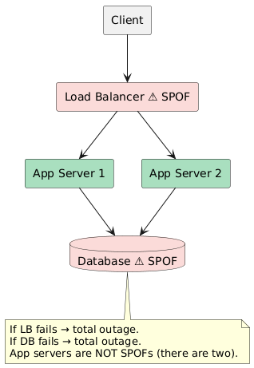
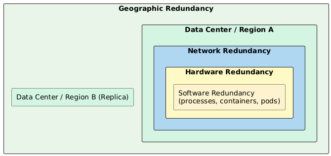
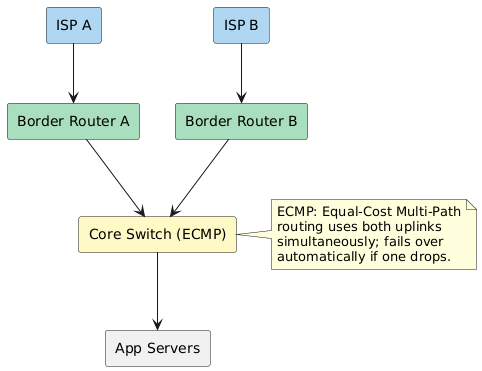
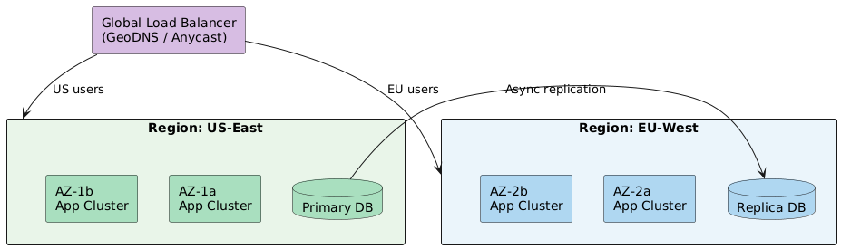
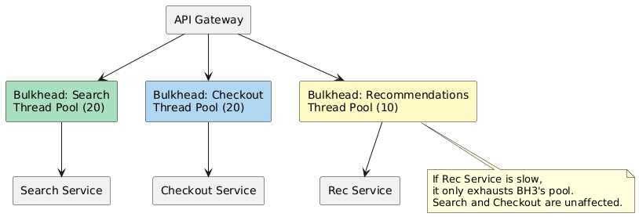
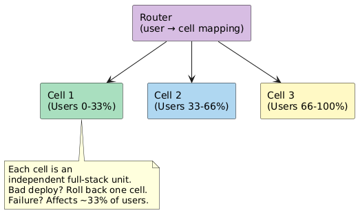
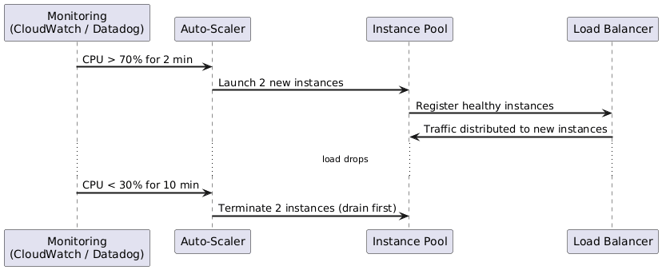

# 04 — Redundancy and Fault Tolerance

Redundancy means provisioning more capacity than strictly required so that when a component fails, the system continues operating. Fault tolerance is the system-level property that emerges from redundancy, isolation, and graceful failure handling.

---

## 1. The Single Point of Failure (SPOF)

A SPOF is any component whose failure causes the **entire system** to fail. Identifying and eliminating SPOFs is the first step in availability design.

### Common SPOFs and Their Mitigations

| Component | SPOF Risk | Mitigation |
|-----------|-----------|-----------|
| Load balancer | Single LB fails | Redundant LBs (primary + hot standby) with anycast/BGP |
| Database | Single DB instance | Master + replicas + automatic failover |
| DNS | Single name server | Multiple NS records; use managed DNS (Route 53, Cloudflare) |
| Network switch / router | Core switch fails | Redundant switch fabric (ECMP, bonded uplinks) |
| Power supply | Single PSU fails | Redundant PSUs + UPS + generator |
| Application config store | Single Consul/Etcd | 3- or 5-node quorum cluster |
| Message queue | Single broker | Multi-broker cluster with replication (Kafka ISR) |

---

## 2. Redundancy Layers

Redundancy must be designed at **every layer** of the stack:

### 2.1 Hardware Redundancy

| Component | Strategy |
|-----------|---------|
| Servers | N+1 provisioning (always one spare per cluster) |
| Disks | RAID (1, 5, 6, 10) for local storage; EBS with replication for cloud |
| Power | Dual PSUs; separate PDU feeds from separate circuits |
| Network cards | NIC bonding / teaming (active-backup or LACP) |
| Memory | ECC RAM (detects and corrects single-bit errors) |

### 2.2 Network Redundancy

| Technique | What It Protects Against |
|-----------|--------------------------|
| Dual ISP links | Single ISP outage |
| BGP anycast | Route traffic to nearest healthy datacenter |
| ECMP routing | Single router/switch failure |
| NIC bonding | Single NIC or cable failure |
| Redundant DNS providers | DNS provider outage |

### 2.3 Geographic Redundancy

| Strategy | RPO | RTO | Cost | Description |
|----------|-----|-----|------|-------------|
| Backup & Restore | Hours | Hours | Low | Restore from snapshot in new region |
| Pilot Light | Minutes | 10–30 min | Medium | Minimal infra running; scale up on failover |
| Warm Standby | Seconds | Minutes | High | Reduced-capacity environment always running |
| Multi-Site Active-Active | ~0 | ~0 | Very High | Full capacity in all regions; traffic split |

> **RPO** = Recovery Point Objective (max acceptable data loss)  
> **RTO** = Recovery Time Objective (max acceptable downtime after failure)

---

## 3. The N+1 / N+2 Rule

| Rule | Meaning | Example |
|------|---------|---------|
| **N+1** | Always have one more instance than needed | 3 app servers where 2 can handle max load |
| **N+2** | Have two spares | 4 servers where 2 can handle load; tolerates 2 simultaneous failures |
| **2N** | Full duplication | Entire standby stack; used for Active-Passive |

> In interview discussions: **N+1 is the minimum for production**. Use 2N for stateful systems where failover correctness is critical.

---

## 4. Fault Isolation Strategies

Even with redundancy, a failure in one component can cascade. Isolation contains the blast radius.

### 4.1 Bulkhead Pattern

Borrowed from ship design — divide the system into isolated compartments so a failure in one doesn't flood the others.

**Implementation options:**
- Separate thread pools per downstream service (Hystrix/Resilience4j)
- Separate connection pools per DB
- Separate Kubernetes pods/namespaces per service
- Rate limiting per tenant (prevents one user from consuming all resources)

### 4.2 Blast Radius

> **Definition:** The blast radius of a failure is the scope of impact — how many users, services, or regions are affected.

| Scope | Example Failure | Blast Radius |
|-------|----------------|-------------|
| Process | Single container OOM | 1 pod |
| Node | VM crash | All pods on that node |
| Availability Zone | AZ power failure | All services in that AZ |
| Region | Region-wide outage | All services in that region |
| Global | Global config push bug | All users everywhere |

**Reducing blast radius:**
- Deploy changes **incrementally** (canary releases, progressive rollouts)
- Use **feature flags** to decouple deployment from release
- Scope config changes to a single AZ before region-wide rollout
- **Cell-based architecture**: partition users into cells; a failure affects only one cell

### 4.3 Cell-Based Architecture

Used by: AWS, Slack, Netflix (zones), Stripe

---

## 5. Capacity Planning for Redundancy

| Scenario | Recommendation |
|----------|---------------|
| Normal load = 40% capacity | N+1 with each node at 40%; if one fails, remaining handle 60% each — still fine |
| Normal load = 70% capacity | N+1 is risky; need N+2 or over-provision |
| Traffic unpredictable / bursty | Use auto-scaling with headroom; pre-warm on predicted spikes |

### Auto-Scaling as Dynamic Redundancy

---

## 6. Redundancy Cost vs. Availability Gain

| Level of Redundancy | Typical Availability Gain | Approx Cost Multiplier |
|--------------------|--------------------------|----------------------|
| No redundancy (single node) | ~99% | 1x |
| N+1 within one AZ | ~99.9% | 1.5–2x |
| Multi-AZ (same region) | ~99.99% | 2–3x |
| Multi-region active-passive | ~99.999% | 4–6x |
| Multi-region active-active | ~99.9999% | 6–10x |

> **Interview framing:** Always tie redundancy decisions to the SLA. There's no "more is better" — over-redundancy wastes engineering and infrastructure budget. Ask: "What's the target SLO, and what failure scenarios must we survive?"

---

*Previous: [03-replication-patterns.md](03-replication-patterns.md) | Next: [05-health-monitoring-and-recovery.md](05-health-monitoring-and-recovery.md)*
