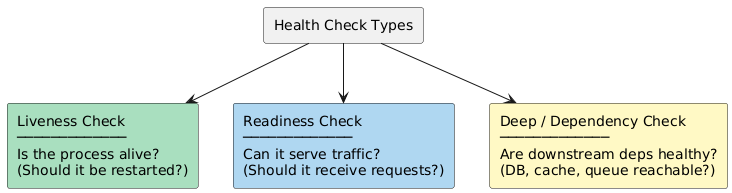
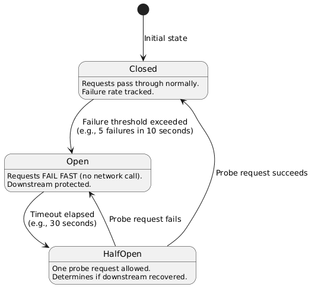
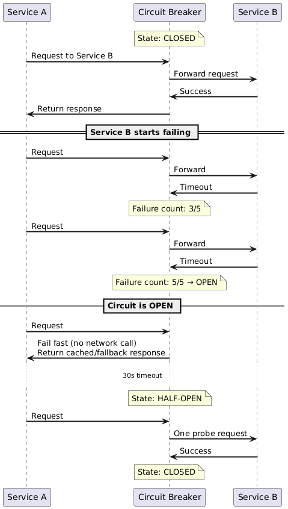
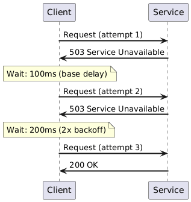
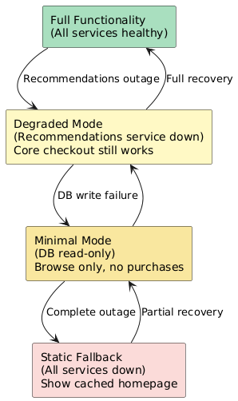
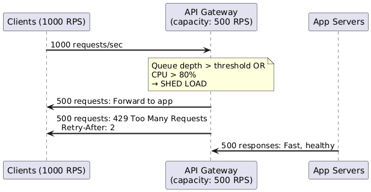
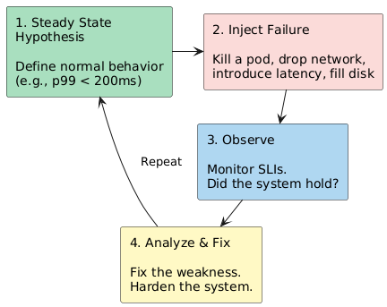
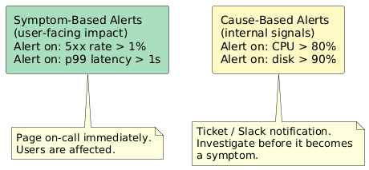
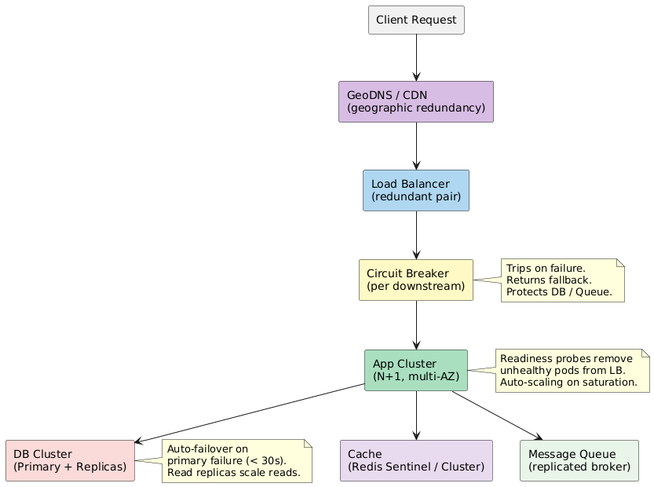

# 05 — Health Monitoring and Recovery Patterns

Availability is not just about redundant hardware — it requires the system to **detect failures quickly**, **recover automatically**, and **degrade gracefully** when full recovery is not possible.

---

## 1. Health Check Types



| Check Type | Kubernetes Probe | Returns Unhealthy When | Action Taken |
|------------|-----------------|----------------------|--------------|
| **Liveness** | `livenessProbe` | Process is deadlocked / hung | Container is **restarted** |
| **Readiness** | `readinessProbe` | Service is starting up or temporarily overloaded | Traffic is **removed** (not restarted) |
| **Startup** | `startupProbe` | Service hasn't finished initializing | Delays liveness checks |
| **Deep/Dependency** | Custom endpoint | DB unreachable, queue full | Alert; circuit breaker trips |

### Health Check Endpoint Design

```
GET /health          → { status: "ok" }                      (simple liveness)
GET /health/ready    → { status: "ok", db: "ok", cache: "ok" } (full readiness)
GET /health/live     → { status: "ok" }                      (process alive)
```

- Liveness endpoint must be **fast and dependency-free** (don't call DB from liveness check — a slow DB should not restart the process)
- Readiness endpoint checks **all critical dependencies**
- Include version, uptime, and component status in responses for debugging

---

## 2. Circuit Breaker Pattern

Prevents a failing downstream service from cascading failures to the caller. Acts like an electrical circuit breaker — trips when too many failures occur, allowing the system to recover.

### States



### Circuit Breaker in Request Flow



### Configuration Parameters

| Parameter | Description | Typical Value |
|-----------|-------------|--------------|
| **Failure threshold** | Failures before tripping | 50% over 10s window |
| **Min requests** | Minimum calls before evaluating | 20 (ignore low-traffic periods) |
| **Timeout** | How long to stay Open before trying | 30–60 seconds |
| **Probe count** | Requests in Half-Open before closing | 1–5 |

### Fallback Strategies When Circuit is Open

| Fallback | Use When | Example |
|----------|----------|---------|
| **Cached response** | Data doesn't change often | Return cached product catalog |
| **Default value** | Additive feature | Return empty recommendations list |
| **Degraded mode** | Core feature affected | Disable personalization, show generic content |
| **Error response** | No safe fallback | Return 503 with Retry-After header |
| **Queue request** | Can be deferred | Queue the write; process when service recovers |

---

## 3. Retry Pattern

Automatically retry failed requests with backoff to handle transient failures.



### Backoff Strategies

| Strategy | Formula | Problem |
|----------|---------|---------|
| **Fixed delay** | Wait = constant | All clients retry simultaneously — thundering herd |
| **Linear backoff** | Wait = n × base | Better, but still coordinated |
| **Exponential backoff** | Wait = base × 2ⁿ | Can grow large quickly |
| **Exponential + Jitter** | Wait = random(0, base × 2ⁿ) | **Best practice** — desynchronizes retries |

```
// Exponential backoff with jitter
delay = min(cap, base * 2^attempt) 
delay = random(0, delay)
```

### Retry Pitfalls

| Pitfall | Risk | Mitigation |
|---------|------|-----------|
| Retrying non-idempotent operations | Duplicate writes (charge customer twice) | Only retry idempotent requests (GET, PUT with idempotency key) |
| Unbounded retries | Runaway resource usage | Set `max_attempts` (3–5) |
| Retrying on all error types | Pointless retries on 400 Bad Request | Only retry on 429, 503, timeouts |
| No jitter | Thundering herd on recovery | Always add jitter |

---

## 4. Timeout Pattern

Every external call must have a **timeout**. Without timeouts, one slow dependency can exhaust all threads.

```
┌────────────────────────────────────────────────────┐
│  Connection Timeout  │  Read / Response Timeout     │
│  (TCP handshake)     │  (waiting for data to arrive)│
└────────────────────────────────────────────────────┘
```

| Timeout Type | Description | Typical Value |
|--------------|-------------|--------------|
| **Connection timeout** | Time to establish TCP connection | 1–3 seconds |
| **Read/socket timeout** | Time to receive first byte of response | 5–30 seconds |
| **Request timeout** | End-to-end time for full response | p99 of upstream × 1.5 |

> **Rule:** Set your timeout to the **p99 latency of the dependency + some headroom** — not to infinity.

---

## 5. Graceful Degradation

A system degrades gracefully when it continues serving a **reduced but useful experience** under partial failure, rather than failing completely.



### Design Principles for Graceful Degradation

1. **Identify your core user journey** — what is the minimum viable experience? (e.g., for e-commerce: browse + checkout)
2. **Mark non-critical features** — recommendations, analytics, A/B experiments, social proof
3. **Build feature flags** — disable non-critical features under load
4. **Cache aggressively** — serve stale data rather than an error
5. **Shed load explicitly** — return 429 with `Retry-After` before becoming unavailable

---

## 6. Load Shedding and Backpressure

When a system is overloaded, it should **intentionally reject excess requests** rather than slowing down for everyone.



| Technique | Description |
|-----------|------------|
| **Rate limiting** | Reject requests above a per-client or global threshold |
| **Concurrency limits** | Cap in-flight requests; queue or reject overflow |
| **Priority queues** | Paid customers served before free tier during overload |
| **Backpressure** | Downstream signals upstream to slow down (TCP flow control, Kafka consumer lag) |

---

## 7. Chaos Engineering

**Definition:** Deliberately injecting failures into production (or staging) to discover weaknesses before they become real outages.



### Common Chaos Experiments

| Experiment | What It Tests |
|------------|--------------|
| Kill random pod | Auto-healing, pod restart policy |
| Terminate primary DB | Failover time, application reconnect logic |
| Inject 500ms latency to service | Timeout settings, circuit breaker thresholds |
| Drop 20% of packets | Retry logic, idempotency |
| Fill disk on app server | Log rotation, disk monitoring alerts |
| Terminate an AZ | Multi-AZ routing, connection drain |
| Inject memory pressure | OOM handling, graceful restart |

**Tools:** Netflix Chaos Monkey, Gremlin, AWS Fault Injection Simulator, LitmusChaos (k8s)

---

## 8. Monitoring for Availability

### Key Signals — The Four Golden Signals (Google SRE)

| Signal | What to Measure | Example Alert |
|--------|----------------|--------------|
| **Latency** | p50 / p95 / p99 response times | p99 > 500ms for 5 minutes |
| **Traffic** | Requests per second | RPS drops by 50% unexpectedly |
| **Errors** | 5xx rate / error ratio | Error rate > 1% for 2 minutes |
| **Saturation** | CPU, memory, queue depth, connection pool | CPU > 85% for 10 minutes |

### Alerting Best Practices



| Alert Type | Trigger | Response |
|------------|---------|----------|
| **Page** | SLO burn rate fast (1hr budget burned in 5 min) | Immediate on-call response |
| **Ticket** | SLO burn rate slow (trending to breach) | Fix during business hours |
| **Informational** | Anomaly but within SLO | Log for post-hoc analysis |

---

## 9. Putting It All Together — Availability Defense in Depth



### Availability Checklist for System Design Interviews

| Area | Questions to Answer |
|------|-------------------|
| **SPOFs** | Have you identified and eliminated every single point of failure? |
| **Replication** | Is all critical data replicated? Sync or async — why? |
| **Failover** | What happens when the primary DB fails? How long? Data loss? |
| **Health checks** | How does the load balancer know a node is unhealthy? |
| **Circuit breakers** | What happens when a downstream service slows down? |
| **Graceful degradation** | What's the minimal viable experience under partial failure? |
| **Recovery targets** | What are the RPO and RTO? Do your mechanisms meet them? |
| **Monitoring** | What metrics trigger an alert? How fast is MTTD? |
| **Chaos testing** | Have you validated your HA mechanisms under real failure? |
| **Cost** | Is the availability/cost trade-off appropriate for the SLA? |

---

*Previous: [04-redundancy-and-fault-tolerance.md](04-redundancy-and-fault-tolerance.md) | Next: [06-availability-in-numbers.md](06-availability-in-numbers.md)*
