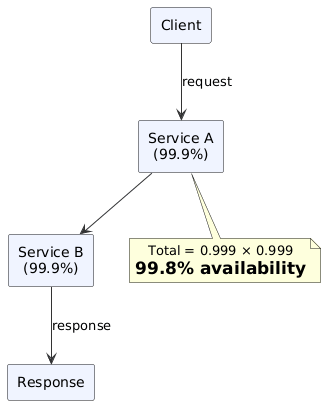
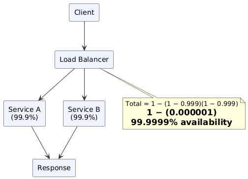

# Availability in Numbers

## What Is Availability?

Availability is the percentage of time a system is **operational and accessible** under normal conditions over a given period.

```
Availability (%) = Uptime / (Uptime + Downtime) × 100
```

> **Rule of thumb:** Every nine added to availability cuts downtime by ~90%.

---

## The Nines of Availability

| Nines | Availability (%) | Downtime / Year | Downtime / Month | Downtime / Week | Downtime / Day |
|-------|-----------------|-----------------|-----------------|-----------------|----------------|
| **1 Nine** | 90% | 36d 12h | 73h | 16h 48m | 2h 24m |
| **2 Nines** | 99% | 3d 15h 39m | 7h 18m | 1h 40.8m | 14m 24s |
| **3 Nines** | 99.9% | 8h 41m 38s | 43m 28s | 10m 4.8s | 1m 26s |
| **4 Nines** | 99.99% | 52m 9.8s | 4m 21s | 1m 0.5s | 8.6s |
| **5 Nines** | 99.999% | 5m 15.6s | 26.3s | 6.1s | 0.9s |
| **6 Nines** | 99.9999% | 31.6s | 2.6s | 0.6s | ~0.09s |

> **5 Nines (99.999%)** is considered the **Gold Standard** of high availability.  
> Achieving it typically requires full redundancy, automated failover, and rigorous chaos engineering.

---

## Availability in Sequence vs. Parallel

When a system is composed of multiple components, the **topology** of those components — sequential or parallel — fundamentally determines overall availability.

### Components in Sequence

If **both components must be healthy** for the system to function (e.g., App → Database), failures compound:

```
Availability(Total) = Availability(A) × Availability(B)
```

> Each component acts as a single point of failure — the weakest link degrades the whole chain.

**Example:**

| Component | Availability |
|-----------|-------------|
| Service A | 99.9% |
| Service B | 99.9% |
| **Total (in sequence)** | **99.8%** ← worse than either alone |

**PlantUML Diagram:**



**N-Component Sequence (Generalized):**

```
Availability(Total) = ∏ Availability(i)  for i = 1..N
```

Each additional component in a sequential chain **strictly decreases** total availability.

---

### Components in Parallel

If the system continues working when **at least one component is healthy** (e.g., redundant servers behind a load balancer), availability compounds upward:

```
Availability(Total) = 1 − (1 − Availability(A)) × (1 − Availability(B))
```

> This is the probability that **not all components fail simultaneously**.

**Example:**

| Component | Availability |
|-----------|-------------|
| Service A | 99.9% |
| Service B | 99.9% |
| **Total (in parallel)** | **99.9999%** ← dramatically better |

**PlantUML Diagram:**



**N-Component Parallel (Generalized):**

```
Availability(Total) = 1 − ∏ (1 − Availability(i))  for i = 1..N
```

Each additional parallel component **strictly increases** total availability (with diminishing returns).

---

## Sequence vs. Parallel: Side-by-Side

| Property | In Sequence | In Parallel |
|----------|-------------|-------------|
| **Formula** | `∏ Availability(i)` | `1 − ∏ (1 − Availability(i))` |
| **Effect on availability** | Decreases (multiplicative degradation) | Increases (fault masking) |
| **Failure condition** | Any component fails → system fails | All components fail → system fails |
| **Analogy** | Chain of locks — one broken link opens nothing | Multiple paths — all must be blocked |
| **Primary concern** | Single Points of Failure (SPOFs) | Cost and complexity of redundancy |
| **Use case** | Simple pipelines, tightly coupled services | Stateless replicas, redundant DBs, multi-AZ |

---

## Real-World Availability Targets

| System Type | Typical Target | Rationale |
|-------------|---------------|-----------|
| Air Traffic Control | 99.9999%+ | Human life safety |
| Payment Processing | 99.999% (5 nines) | Revenue-critical, regulatory |
| Core API / SaaS | 99.99% (4 nines) | SLA-backed, customer-facing |
| Internal tooling | 99.9% (3 nines) | Operational overhead vs. cost |
| Batch / analytics | 99%–99.9% | Tolerance for brief outages |

---

## Key Design Takeaways

1. **Eliminate SPOFs first.** Every component in sequence is a liability — audit your critical path.
2. **Redundancy is multiplicative.** Even one extra 99.9% replica in parallel yields six nines.
3. **Diminishing returns exist.** Going from 4 to 5 nines often requires 10× the engineering effort.
4. **Availability and performance trade off.** Synchronous replication for high availability increases write latency.
5. **Measure what matters.** Track p99/p99.9 latency alongside uptime — a slow system can be "available" but effectively broken.

---

*See also: `availability_concepts.md` (redundancy types, failover strategies, HA vs. fault tolerance)*