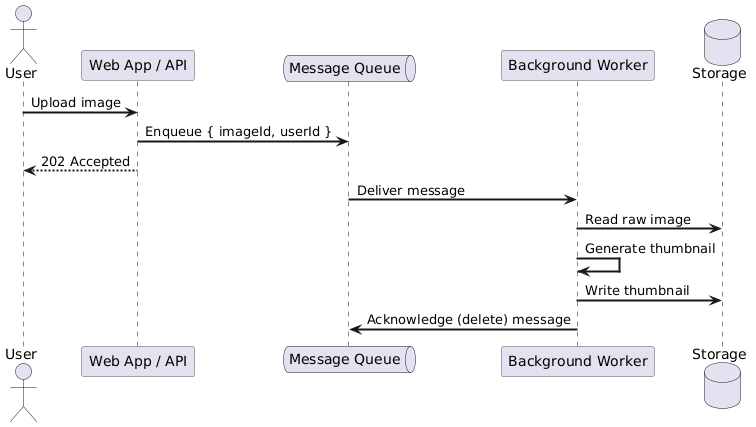
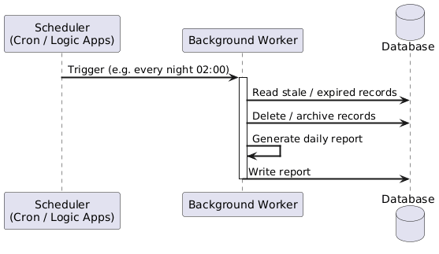
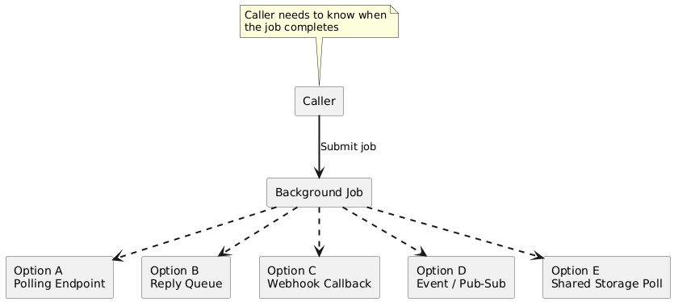
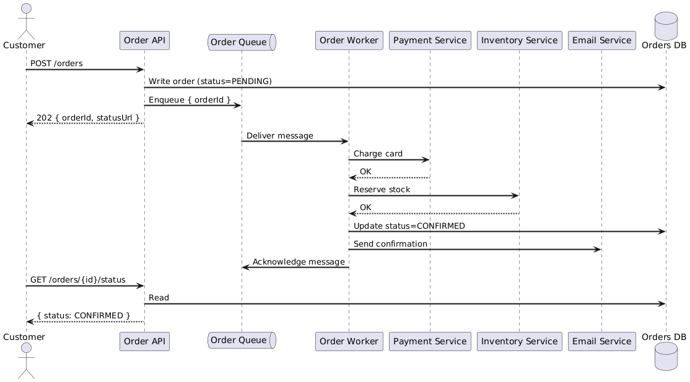

# Background Jobs — 01: Fundamentals

---

## 1. Job Types

| Type | Characteristics | Examples |
|---|---|---|
| **CPU-intensive** | High compute, low I/O | ML inference, video encoding, mathematical modelling |
| **I/O-intensive** | High I/O, moderate CPU | File indexing, DB migrations, storage transactions |
| **Batch** | Scheduled, bulk data | Nightly ETL, report generation, index rebuilds |
| **Long-running workflow** | Multi-step, stateful | Order fulfilment, provisioning pipelines |
| **Sensitive-data processing** | Isolated compute required | PII processing, payment tokenisation |

---

## 2. Trigger Models

### 2.1 Event-Driven Triggers

A user action or system event produces a message/signal that starts the job.

**Event sources:**

| Source | Pattern | Best For |
|---|---|---|
| Message queue (SQS, Service Bus) | Worker polls or subscribes | Decoupled async processing |
| Storage change (blob created) | Trigger on mutation | File-processing pipelines |
| HTTP endpoint | Caller pushes payload | Webhooks, third-party integrations |
| Event stream (Kafka, Kinesis) | Consumer group reads | High-throughput event processing |

---

### 2.2 Schedule-Driven Triggers

A timer invokes the job at a fixed time or recurring interval (cron).

**Scheduling anti-patterns:**

| Anti-pattern | Problem | Fix |
|---|---|---|
| Non-idempotent scheduled task | Multiple instances run the same job and corrupt state | Use distributed lock; design for idempotency |
| Job runtime > interval | Scheduler starts a second instance while first is still running | Enforce concurrency limit (e.g. `Forbid`) |
| No missed-run alerting | Silent failure — no error, no data | Monitor actual run times vs expected schedule |

---

## 3. Returning Results to the Caller

Background jobs are fire-and-forget by nature. When the caller **needs** a result, use one of these patterns:

| Pattern | How it works | Trade-offs |
|---|---|---|
| **Polling endpoint** | Job returns a status URL; caller polls until done | Simple; wastes requests; good for HTTP APIs |
| **Reply queue** | Job publishes result to a queue the caller subscribes to | Decoupled; requires caller to manage subscription |
| **Webhook callback** | Caller provides a callback URL at submission; job POSTs result | Great for external systems; caller must be reachable |
| **Pub/Sub events** | Job publishes completion event; interested parties subscribe | Scales to multiple consumers; eventual |
| **Shared storage poll** | Job writes result/status to DB/blob; caller polls | Simplest to implement; polling overhead |

**Rule of thumb:** prefer **events** (pub/sub) for internal systems where multiple consumers may care; prefer **webhooks** when the caller is an external third party.

---

## 4. Full Flow: Order Processing Example

