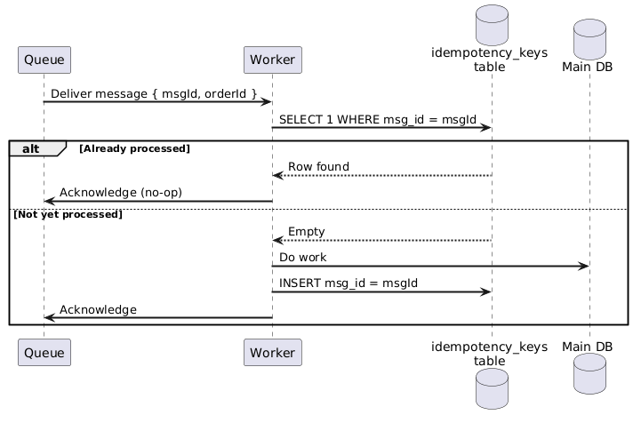
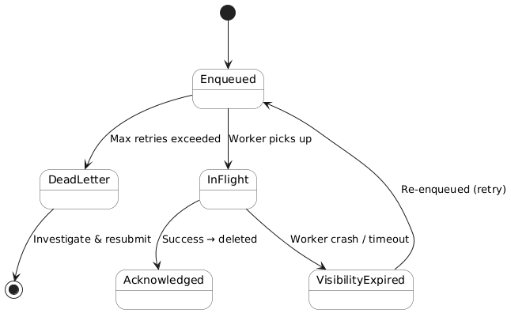
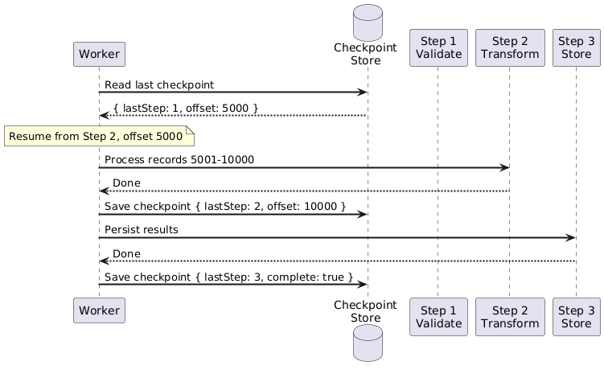
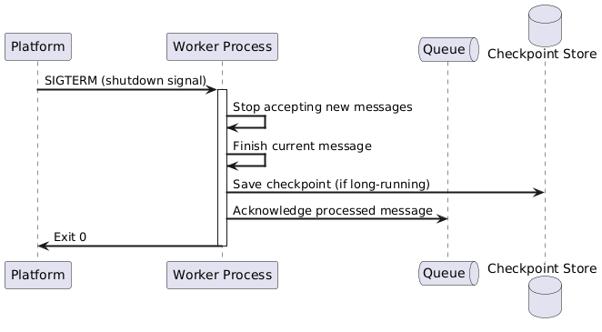
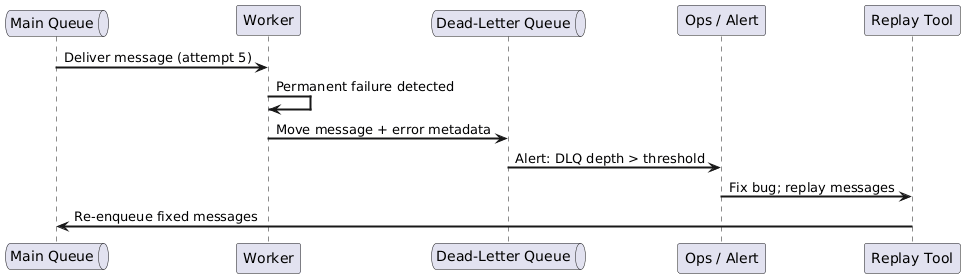

# Background Jobs — 02: Reliability

> **Core principle:** Background jobs must tolerate failures, restarts, and duplicate delivery without corrupting data.

---

## 1. Idempotency

Every background job **must** be idempotent: running the same job N times must produce the same outcome as running it once.

### Why

Queues guarantee **at-least-once** delivery. A message can be delivered more than once if:
- The worker crashes after processing but before acknowledging.
- The visibility timeout expires before the worker finishes.
- The message broker retries on network failure.

### Techniques

| Technique | How | Example |
|---|---|---|
| **Natural idempotency** | Operation is inherently safe to repeat | `SET thumbnail_url = ?` (overwrite is fine) |
| **Idempotency key** | Store a unique job/message ID in a processed-IDs table; skip if already present | `INSERT IGNORE INTO processed_jobs (msg_id) VALUES (?)` |
| **Conditional writes** | Only write if state is still the expected value | `UPDATE orders SET status='SHIPPED' WHERE status='CONFIRMED'` |
| **Upsert** | Insert or update; never duplicate | `INSERT ... ON CONFLICT DO UPDATE` |



---

## 2. Message Failure Modes



| Failure Mode | Description | Mitigation |
|---|---|---|
| **Transient failure** | Timeout, throttle, network blip | Retry with exponential backoff + jitter |
| **Permanent failure** | Bad payload, schema mismatch | Detect and route to DLQ immediately (don't exhaust retries) |
| **Poison message** | Always causes consumer error, blocks queue | DLQ + alerting on DLQ depth |
| **Out-of-order delivery** | Message B arrives before A | Include sequence number; design order-independent processing when possible |
| **Duplicate delivery** | Same message delivered twice | Idempotency key |

### Retry Strategy

```
attempt 1  → wait 1s
attempt 2  → wait 2s
attempt 3  → wait 4s
attempt 4  → wait 8s  (+ random jitter ±20%)
attempt 5  → Dead-Letter Queue
```

**Always add jitter** to prevent thundering-herd when many workers retry simultaneously.

---

## 3. Checkpointing (Long-Running Jobs)

For multi-step jobs, save progress to durable storage so a restart resumes from the last good checkpoint rather than the beginning.



**What to checkpoint:**
- Current step / stage
- Record offset or cursor (page, partition offset, file byte position)
- Partial aggregate state if needed

---

## 4. Graceful Shutdown

Hosting platforms send termination signals during deployments, scale-in events, and maintenance. Workers **must** handle these cleanly.



| Platform | Graceful shutdown mechanism |
|---|---|
| Kubernetes | `terminationGracePeriodSeconds` on pod spec |
| Azure Functions (Flex/Premium) | Up to 60 min for in-progress work on scale-in |
| Container Apps | Configurable per-job |
| Docker / bare VM | Catch `SIGTERM`, finish work unit, exit |

**Rule:** Set the grace period to cover your **worst-case single work-item processing time**, not the average.

---

## 5. Dead-Letter Queue (DLQ) Strategy



**DLQ message envelope should include:**
- Original message body
- Number of delivery attempts
- Last exception / error message
- Timestamps (enqueued, last attempted)
- Correlation ID (trace back to originating request)

---

## 6. Reliability Checklist

| Item | Done? |
|---|---|
| Job is idempotent | ☐ |
| Retry policy with backoff + jitter configured | ☐ |
| Permanent vs transient failures distinguished | ☐ |
| Dead-letter queue configured | ☐ |
| DLQ depth alert set | ☐ |
| Graceful shutdown handled (SIGTERM) | ☐ |
| Checkpointing implemented for long-running jobs | ☐ |
| Duplicate delivery tested | ☐ |
| Out-of-order message handling considered | ☐ |