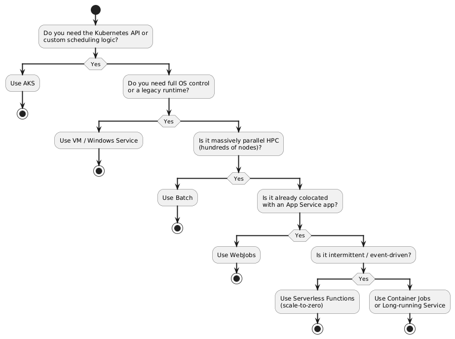
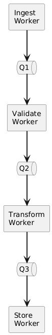
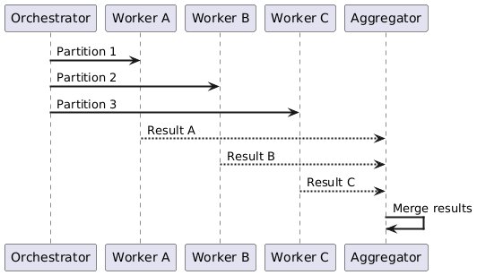
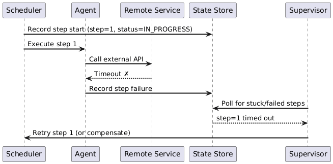
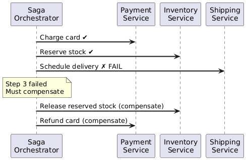
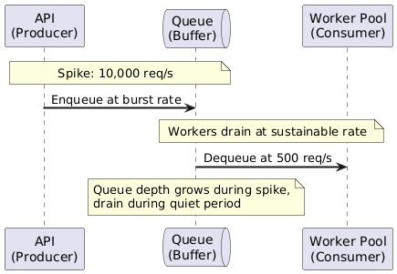

# Background Jobs — 03: Architecture

---

## 1. Hosting Options (Compute Trade-offs)

| Option | Best For | Scale Model | Operational Overhead | Cold Start |
|---|---|---|---|---|
| **Serverless Functions** | Intermittent, event-driven | Auto (incl. scale-to-zero) | Very Low | Yes (mitigable) |
| **Container Jobs** | Any runtime, batch/event | KEDA (scale-to-zero) | Low | Moderate |
| **Managed Kubernetes (AKS)** | Full K8s control, custom scheduling | KEDA + HPA | High | No |
| **Managed Batch (AWS Batch / Azure Batch)** | HPC / massively parallel | Pool-based auto-scale | Medium | Yes (node provision) |
| **Long-running container service** | Continuously polling workers | Manual / KEDA | Low–Medium | No |
| **Virtual Machine / Windows Service** | Legacy runtimes, OS-level access | Manual | High | No |
| **App Service WebJobs** | Co-located with existing App Service app | Shares app instance | Low | Shares app |

### Decision Guide

---

## 2. Partitioning: Co-located vs. Separated

When adding background jobs to an existing system, decide whether to host them **alongside** the main app or in **dedicated compute**.

| Factor | Co-located | Separated |
|---|---|---|
| **Cost** | Lower (shared resources) | Higher (extra hosting) |
| **Isolation** | Low — job can starve the UI | High — failures contained |
| **Security** | Shared credentials/network | Independent boundary |
| **Scalability** | Scales with app (wrong signal) | Scales independently on queue depth |
| **Deploy cadence** | Must redeploy app to update job | Deploy jobs independently |
| **Suitable when** | Low-traffic, simple jobs | Production workloads |

**Rule:** Separate background tasks whenever they have different scaling signals, security requirements, or release cadences than the UI.

---

## 3. Coordination Patterns

### 3.1 Pipes and Filters

Decompose a complex job into discrete, reusable stages connected by queues. Each stage can scale independently.

**Advantages:** Each filter is independently testable, scalable, and replaceable. Stages can be reordered or reused across pipelines.

---

### 3.2 Fan-out / Fan-in

Distribute a large unit of work across many parallel workers, then aggregate results.

**Use case:** Monthly report that must aggregate data from 12 monthly shards in parallel.

---

### 3.3 Scheduler-Agent-Supervisor

For long-running multi-step workflows that call remote services: separate the **orchestration logic** (Scheduler) from the **execution logic** (Agent) and add a **Supervisor** that detects stuck or failed steps and triggers recovery.

---

### 3.4 Saga (Compensating Transactions)

For distributed workflows spanning multiple services, where a later step failure requires **undoing** already-completed steps.

| Pattern | Use when |
|---|---|
| **Pipes and Filters** | Linear pipeline with reusable stages |
| **Fan-out / Fan-in** | Embarrassingly parallel work |
| **Scheduler-Agent-Supervisor** | Long-running workflows calling unreliable remote services |
| **Saga** | Distributed transactions spanning multiple services |

---

## 4. Queue-Based Load Leveling

The queue acts as a **buffer** between the producer (UI/API) and the consumer (background worker), absorbing traffic spikes.

**Benefits:**
- UI remains responsive during traffic spikes.
- Workers never receive more than they can handle.
- Natural back-pressure: if queue grows unboundedly, add more workers or slow producers.

---

## 5. Priority Queue Pattern

When some background work is more urgent than others, use separate queues per priority tier and allocate worker capacity accordingly.

| Priority | Queue | Worker Allocation | Examples |
|---|---|---|---|
| High | `queue-high` | 60% of workers | Payment processing, password reset emails |
| Medium | `queue-medium` | 30% of workers | Order confirmation emails |
| Low | `queue-low` | 10% of workers | Weekly digest emails, report generation |

Workers poll high-priority queues first; only poll low-priority when higher queues are empty.