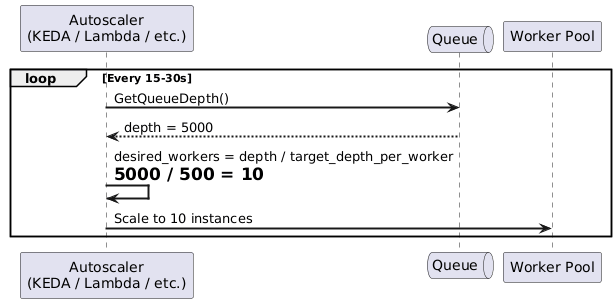
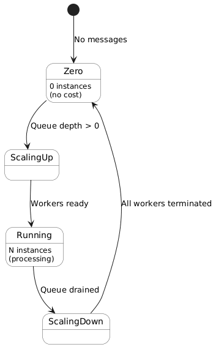
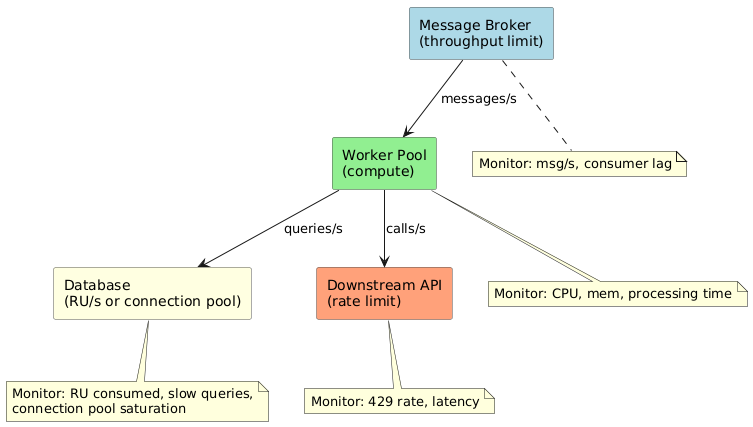
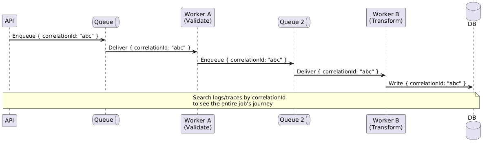
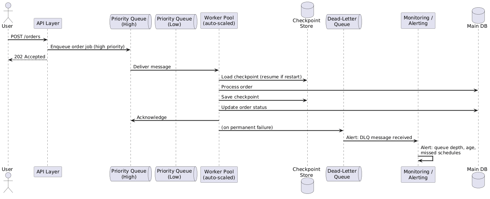

# Background Jobs — 04: Scaling & Observability

---

## 1. Scaling Mental Model

> **Scale on queue depth, not CPU.**

CPU utilisation is a lagging indicator of queue-driven work. By the time CPU spikes, the queue has already grown and latency has already degraded. Use **queue depth** as the primary autoscaling signal.



---

## 2. Scaling Signals by Job Type

| Job Type | Primary Scaling Signal | Secondary Signal |
|---|---|---|
| Queue-driven worker | Queue depth | Message age (oldest unprocessed) |
| Batch processor | Batch size / record count | Elapsed time |
| Scheduled job | Fixed (1 instance or N) | N/A |
| Stream consumer | Consumer lag (Kafka offset lag) | Processing throughput |
| HTTP-triggered job | Concurrent executions | Request queue depth |

---

## 3. Scale-to-Zero

For **intermittent** workloads (nightly batch jobs, event-driven processors with quiet periods), scale to zero workers when the queue is empty.



**Trade-off:** Scale-to-zero introduces a **cold start penalty** when work arrives after an idle period. Mitigate with:
- Pre-warmed / "always ready" instances for latency-sensitive jobs.
- Accept cold start for truly intermittent batch work where a few extra seconds don't matter.

---

## 4. Pipeline Bottleneck Analysis

Adding more workers does not help if the bottleneck is elsewhere. Profile every layer.



| Layer | Metric to Watch | Scaling Action |
|---|---|---|
| Message broker | Throughput units / partition count | Add partitions or upgrade tier |
| Worker compute | Processing time p95, worker count | Scale out workers |
| Database | Connection pool saturation, query latency | Add read replicas, connection pooler |
| Downstream API | HTTP 429 rate | Implement rate-limit-aware backoff; request quota increase |

---

## 5. Observability: What to Instrument

> Background jobs fail silently. No user sees an error. Instrument everything.

### 5.1 Key Metrics

| Metric | Why it matters |
|---|---|
| **Job start count** | Baseline; verify jobs are triggering |
| **Job completion count** | Compare to start: are jobs finishing? |
| **Job failure count** | Direct signal of breakage |
| **End-to-end latency** (enqueue → completion) | Business SLA; not just processing time |
| **Processing time** (dequeue → completion) | Worker performance |
| **Queue depth** | Accumulation = workers falling behind |
| **Message age** (oldest message) | Better SLA indicator than depth alone |
| **DLQ depth** | Failed work piling up |
| **Retry rate** | Elevated retries = transient or worsening failures |

### 5.2 Logging Schema (per job execution)

```json
{
  "timestamp": "2025-01-15T03:02:00Z",
  "correlationId": "ord-8821-abc123",
  "jobType": "order-fulfillment",
  "messageId": "msg-uuid-here",
  "status": "COMPLETED",
  "durationMs": 1240,
  "attempt": 1,
  "workerId": "worker-pod-7d9f",
  "queueWaitMs": 320
}
```

Always log: `correlationId`, `jobType`, `status` (STARTED / COMPLETED / FAILED), `durationMs`, `attempt`.

---

## 6. Distributed Tracing for Multi-Step Jobs

Propagate a single `correlationId` (trace ID) through every step so the full lifecycle of a work item is queryable.



---

## 7. Alerting Rules

| Alert | Condition | Severity |
|---|---|---|
| DLQ depth high | DLQ messages > 0 for > 5 min | High |
| Queue depth growing | Depth growing monotonically for > 15 min | High |
| Old message in queue | Oldest message age > SLA threshold | High |
| Missed schedule | Expected job run not observed within window | High |
| High retry rate | Retry rate > 10% of total deliveries | Medium |
| Job failure spike | Failure rate > 1% over 5-min window | Medium |
| Processing time p99 regression | p99 duration > 2× baseline | Low |

---

## 8. Security Principles

| Principle | Practice |
|---|---|
| **Least privilege** | Job IAM role/identity: only the exact permissions needed (read queue + write DB), nothing more |
| **No secrets in messages** | Pass a reference ID in the message; job fetches sensitive data from a secrets store at runtime |
| **Separate identity from UI** | Background job identity ≠ API identity; limits blast radius if compromised |
| **Encrypt queue messages** | Enable encryption at rest and in transit on the message broker |
| **DLQ access control** | Restrict DLQ read access to ops/admin roles only; messages may contain sensitive data |

---

## 9. Full Architecture: Production-Grade Background Job System

