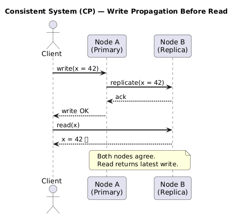
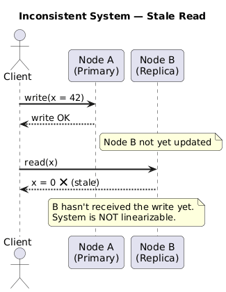

# Consistency (C)

---

## 1. Definition

**Consistency** in the context of CAP means **linearizability** (also called atomic consistency). Formally:

> A system is consistent if every read operation returns the value of the **most recent completed write**, and all operations appear to execute **instantaneously at some point** between their invocation and their response.

This is a very strong guarantee. It means the distributed system appears to all clients as if it were a **single-node machine** responding to operations one at a time in a total order.

> ⚠️ **Critical distinction:** CAP Consistency ≠ ACID Consistency.
> - **ACID Consistency** means a transaction brings the database from one valid state to another (enforcing integrity constraints).
> - **CAP Consistency** is about *recency* and *visibility* of writes across nodes — i.e., linearizability.

---

## 2. Formal Model: The Register

CAP reasons about a theoretical primitive called a **register**:

```
Operations:
  write(v)  → stores value v
  read()    → returns the last written value
```

A key-value store is modelled as a **collection of registers**. Despite their simplicity, registers capture the essence of all distributed read/write workloads.

---

## 3. Linearizability — Precise Definition

Given a history `H` of operations (invocations and responses across all clients), `H` is **linearizable** if:

1. There exists a **legal sequential history** `S` consistent with `H`
2. If operation `op1` completes before `op2` begins in real time in `H`, then `op1` appears before `op2` in `S`

In plain terms: you can find a single "imaginary moment" within each operation's time window at which it appears to take effect, and these moments form a total ordering consistent with observed results.

---

## 4. Examples

### 4a. Linearizable History ✅

```
Client A:  |──write(10)──|
Client B:              |──write(5)──|
Client C:                         |──read() = 5──|
```

Both writes complete before the read. The read returns `5` (the most recent write). This is linearizable — there is a valid ordering: `write(10) → write(5) → read() = 5`.

### 4b. Non-Linearizable History ❌

```
Client A:  |──write(10)──|
Client B:  |──write(5)───────────────|
Client C:                |──read() = 10──|
Client D:  |──────────────────read() = 5──|
```

After `write(10)` completes, client C reads `10`. But client D—whose read overlaps client B's `write(5)`—also reads `5`. This is fine so far. But suppose:

```
Client A writes 10.
Client B writes 5 (concurrent, reaches Node 2 first).
Client C reads from Node 1 → gets 10.
Client D reads from Node 2 → gets 5.
```

If Client C then tells Client D "the value is 10", but D reads 5, the system has violated the **external consistency** requirement of linearizability. Even if each individual operation looks valid in isolation, the inter-client communication exposes the inconsistency.

### 4c. Eventual Consistency is NOT Linearizable ❌

```
write(10), write(5), read() = 10
```

Under eventual consistency, a read after two writes may return a stale value (`10` instead of `5`). This violates the "most recent write" rule of linearizability.

---

## 5. Consistent vs Inconsistent System





---

## 6. Consistency Levels (Spectrum)

Linearizability is the strongest model. In practice, systems offer weaker models as trade-offs for performance:

| Level | Guarantee | Example Systems |
|---|---|---|
| **Linearizability** | Global total order; reads always return latest write | etcd, ZooKeeper, Spanner |
| **Sequential Consistency** | All operations appear in some total order; respects each client's program order | Some configurations of Cassandra |
| **Causal Consistency** | Operations causally related appear in order; concurrent ops may differ | MongoDB (causal sessions) |
| **Read-your-writes** | A client always sees its own writes | Dynamo (per-session) |
| **Eventual Consistency** | Given no new updates, all replicas converge to the same value *eventually* | Cassandra, DynamoDB (default) |
| **Weak Consistency** | No guarantees after a write | Memcached |

```
Strongest ◄────────────────────────────────────► Weakest
Linearizable → Sequential → Causal → Read-your-writes → Eventual → Weak
```

---

## 7. The Cost of Consistency

Achieving linearizability in a distributed system requires **coordination**:

- Before responding to a read, a node must ensure no concurrent write is in-flight on another node
- This requires **consensus protocols** (Paxos, Raft) or **synchronous replication**
- Coordination introduces **latency** and **blocking** — especially during partitions

This is the fundamental tension CAP captures: **the price of being correct is availability**.

---

## 8. Key Takeaways

- CAP Consistency = Linearizability (not ACID consistency)
- It guarantees reads always reflect the latest write, system-wide
- Achieving it requires node coordination — which becomes impossible during a partition without sacrificing availability
- Consistency lives on a spectrum; real systems choose the weakest level that satisfies their business requirements

---

← [Back to README](./README.md) | Next: [Availability →](./02-availability.md)
