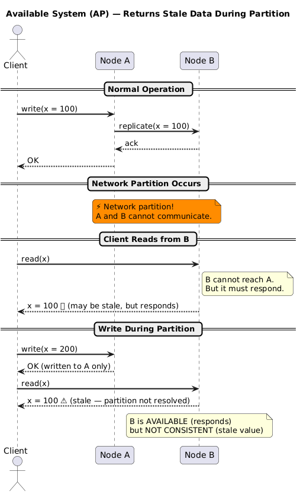
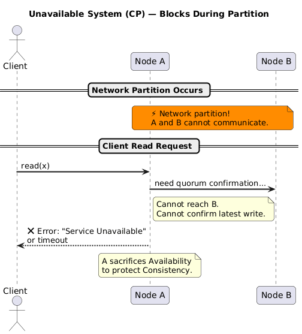

# Availability (A)

---

## 1. Definition

**Availability** in CAP is defined as:

> Every request received by a **non-failing node** must result in a response. The response must be a valid, non-error answer that is part of the system's specification. A response of "error" or "timeout" does not count.

More formally, from Gilbert & Lynch (2002):

> *"For a distributed system to be available, every request received by a non-failing node in the system must result in a response."*

---

## 2. What Availability Guarantees (and What It Doesn't)

### It Guarantees

- Every **live node** responds to every request
- The response is **meaningful** (not an error code or timeout)
- The system never "goes silent" as long as at least one node is alive

### It Does NOT Guarantee

- That the response contains the **most recent data** (that's Consistency)
- That the response arrives within a **specific time bound** — only that it eventually arrives (the bound is unbounded but finite)
- That **all nodes** are available — only that non-failing ones are

---

## 3. The Strength and Weakness of This Definition

This definition is simultaneously strong and weak:

**Strong:** 100% of requests to non-failing nodes must return a valid response. There is no "99.9% availability" in the CAP sense — it's all-or-nothing. A single unavailable response breaks the guarantee.

**Weak:** The response may take an arbitrarily long (but finite) time. There is no SLA on latency embedded in the definition.

> This is why "five nines" (99.999%) availability in SRE/operations is a **different concept** from CAP availability. CAP availability is a theoretical guarantee; operational availability is a measured statistic.

---

## 4. Availability vs. Reliability

These are frequently confused:

| Concept | Definition | Example |
|---|---|---|
| **CAP Availability** | Non-failing nodes always respond with a valid answer | A node that is up always returns *something* |
| **Operational Availability** | % of time the system is up and serving requests | 99.99% uptime over 30 days |
| **Reliability** | System performs its intended function without failure | No data corruption or wrong answers |
| **Fault Tolerance** | System continues operating despite component failures | Works when 2 of 5 nodes die |

---

## 5. Available System During Partition



---

## 6. Unavailable System: What It Looks Like

When a system **sacrifices availability** for consistency (CP), during a partition:



---

## 7. Availability in Multi-Node Systems

In practice, availability is tied to **replication factor** and **quorum settings**:

| Scenario | Behaviour |
|---|---|
| All nodes healthy | All respond; full availability |
| Minority of nodes fail, no partition | Remaining nodes handle requests |
| Network partition occurs | Must choose: respond with possibly stale data (AP) or refuse (CP) |
| All nodes fail | No availability possible regardless of design |

### Quorum and Availability Trade-off

In a system of `N` replicas, with `W` write quorum and `R` read quorum:

```
Strong consistency:  R + W > N
High availability:   W = 1, R = 1  (but no consistency guarantee)
```

For example, in a 3-node cluster:
- `W=2, R=2` → `R + W = 4 > 3` → consistent, but less available (both quorum nodes must be up)
- `W=1, R=1` → always responds, but may return stale data

---

## 8. Eventual Availability vs. Strict Availability

Some systems offer **high availability** without full CAP availability by using:

- **Retry logic:** A failed request is retried until it succeeds
- **Circuit breakers:** Requests fail fast to avoid cascading failures
- **Fallback responses:** A cached or default value is returned

These are engineering patterns that improve practical availability but operate outside the strict theoretical CAP definition.

---

## 9. Key Takeaways

- CAP Availability = every non-failing node responds with a valid (non-error) answer
- No time bound is specified — only eventual (finite) response is required
- It is an absolute guarantee — one missing response violates it
- During a partition, maintaining availability means accepting potentially stale reads
- Operational "five nines" availability is separate from CAP availability

---

← [Consistency](./01-consistency.md) | [Back to README](./README.md) | Next: [Partition Tolerance →](./03-partition-tolerance.md)
