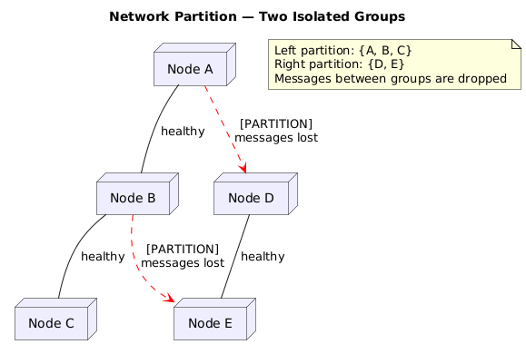
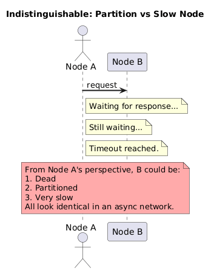
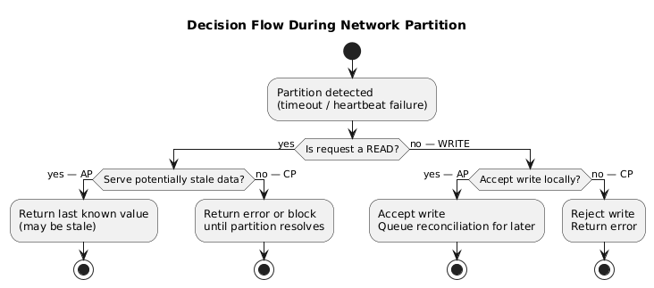

# Partition Tolerance (P)

---

## 1. Definition

**Partition Tolerance** means:

> The system continues to operate correctly even when an arbitrary number of **messages between nodes are dropped** (or delayed indefinitely) by the network.

A **network partition** is a scenario where a subset of nodes in a distributed system cannot communicate with another subset — either because messages are lost, a network link has failed, or a node is unreachable.



---

## 2. The Fallacies of Distributed Computing

Network partitions are not hypothetical. They are a **guaranteed fact of life** in any distributed system. The fallacies of distributed computing (Peter Deutsch, 1994) remind us:

| Fallacy | Reality |
|---|---|
| The network is reliable | Networks fail constantly — hardware, software, misconfiguration |
| Latency is zero | Round-trips take time; links get congested |
| Bandwidth is infinite | Bandwidth is always finite and contested |
| The network is secure | Networks are hostile environments |
| Topology doesn't change | Nodes join and leave; links are rerouted |
| There is one administrator | Multi-team ownership causes inconsistent configs |
| Transport cost is zero | Serialization, encryption, and routing have costs |
| The network is homogeneous | Hardware and software versions differ across nodes |

**The critical implication:** You do not get to choose whether partitions happen. You only get to choose how your system behaves *when* they happen.

---

## 3. Why Partition Tolerance Is Non-Negotiable

The CAP theorem is sometimes presented as "choose two of C, A, P." This framing is misleading. Here's why:

**A CA system (no partition tolerance) would require:**
- A network that never drops or delays messages
- No possibility of node isolation
- Perfect, synchronous communication between all nodes at all times

This does not exist in any real network. Even in a single data center, you will experience:
- NIC failures
- Switch failures
- BGP route flaps
- Full datacenter network partitions
- Rolling restarts causing momentary isolation
- GC pauses that look like slow/failed nodes

**Conclusion:** Every distributed system must be Partition Tolerant. The actual choice is between **CP** and **AP** — not between CA, CP, and AP.

```
MYTH:  "I'll build a CA system."
REALITY: You've built a single-node system with the illusion of distribution,
         or you've built a system that will fail catastrophically during the
         inevitable partition.
```

---

## 4. Types of Partitions

| Type | Description | Example |
|---|---|---|
| **Total Partition** | All messages between two node groups are lost | Switch failure isolating a rack |
| **Partial Partition** | Some messages get through, others are lost | Flaky network link with packet loss |
| **Asymmetric Partition** | A→B messages delivered, B→A messages dropped | Firewall misconfiguration |
| **Transient Partition** | Partition lasts for a short period then heals | Brief network blip |
| **Permanent Partition** | Node is permanently unreachable | Hardware failure, decommission |

---

## 5. Partition vs. Slow Node

This is a critical and subtle point:

> In an **asynchronous network**, it is **impossible to distinguish** between a partitioned node and a very slow node.

A node waiting for a response from Node B cannot know whether:
- Node B has failed permanently
- Node B is alive but unreachable (partition)
- Node B is alive but overwhelmed and slow
- The response is in-flight but delayed

This is directly why CAP, FLP, and related impossibility results hold. The system cannot make correct decisions with incomplete information about remote node state.



---

## 6. Partition Tolerance in Practice

When a partition is detected (via timeout or heartbeat failure), the system must make a decision for every pending and incoming request:



---

## 7. Quorum and Partition Tolerance

Many distributed systems use **quorum-based** approaches to handle partitions gracefully:

Given `N` total nodes, `W` write quorum, `R` read quorum:

| Configuration | Behavior During Partition |
|---|---|
| `W=N, R=1` | Writes fail if any node is partitioned (CP-leaning) |
| `W=1, R=N` | Reads fail if any node is partitioned (CP-leaning) |
| `W=ceil(N/2)+1, R=ceil(N/2)+1` | Strong consistency, tolerates minority partitions (CP) |
| `W=1, R=1` | Always responds, may return stale data (AP) |

For a 3-node cluster: majority quorum `W=2, R=2` means the system continues to function as long as 2 nodes are reachable — it tolerates the partition of 1 node while maintaining consistency.

---

## 8. The Partition Decision Is a Policy Choice

Partition tolerance itself is not optional. But **how you respond to a partition** is a design decision:

| Design Choice | Trade-off | Best For |
|---|---|---|
| Refuse all requests | Maximises consistency | Financial transactions, coordination services |
| Return stale data | Maximises availability | Social feeds, shopping carts, DNS |
| Return stale data + accept writes | Maximum availability, reconcile later | Offline-first apps, highly distributed systems |

---

## 9. Key Takeaways

- A partition is a network failure where messages between nodes are lost
- Real networks always produce partitions — this is not theoretical
- "CA" systems do not exist in distributed computing — partition tolerance is mandatory
- The inability to distinguish slow nodes from partitioned ones is fundamental to why C and A cannot coexist under partitions
- The real CAP decision is: **when a partition occurs, do I stay consistent (CP) or available (AP)?**

---

← [Availability](./02-availability.md) | [Back to README](./README.md) | Next: [Mathematical Proof →](./04-mathematical-proof.md)
