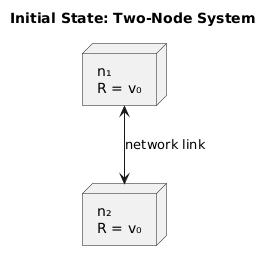
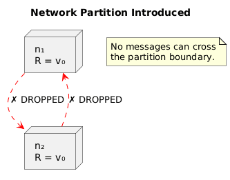

# Mathematical Proof of CAP Theorem

---

## 1. Background and Attribution

The CAP Theorem was conjectured by Dr. Eric Brewer at PODC 2000. It was formally stated and **proved** by Seth Gilbert and Nancy Lynch (MIT) in their 2002 paper:

> *"Brewer's Conjecture and the Feasibility of Consistent, Available, Partition-Tolerant Web Services"*
> — Gilbert & Lynch, ACM SIGACT News, 2002

The proof is a **proof by contradiction**: we assume a system is simultaneously Consistent (linearizable), Available, and Partition Tolerant, and derive a contradiction.

---

## 2. Formal System Model

### 2.1 Network Model

We model a distributed system as a set of nodes `{n₁, n₂, ..., nₖ}` connected by an **asynchronous network**. An asynchronous network has the following properties:

- Messages may be **arbitrarily delayed** or **lost entirely**
- There is **no global clock**
- There is **no upper bound** on message delivery time
- A node cannot distinguish between a lost message and a delayed one

### 2.2 Register Abstraction

The system implements a **read/write register** `R` with:
- `write(v)` — sets the register value to `v`
- `read()` — returns a value from the register

The register is **distributed** — its value is replicated across multiple nodes.

### 2.3 Formal Definitions

**Definition 1 — Availability (A):**
For every request `req` sent to a non-failing node `nᵢ`, there exists a finite time `t` such that `nᵢ` returns a response `res` at time `t`.

> `∀ req, ∀ nᵢ ∈ non-failing : ∃ t < ∞ such that response(nᵢ, req, t) is valid`

**Definition 2 — Atomic Consistency (C):**
A history `H` of operations is atomically consistent (linearizable) if there exists a legal sequential history `S` such that:
1. `S` is equivalent to `H` (same operations, same return values)
2. If operation `op₁` completes before `op₂` begins in real time in `H`, then `op₁` precedes `op₂` in `S`

> The system appears to execute all reads and writes on a single copy in a total order.

**Definition 3 — Partition Tolerance (P):**
The network may lose any message sent from node `nᵢ` to node `nⱼ`. The system must continue to satisfy properties A and C despite such losses.

> `∀ messages m(nᵢ → nⱼ) : m may be dropped; system must still satisfy A and C`

---

## 3. The Proof

### 3.1 Theorem Statement

**Theorem (Gilbert & Lynch, 2002):** It is impossible for a distributed data store to simultaneously provide all three of the following guarantees:

1. **C** — Atomic (linearizable) consistency
2. **A** — Availability (every non-failing node responds)
3. **P** — Partition Tolerance (correct operation despite message loss)

### 3.2 Proof by Contradiction

**Assume** a system `Σ` satisfies C, A, and P simultaneously.

**Step 1 — Set up the scenario**

Consider a minimal system with exactly **two nodes**: `n₁` and `n₂`. The system stores a single register `R`.

Initially, the register holds value `v₀`.



**Step 2 — Introduce a total partition**

By the assumption of Partition Tolerance, the system must handle the case where all messages between `n₁` and `n₂` are lost.

Force a **total partition**: drop all messages between `n₁` and `n₂`.



**Step 3 — Client₁ writes to n₁**

A client sends `write(v₁)` to node `n₁` (where `v₁ ≠ v₀`).

By **Availability**, `n₁` must respond to the write (it is non-failing). So `n₁` accepts the write and updates its local register to `v₁`.

```
State after write:
  n₁: R = v₁
  n₂: R = v₀   (cannot receive replication message — partition)
```

**Step 4 — Client₂ reads from n₂**

A second client sends `read()` to node `n₂`.

By **Availability**, `n₂` must respond with a valid value (it is non-failing).

`n₂` has two choices:

- **Choice A:** Return `v₀` (its local value, which is stale)
- **Choice B:** Wait for confirmation from `n₁` (but all messages are dropped — wait is infinite)

Choice B violates Availability (infinite wait = no response in finite time).

So `n₂` must return `v₀`.

**Step 5 — Derive the contradiction**

We now have a history:
```
write(v₁) to n₁  → completes successfully (by Availability)
read()   from n₂ → returns v₀              (by Availability)
```

For this history to be **linearizable** (Consistency), we need a valid sequential ordering where the read returns the most recent completed write.

The write `write(v₁)` completed before the read began. Therefore, by linearizability, the read must return `v₁`.

But `n₂` returned `v₀ ≠ v₁`. **Contradiction.**

**Step 6 — Conclusion**

We assumed `Σ` satisfies C, A, and P. Under a total partition:
- Availability forces `n₁` to accept the write and `n₂` to respond to the read
- The partition prevents `n₁` from communicating `v₁` to `n₂`
- Therefore `n₂` cannot return `v₁` — violating Consistency

**∴ No system can simultaneously satisfy C, A, and P. QED. □**

---

## 4. Summary of the Proof in Logical Form

```
Assume:  Σ satisfies C ∧ A ∧ P

Scenario:
  - Two nodes: n₁, n₂
  - Initial value: R = v₀
  - Total partition: all messages n₁ ↔ n₂ dropped

From A: n₁ must accept write(v₁) and complete it           → n₁: R = v₁
From A: n₂ must respond to read() in finite time            → n₂ returns v₀ (only local state)
From C: read() after completed write(v₁) must return v₁    → n₂ must return v₁

Contradiction: n₂ returns v₀  ≠  v₁

∴ ¬(C ∧ A ∧ P) under partition
∴ C ∧ A ∧ P is impossible in an asynchronous network   □
```

---

## 5. What the Proof Actually Shows

It's important to understand what this proof does and does not show:

| Claim | Correct? |
|---|---|
| C, A, P cannot all hold simultaneously | ✅ Yes |
| The system must always sacrifice one of C or A | ✅ Yes, during a partition |
| C and A are both binary (all-or-nothing) | ✅ In the formal model |
| C and A cannot coexist when there's no partition | ❌ No — without partitions, both can hold |
| CA systems are valid distributed systems | ❌ No — partitions always occur |

The proof is a **proof by construction** — it shows *one specific scenario* (total partition) where C and A cannot coexist. It doesn't say the system fails all the time — only that it must fail in this scenario.

---

## 6. The Role of Asynchrony

The proof critically depends on the **asynchronous network model**:

> Because `n₂` cannot tell the difference between "message delayed" and "message lost," it cannot wait indefinitely. It must respond with what it knows — which is stale.

In a **synchronous network** (with known message delay bounds), a node could wait for the maximum possible delay and *then* conclude the message was lost. Gilbert & Lynch also proved that in a **partially synchronous** model, the impossibility still holds during periods when the synchrony bound is violated.

---

## 7. Relationship to FLP Impossibility

The **Fischer-Lynch-Paterson (FLP) theorem** (1985) is a related but distinct result:

| | FLP | CAP |
|---|---|---|
| **Year** | 1985 | 2002 (proved) |
| **Problem** | Consensus (agree on a value) | Read/write register |
| **Failure model** | One node may fail (crash) | Network may drop messages |
| **Network model** | Asynchronous, no message loss | Asynchronous, with message loss |
| **Result** | Consensus is impossible with even one failure | C + A + P is impossible |

Both results stem from the same core challenge: **in an asynchronous system, you cannot distinguish slow from failed**, making safe decisions impossible in all cases.

---

## 8. Key Takeaways

- The proof uses a minimal two-node system and a single total partition
- It is a proof by contradiction: assume C ∧ A ∧ P, derive contradiction
- The contradiction comes from Availability forcing a response that violates Consistency
- The asynchronous network model is what makes the proof work
- CAP does not say a system is *always* failing — only that it *must* fail during a partition
- The practical implication: choose your failure mode, because the partition will come

---

← [Partition Tolerance](./03-partition-tolerance.md) | [Back to README](./README.md) | Next: [CP vs AP Systems →](./05-cp-ap-systems.md)
