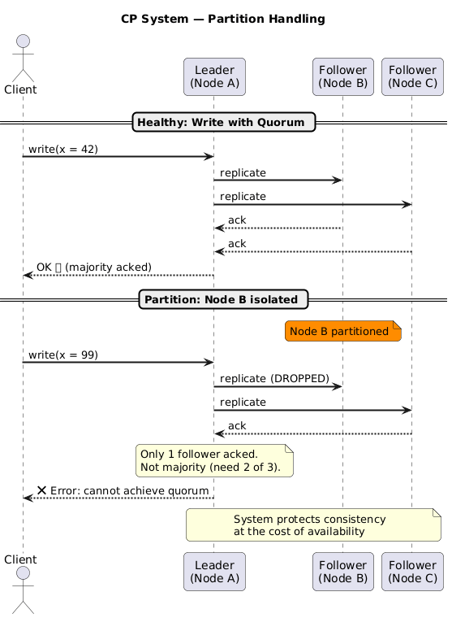
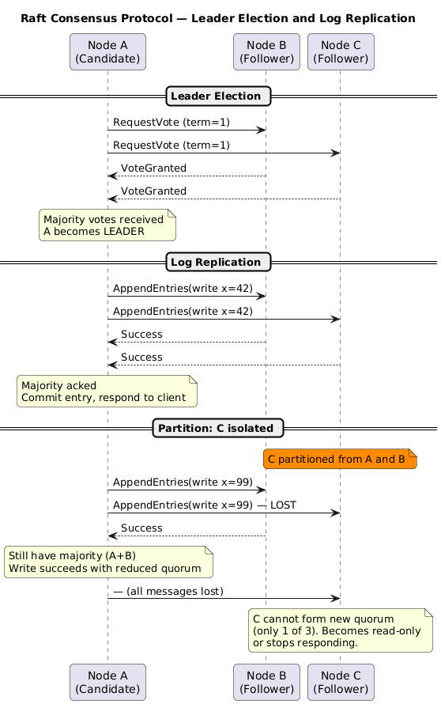
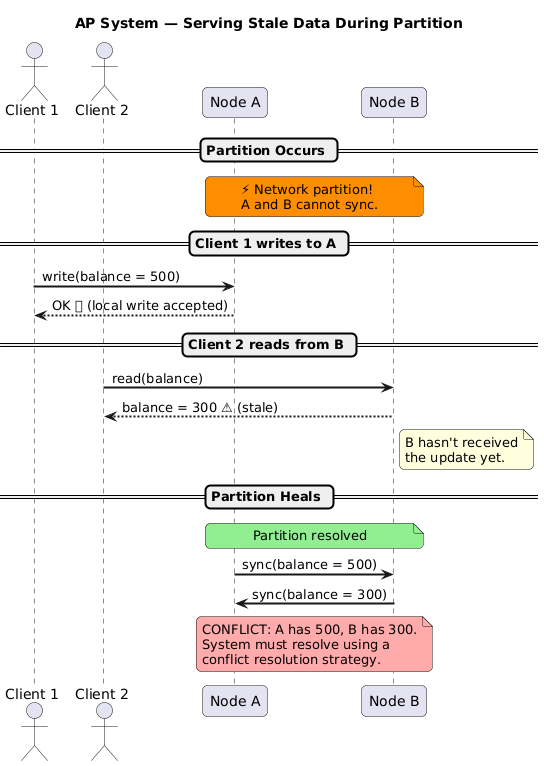

# CP vs AP Systems

---

## 1. The Real Choice: CP or AP

As established in the [Partition Tolerance section](./03-partition-tolerance.md), every distributed system must be partition tolerant. This reduces the CAP decision to a single binary choice:

```
When a network partition occurs:
  ┌─────────────────────────────────┐
  │  Do you prioritise...           │
  │                                 │
  │  ┌───────────┐ ┌─────────────┐  │
  │  │ CP        │ │ AP          │  │
  │  │ Correct   │ │ Responsive  │  │
  │  │ answers   │ │ always      │  │
  │  └───────────┘ └─────────────┘  │
  └─────────────────────────────────┘
```

This is a **business and engineering decision**, not a purely technical one. The right answer depends on what failure mode is more acceptable to your users.

---

## 2. CP — Consistency + Partition Tolerance

### 2.1 Behaviour

In a CP system, when a partition is detected:
- The system **refuses to serve** requests it cannot answer correctly
- Writes may be **blocked** until quorum is restored
- Reads return an **error or timeout** rather than stale data
- The system **waits** for the partition to heal before resuming normal operation

The invariant: **if you get a response, it is correct. You may not always get a response.**

### 2.2 Architecture Pattern



### 2.3 When to Choose CP

Choose CP when **incorrect data is worse than no data**:

| Scenario | Reason |
|---|---|
| Financial ledgers, banking | Stale balance = incorrect transactions |
| Distributed locking / leader election | Two leaders = split-brain catastrophe |
| Configuration management | Nodes acting on stale config = unsafe deployments |
| Inventory management | Overselling = real-world obligations you can't fulfil |
| Medical records | Stale drug interaction data = patient harm |

### 2.4 Real-World CP Systems

| System | How It Achieves CP |
|---|---|
| **ZooKeeper** | Zab consensus protocol; majority quorum required for writes |
| **etcd** | Raft consensus; leader handles all writes, rejects if quorum lost |
| **HBase** | Relies on HDFS + ZooKeeper; sacrifices availability during partition |
| **Google Spanner** | TrueTime + Paxos; globally consistent transactions |
| **PostgreSQL** (sync replication) | Synchronous commit to standby before acknowledging write |
| **Apache Kafka** (min.insync.replicas) | Producer waits for N replicas to ack; errors if not met |

### 2.5 Consensus Protocols (The Engine of CP)

CP systems use **consensus algorithms** to coordinate writes:



---

## 3. AP — Availability + Partition Tolerance

### 3.1 Behaviour

In an AP system, when a partition is detected:
- Every non-failing node **continues to respond** to requests
- Reads may return **stale (out-of-date) data**
- Writes are accepted locally and **reconciled later** when the partition heals
- The system **never returns an error due to partition** (only due to hard node failure)

The invariant: **you always get a response. It may not always be the most recent data.**

### 3.2 Architecture Pattern



### 3.3 Conflict Resolution Strategies

AP systems accept divergent writes and must reconcile them. Common strategies:

| Strategy | Description | Used By |
|---|---|---|
| **Last Write Wins (LWW)** | The write with the latest timestamp wins | Cassandra (default) |
| **Vector Clocks** | Track causality; expose conflicts to application | DynamoDB, Riak |
| **CRDTs** | Conflict-Free Replicated Data Types; mathematically guaranteed to converge | Redis (some types), Riak |
| **Application-level merge** | Application defines merge logic (e.g., union of shopping carts) | Amazon shopping cart |
| **Multi-version concurrency** | Keep all versions; present conflict to user | CouchDB |

### 3.4 When to Choose AP

Choose AP when **availability is more valuable than perfect consistency**:

| Scenario | Reason |
|---|---|
| Shopping carts | A stale cart is better than an error page |
| Social media feeds | Slightly old posts are acceptable |
| DNS | Stale records eventually update; downtime is unacceptable |
| Product catalogue / pricing | Brief staleness acceptable; errors are not |
| Metrics / analytics | Approximate counts are fine |
| Recommendation engines | Stale recommendations are still useful |

### 3.5 Real-World AP Systems

| System | How It Achieves AP | Consistency Model |
|---|---|---|
| **Cassandra** | Tunable consistency; default eventual | Eventual (tunable) |
| **DynamoDB** | Multi-AZ replication; always responds | Eventual (strong available as option) |
| **CouchDB** | Multi-master replication; MVCC | Eventual |
| **Riak** | Vector clocks; always responds | Eventual |
| **DNS** | TTL-based caching; stale records served | Eventual |
| **Couchbase** | Asynchronous replication | Eventual |

---

## 4. Side-by-Side Comparison

| Dimension | CP | AP |
|---|---|---|
| **During partition — reads** | Error / timeout | Returns (possibly stale) data |
| **During partition — writes** | Error / blocks | Accepted locally |
| **After partition heals** | Resumes normal ops | Reconciles divergent writes |
| **Data guarantee** | Always correct | Eventually correct |
| **Latency** | Higher (coordination needed) | Lower (local response) |
| **Throughput** | Lower (consensus overhead) | Higher (no coordination) |
| **Failure mode** | Visible errors (safe) | Silent staleness (subtle) |
| **Use case** | Finance, config, locks | Social, shopping, DNS |

---

## 5. Tunable Consistency: The Middle Ground

Many modern systems offer **tunable consistency** — the ability to choose per-operation where on the CP↔AP spectrum you want to operate:

### Cassandra Example

```
Replication factor N = 3
Write quorum W
Read quorum R

Strong consistency: R + W > N  →  W=2, R=2 (CP behaviour)
High availability:  W=1, R=1              (AP behaviour)
```

| `W` | `R` | Behaviour |
|---|---|---|
| `ALL` | `ALL` | Maximum consistency; single node failure → unavailable |
| `QUORUM` | `QUORUM` | Strong consistency (R+W > N); tolerates minority failure |
| `ONE` | `QUORUM` | AP reads, CP writes |
| `ONE` | `ONE` | Maximum availability; stale reads possible |

This is powerful but dangerous — the application layer must understand what guarantee it's getting per query.

---

## 6. The "CA is Not CA" Problem

When engineers call a system "CA," they typically mean "it's consistent and available when the network is healthy." But:

- Under CAP, P is not optional
- Every distributed system will eventually experience a partition
- So "CA" actually means "I haven't decided what to do during a partition yet"

This is arguably worse than explicitly choosing CP or AP — the system's behaviour under partition is undefined, leading to unpredictable failures.

```
❌ CA system (distributed): undefined partition behaviour
✅ CP system:  defined — returns errors on partition
✅ AP system:  defined — returns stale data on partition
```

---

## 7. Key Takeaways

- Partition Tolerance is mandatory in distributed systems; the real choice is CP vs AP
- CP: Always correct, sometimes unavailable. AP: Always available, sometimes stale.
- CP uses consensus (Raft, Paxos, Zab) to coordinate writes; AP uses eventual consistency and conflict resolution
- The right choice is driven by business requirements — what failure mode is more harmful to your users?
- Tunable consistency lets you operate at different points on the spectrum per operation
- Calling a system "CA" in distributed computing is a sign of unclear failure design

---

← [Mathematical Proof](./04-mathematical-proof.md) | [Back to README](./README.md) | Next: [PACELC →](./06-pacelc.md)
