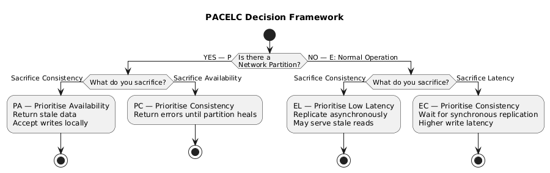
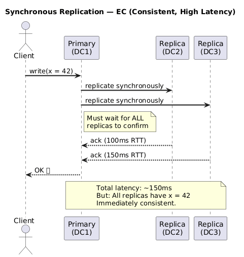
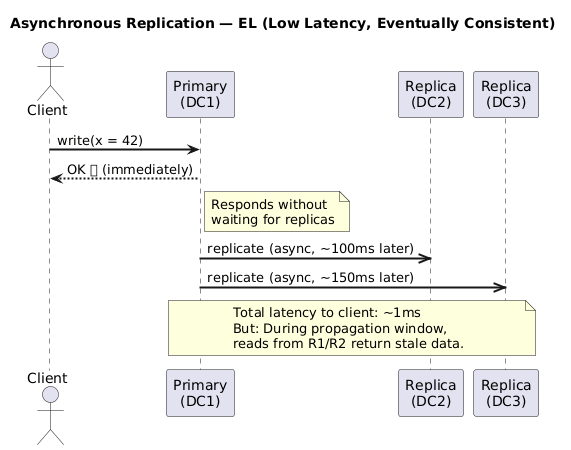
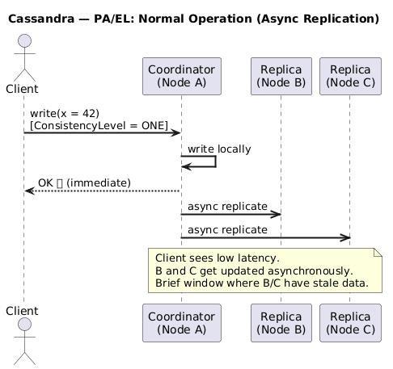
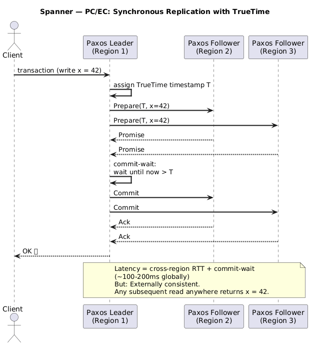
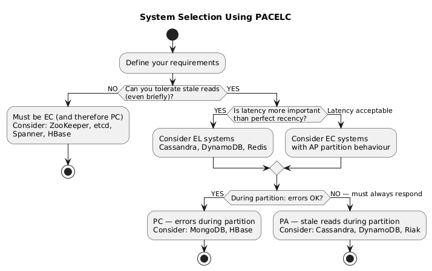

# PACELC Theorem

---

## 1. The Problem with CAP

CAP is a powerful framework, but it has a critical blind spot: **it only addresses behaviour during a network partition**. In the real world, network partitions are relatively rare. But the trade-off between consistency and latency is **constant** — it exists even when everything is working perfectly.

Daniel Abadi (Yale University) identified this gap and proposed the **PACELC theorem** in 2010 (published 2012):

> *"In case of network Partitioning (P), one has to choose between Availability (A) and Consistency (C) (as per the CAP theorem), but Else (E), even when the system is running normally in the absence of partitions, one has to choose between Latency (L) and Consistency (C)."*
> — Daniel Abadi, 2012

---

## 2. PACELC Defined

The full acronym breaks down as:

```
P  →  A/C   (during Partition: choose Availability or Consistency)
   |
   E  →  L/C   (Else: choose Latency or Consistency)
```



---

## 3. Why the E/L-C Trade-off Matters

Consider a write operation in a system with 3 replicas across 3 data centres:

### Option A: Synchronous Replication (EC — High Consistency, High Latency)



### Option B: Asynchronous Replication (EL — Low Latency, Eventual Consistency)



The latency difference is not subtle — it can be **10–100x** for geographically distributed systems. This is why the E/L-C trade-off matters as much as the partition trade-off.

---

## 4. PACELC Classification of Real Systems

### 4.1 Classification Table

| System | Partition Behaviour | Else Behaviour | PACELC Class | Notes |
|---|---|---|---|---|
| **DynamoDB** | Availability | Latency | PA/EL | Default config; tunable to PC/EC |
| **Cassandra** | Availability | Latency | PA/EL | Tunable; default eventual consistency |
| **Riak** | Availability | Latency | PA/EL | Vector clock conflict resolution |
| **Amazon S3** | Availability | Latency | PA/EL | Eventual consistency for some ops |
| **ZooKeeper** | Consistency | Consistency | PC/EC | All writes go through leader |
| **HBase** | Consistency | Consistency | PC/EC | Zookeeper-backed; strong consistency |
| **etcd** | Consistency | Consistency | PC/EC | Raft-based; used for K8s state |
| **Google Spanner** | Consistency | Consistency | PC/EC | TrueTime; globally consistent |
| **MongoDB** | Consistency | Latency | PC/EL | Default: strong C during partition, async replication |
| **MySQL (sync replication)** | Consistency | Consistency | PC/EC | Synchronous slaves |
| **CouchDB** | Availability | Latency | PA/EL | Multi-master, MVCC |
| **VoltDB** | Consistency | Consistency | PC/EC | In-memory; full ACID |
| **Redis (cluster)** | Availability | Latency | PA/EL | Asynchronous replication |

### 4.2 PACELC Spectrum Diagram

```
                PA/EL ◄─────────────────────► PC/EC
                (AP)                           (CP)
                
High            Cassandra                   ZooKeeper
Availability    DynamoDB                    etcd
                Riak                        Spanner
                CouchDB                     HBase
                                            VoltDB

                         MongoDB
                         (PC/EL — middle ground)
Low
Latency         ◄──────────────────────────────────►  High
                                                       Latency / High Consistency
```

---

## 5. The PACELC Matrix

```
              ┌──────────────┬──────────────┐
              │  EL          │  EC          │
              │ (Low Latency)│ (Consistent) │
  ┌───────────┼──────────────┼──────────────┤
  │ PA        │ PA/EL        │ PA/EC        │
  │(Available)│ Dynamo,      │ Rare — high  │
  │           │ Cassandra    │ availability │
  │           │ Riak         │ + strong C   │
  ├───────────┼──────────────┼──────────────┤
  │ PC        │ PC/EL        │ PC/EC        │
  │(Consistent│ MongoDB      │ ZooKeeper,   │
  │  on part.)│ (default)    │ etcd, HBase, │
  │           │              │ Spanner      │
  └───────────┴──────────────┴──────────────┘
```

---

## 6. Deep Dive: PA/EL Systems (e.g., Cassandra)

Cassandra is the canonical PA/EL system:

- **During partition:** Nodes on either side continue accepting reads and writes. Partition is resolved later using reconciliation.
- **During normal operation:** Writes are acknowledged after a configurable number of replicas respond (`W`). With `W=1`, the primary acknowledges immediately — low latency but stale reads possible.



---

## 7. Deep Dive: PC/EC Systems (e.g., Google Spanner)

Spanner is the canonical PC/EC system — it achieves strong consistency at global scale:

- **During partition:** Spanner's Paxos groups refuse to commit if a majority cannot be reached. Operations wait or return errors.
- **During normal operation:** Spanner uses **TrueTime** — GPS and atomic clock-based timestamps — to establish a global ordering of transactions. Every write waits for the commit timestamp to be in the past (commit-wait), adding latency but guaranteeing external consistency.



---

## 8. CAP vs PACELC — Side-by-Side

| Aspect | CAP | PACELC |
|---|---|---|
| **When does it apply?** | Only during partitions | Always (partition and normal operation) |
| **Trade-offs captured** | C vs A (during partition) | C vs A (partition) + C vs L (always) |
| **What it misses** | Latency-consistency trade-off in normal ops | Nothing — PACELC is a superset |
| **Complexity** | Simple, memorable | More nuanced, more accurate |
| **Practical value** | Good for reasoning about partition failures | Better for engineering system selection |

---

## 9. Choosing a System Using PACELC

Use this decision tree when selecting a data store:



### Quick Reference for System Selection

| Business Need | Recommended Class | Example Systems |
|---|---|---|
| Financial transactions, strong ACID | PC/EC | Spanner, VoltDB, CockroachDB |
| Distributed coordination, locks | PC/EC | ZooKeeper, etcd |
| Time-series metrics, high-write | PA/EL | Cassandra, InfluxDB |
| Global user profiles, shopping carts | PA/EL | DynamoDB, Cassandra |
| Document storage, flexible schema | PC/EL | MongoDB |
| Caching layer | PA/EL | Redis |
| Event streaming | PC/EL | Kafka (with acks=all) |
| Session management | PA/EL | Redis, DynamoDB |

---

## 10. Key Takeaways

- CAP only addresses behaviour during partitions; PACELC extends it to normal operation
- Even without partitions, there is a fundamental trade-off between **consistency** and **latency**
- Synchronous replication → EC (consistent, higher latency)
- Asynchronous replication → EL (lower latency, eventual consistency)
- PACELC gives four classes: PA/EL, PA/EC, PC/EL, PC/EC
- Most systems fall into PA/EL (Cassandra, DynamoDB) or PC/EC (ZooKeeper, Spanner)
- PACELC is a more complete model for real system design decisions than CAP alone

---

← [CP vs AP Systems](./05-cp-ap-systems.md) | [Back to README](./README.md)
