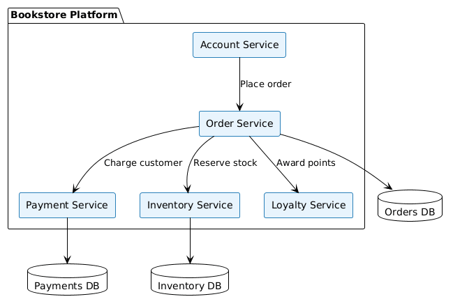
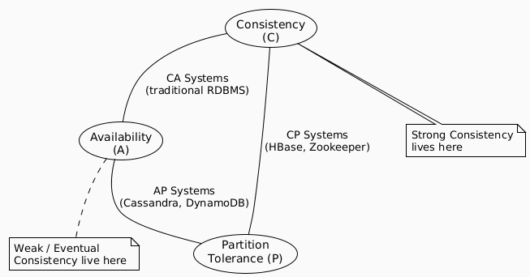

# Consistency Patterns in Distributed Systems

> **"In a distributed system, you can have consistency, availability, or partition tolerance — but only two of the three."**
> — CAP Theorem (Brewer, 2000)

---

## What is a Distributed System?

A **distributed system** is a collection of independent components located on different networked computers that communicate and coordinate their actions by passing messages — all working toward a common goal.

### Real-World Example: A Bookstore Platform



When a user buys a book, at least three services must coordinate:
- **Order Service** — records the order
- **Payment Service** — processes the charge
- **Inventory Service** — decrements stock

The question of *how consistent* the data must be across these services at any point in time is what **Consistency Patterns** address.

---

## Why Does Consistency Matter?

Imagine two customers looking at the last copy of a book simultaneously:

| Event | Time | Customer A | Customer B |
|-------|------|------------|------------|
| Both view book | T+0 | Stock = 1 | Stock = 1 |
| A places order | T+1 | Order confirmed | Stock still = 1 (stale read) |
| B places order | T+2 | — | Order confirmed ❌ |
| Inventory updated | T+3 | Stock = 0 | Stock = -1 💥 |

This **inconsistency** is the exact problem consistency patterns are designed to solve.

---

## The Three Consistency Patterns

| Pattern | Guarantee | Availability | Latency | Best For |
|---------|-----------|-------------|---------|---------|
| [Strong Consistency](./strong-consistency.md) | All reads reflect the latest write | Lower | Higher | Financial systems, inventory |
| [Weak Consistency](./weak-consistency.md) | Reads may not reflect recent writes | Highest | Lowest | Real-time gaming, VoIP, live video |
| [Eventual Consistency](./eventual-consistency.md) | Reads will *eventually* reflect all writes | High | Low | Social feeds, DNS, shopping carts |

---

## Notes Index

| File | Description |
|------|-------------|
| [`strong-consistency.md`](./strong-consistency.md) | Deep-dive into Strong Consistency — how it works, trade-offs, and real-world use |
| [`weak-consistency.md`](./weak-consistency.md) | Deep-dive into Weak Consistency — fire-and-forget semantics and when to use them |
| [`eventual-consistency.md`](./eventual-consistency.md) | Deep-dive into Eventual Consistency — async replication and convergence strategies |
| [`comparison.md`](./comparison.md) | Side-by-side comparison of all three patterns with decision framework |

---

## The Core Trade-off (CAP Theorem)



> **Key Insight:** In practice, network partitions are *unavoidable* in distributed systems. So the real choice is between **Consistency** and **Availability** when a partition occurs.

---

## Quick Decision Guide

```
Is data loss / stale data completely unacceptable?
├── YES → Strong Consistency
│         (banking, inventory, reservations)
└── NO  → Can you tolerate temporary inconsistency?
          ├── YES, and convergence is OK → Eventual Consistency
          │         (social media, DNS, caches)
          └── YES, even permanently → Weak Consistency
                    (gaming, real-time streams, metrics)
```
