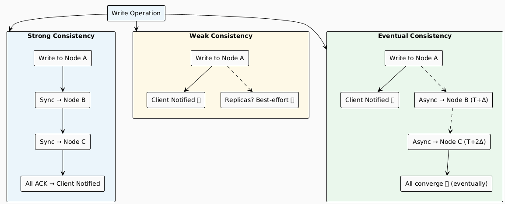
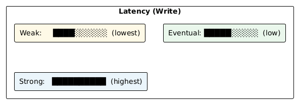
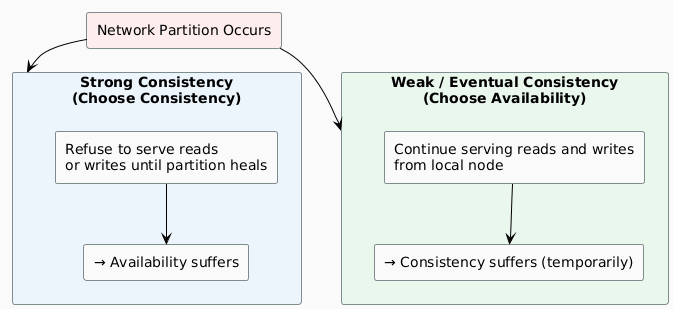
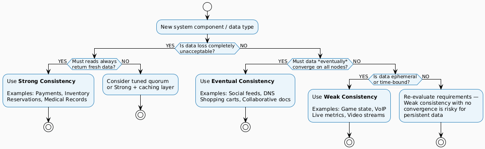
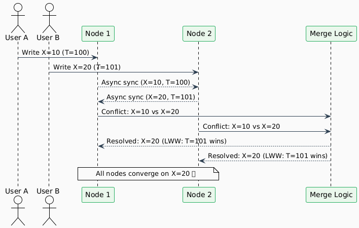
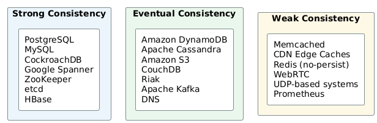

# Consistency Patterns — Comparison

---

## At a Glance

| Property | Strong Consistency | Weak Consistency | Eventual Consistency |
|----------|:-----------------:|:----------------:|:-------------------:|
| **Definition** | All reads reflect latest write | Reads may never reflect recent writes | Reads will *eventually* reflect all writes |
| **Convergence Guarantee** | Immediate | ❌ None | ✅ Yes (async) |
| **Replication Mode** | Synchronous | Best-effort / none | Asynchronous |
| **Read Staleness** | Never stale | May always be stale | Temporarily stale |
| **Write Latency** | High | Lowest | Low |
| **Read Latency** | Medium–High | Lowest | Low |
| **Availability** | Lower | Highest | High |
| **Throughput** | Lower | Highest | High |
| **CAP Position** | CP | AP | AP |
| **Data Durability** | Highest | Lowest | High |
| **Complexity** | Low (simple to reason about) | Low (simple to implement) | Medium–High (conflict resolution) |

---

## Behaviour Under Load

---

## Latency Profile

| Operation | Strong | Eventual | Weak |
|-----------|--------|----------|------|
| **Write** | Slowest (waits for all replicas) | Fast (wait for quorum or 1 node) | Fastest (write and forget) |
| **Read** | Fast (any replica is fresh) | Fast (may be stale) | Fastest (always returns immediately) |
| **Failure Recovery** | Slowest (must re-sync before serving) | Moderate (background anti-entropy) | Instant (serve whatever is local) |

---

## Consistency vs. Availability Trade-off (CAP)

---

## Real-World Examples Side by Side

| Domain | Strong Consistency | Eventual Consistency | Weak Consistency |
|--------|-------------------|---------------------|-----------------|
| **Finance** | Bank transfers, ledger balances | Balance history export | — |
| **E-Commerce** | Inventory reservation, payment | Product catalog, reviews | Live visitor count |
| **Social Media** | — | Post feeds, likes, follows | Live view count |
| **Gaming** | Leaderboard (official) | Player profile updates | Real-time position |
| **Infrastructure** | Distributed locks (etcd/ZooKeeper) | Service discovery (Consul) | Metrics dashboards |
| **Communication** | — | Message delivery (SMS/chat) | VoIP, live video packets |
| **Content** | — | DNS records, CDN purge | CDN edge cache |

---

## Decision Flowchart

---

## Conflict Resolution Strategies

When multiple writes occur concurrently, different patterns handle them differently:

| Pattern | Conflict Handling | Strategy | Risk |
|---------|------------------|----------|------|
| **Strong** | Prevented via locking | Serialization / 2PC | Deadlocks, reduced throughput |
| **Eventual** | Detected and resolved | LWW, Vector Clocks, CRDTs | Merge errors, data anomalies |
| **Weak** | Often ignored | Last-write-wins or dropped | Data loss |

### Conflict Resolution in Practice

---

## Technology Mapping

---

## Summary Table

| | Strong | Eventual | Weak |
|--|--------|----------|------|
| **Guarantee** | Immediate consistency | Convergence over time | No guarantee |
| **Suitable for** | Finance, booking, locks | Social, DNS, carts | Gaming, VoIP, metrics |
| **Main Risk** | Lower availability | Temporary stale reads | Data loss / divergence |
| **Scaling Difficulty** | Hardest | Moderate | Easiest |
| **Conflict Possible?** | No (prevented) | Yes (resolved) | Yes (ignored) |
| **Best Technologies** | PostgreSQL, Spanner, etcd | Cassandra, DynamoDB, S3 | Memcached, CDN, UDP |

---

← [Eventual Consistency](./eventual-consistency.md) | [Back to README](./README.md)
