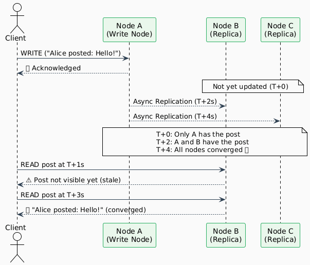
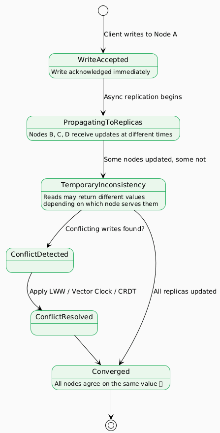
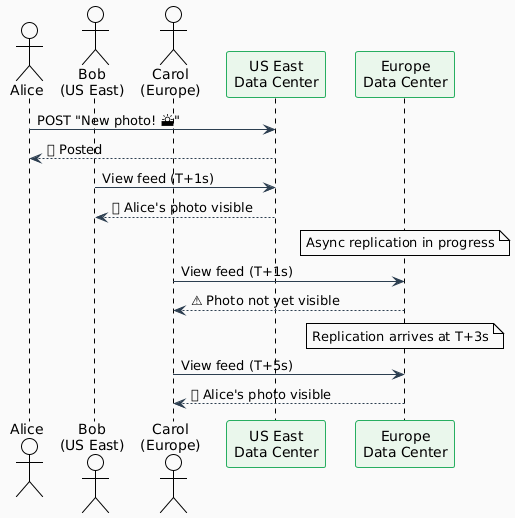
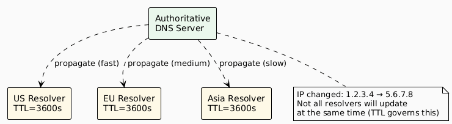
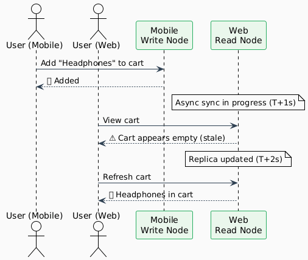

# Eventual Consistency

---

## Definition

> **After an update is made to the data, it will eventually be visible to any subsequent read operations. The data is replicated asynchronously, ensuring that all copies of the data are eventually updated.**

Eventual consistency is a specific form of weak consistency that adds one critical guarantee: **all replicas will converge to the same value — eventually** — if no new updates are made. It balances high availability and low latency with the acceptance of temporary, bounded inconsistency.

---

## How It Works

In an eventually consistent system, a write is acknowledged after landing on one (or a quorum of) node(s). Replication to other nodes happens **asynchronously** in the background. Reads may return stale data until all replicas converge.



---

## Convergence Strategies

Different systems use different strategies to resolve conflicts and drive convergence:

| Strategy | Description | Example |
|----------|-------------|---------|
| **Last-Write-Wins (LWW)** | The write with the latest timestamp wins | Cassandra (default) |
| **Vector Clocks** | Track causality across nodes to detect true conflicts | DynamoDB, Riak |
| **CRDT (Conflict-free Replicated Data Types)** | Data structures that merge automatically without conflicts | Redis, Riak |
| **Read Repair** | On a read, stale replicas are updated in the background | Cassandra |
| **Anti-Entropy (Gossip)** | Nodes periodically exchange state to reconcile differences | Cassandra, DynamoDB |
| **Application-Level Merge** | App logic defines how conflicts are resolved | Custom systems |

---

## The Convergence Lifecycle



---

## Real-World Examples

### 1. 📱 Social Media Feed (e.g., Twitter/X, Instagram)

**Scenario:** Alice posts a photo. It appears instantly in her feed, but followers in different regions may see it a few seconds later.



**Why Eventual Consistency?**
- Instagram serves 2B+ users; synchronous global replication is infeasible
- A 3–5 second delay before a post reaches all regions is imperceptible
- High availability matters more — posts must never fail to publish

---

### 2. 🌐 DNS (Domain Name System)

**Scenario:** A company changes its website's IP address. The change propagates globally over 24–48 hours.

| Time After Update | US Users | EU Users | Asia Users |
|-------------------|----------|----------|------------|
| 0 min | Old IP | Old IP | Old IP |
| 10 min | **New IP** | Old IP | Old IP |
| 2 hours | New IP | **New IP** | Old IP |
| 24 hours | New IP | New IP | **New IP** ✅ |



**Why Eventual Consistency?**
- There are millions of DNS resolvers worldwide — synchronous updates are impossible
- TTL (Time-to-Live) bounds the staleness window
- DNS has been eventually consistent since the 1980s — it is the defining example

---

### 3. 🛒 Shopping Cart (e.g., Amazon)

**Scenario:** A user adds items to their cart on mobile, then opens the web app. There may be a brief moment where the web app cart appears empty.



**Why Eventual Consistency?**
- Amazon's 2007 Dynamo paper introduced this model specifically for shopping carts
- A briefly empty cart is tolerable; failing to add items is not
- Availability > consistency for this use case

---

### 4. 🔄 Collaborative Documents (e.g., Google Docs)

**Scenario:** Two users edit the same paragraph simultaneously in different regions.

| User | Action | Their View |
|------|--------|------------|
| Alice (US) | Types "Hello World" | Sees her text immediately |
| Bob (EU) | Types "Hi Everyone" at same position | Sees his text immediately |
| T+500ms | CRDT merge occurs | Both see "Hello World Hi Everyone" (merged) |

**Conflict Resolution:** Google Docs uses **Operational Transformation (OT)** / CRDT to merge concurrent edits without losing either user's changes.

---

### 5. 🏪 Product Availability on E-Commerce

**Scenario:** A flash sale starts. Inventory counts may be slightly stale for seconds.

| Approach | Behavior | Consequence |
|----------|----------|-------------|
| Strong Consistency | Lock inventory row on every read | Slow pages, lock contention at scale |
| Eventual Consistency | Show approximate stock | Rare oversell (handled by backorder logic) |

**Why Eventual Consistency?**
- At peak sales (Black Friday), the write throughput on inventory tables is massive
- A brief oversell handled by backorder is cheaper than a site outage
- Stock counts are an approximation anyway (shrinkage, returns, etc.)

---

## Technologies That Implement Eventual Consistency

| Technology | Mechanism | Use Case |
|------------|-----------|----------|
| **Amazon DynamoDB** | Vector clocks + quorum | Shopping carts, session state |
| **Apache Cassandra** | Gossip protocol + read repair | Time-series, IoT, social graphs |
| **Amazon S3** | Asynchronous cross-region replication | Object storage |
| **Couchbase / CouchDB** | MVCC + replication | Offline-first mobile apps |
| **Riak** | Vector clocks + CRDT | Distributed key-value store |
| **Apache Kafka** | Log replication | Event streaming |
| **DNS** | TTL-based cache expiry | Global name resolution |

---

## Tuning Consistency in Eventual Systems

Many eventually consistent databases allow you to tune the consistency level per-operation using **quorum reads/writes**:

```
N = total replica count
W = write quorum (nodes that must ACK write)
R = read quorum (nodes that must respond to read)

Eventual:          W=1, R=1   → fastest, least consistent
Strong (tuned):    W+R > N    → slower, most consistent
Balanced:          W=2, R=2, N=3 → good middle ground
```

| Profile | W | R | Behaviour |
|---------|---|---|-----------|
| Write-optimised | 1 | 1 | Fast writes, stale reads possible |
| Read-optimised | 3 | 1 | Slow writes, always-fresh reads |
| Balanced | 2 | 2 | Moderate on both |
| Strong (N=3) | 2 | 2 | `W+R=4 > 3`, effectively strong |

---

## When to Use Eventual Consistency

✅ **Use it when:**
- High availability is a top requirement
- Low latency at global scale is needed
- Short periods of stale data are acceptable to users
- Data is naturally append-heavy (posts, events, logs)
- You can handle conflicts at the application layer (or use CRDTs)

❌ **Avoid it when:**
- Operations require atomicity across entities (bank transfers)
- Reading stale data causes incorrect business decisions (inventory, booking)
- The system needs to enforce uniqueness constraints (usernames, IDs)

---

## Summary

| | |
|--|--|
| **Consistency Level** | Eventual (guaranteed convergence) |
| **Replication Mode** | Asynchronous |
| **CAP Position** | AP (Availability + Partition Tolerance) |
| **Latency** | Low |
| **Availability** | High |
| **Use Cases** | Social feeds, DNS, shopping carts, collaborative tools, object storage |

---

← [Weak Consistency](./weak-consistency.md) | [Back to README](./README.md) | [Comparison →](./comparison.md)
