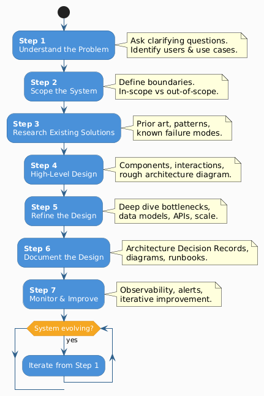
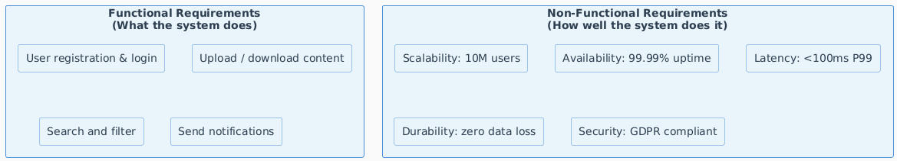
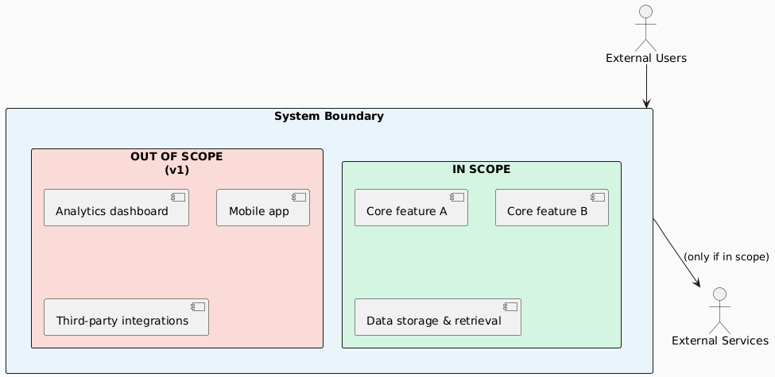
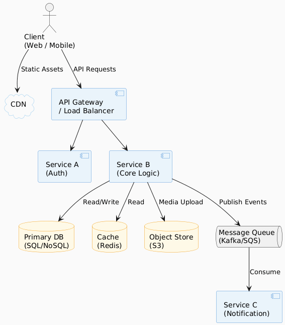
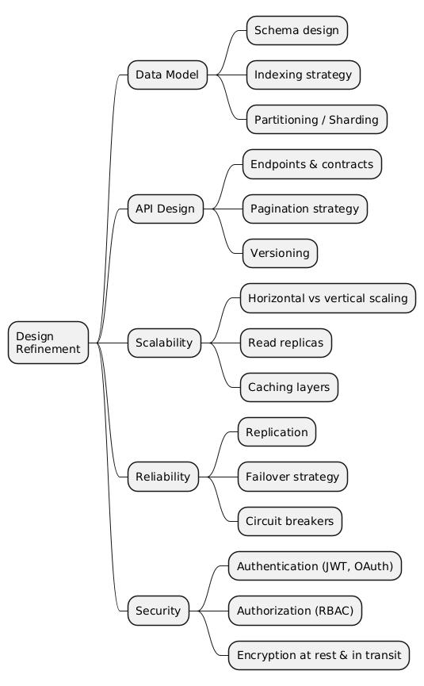
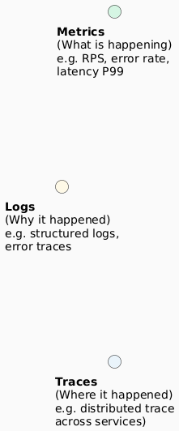
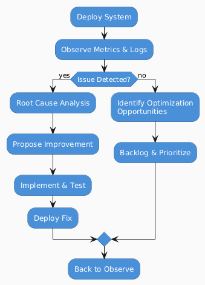

# 01 — How To: System Design

> **The difference between a good engineer and a great one is process.**  
> Great system design isn't about knowing every technology — it's about asking the right questions, making intentional trade-offs, and communicating decisions clearly.

---

## Overview — The 7-Step Process



---

## Step 1 — Understand the Problem

> **Never start designing until you fully understand what you're building and for whom.**

### Key Questions to Ask

| Category | Questions |
|----------|-----------|
| **Users** | Who are the users? How many (DAU/MAU)? Technical or non-technical? |
| **Use Cases** | What are the primary actions users perform? Edge cases? |
| **Data** | What data is being created, stored, and retrieved? What's the read/write ratio? |
| **Scale** | Expected traffic now? In 1 year? 5 years? |
| **Latency** | What are acceptable response times? Real-time or batch? |
| **Availability** | What is the required uptime? (99.9%? 99.99%?) |
| **Constraints** | Budget limits? Regulatory requirements? Existing infrastructure? |

### Functional vs. Non-Functional Requirements



### Common Non-Functional Requirement Targets

| Property | Typical Target | Notes |
|----------|---------------|-------|
| **Availability** | 99.9% – 99.999% | 99.9% = ~8.7 hrs downtime/year; 99.999% = ~5 min/year |
| **Latency (P99)** | < 100ms – 500ms | APIs typically < 200ms; search < 500ms |
| **Throughput** | Depends on scale | Define as RPS (requests per second) |
| **Durability** | 99.999999999% (11 nines) | Standard for object storage like S3 |
| **Consistency** | Strong / Eventual | Trade-off with availability (CAP theorem) |

---

## Step 2 — Identify the Scope

> **A system you don't define will grow to fill all available time and complexity.**

### Scoping Framework



### Scope Checklist

- [ ] List all features the system **must** support
- [ ] List all features **explicitly excluded** from this version
- [ ] Define external systems and integration points
- [ ] Agree on the number of users / scale being designed for
- [ ] Clarify data ownership and retention policies

---

## Step 3 — Research Existing Solutions

> **Don't reinvent the wheel. Understand why it's round first.**

### What to Look For

| Area | What to Research |
|------|-----------------|
| **Architecture Patterns** | How do similar systems (Twitter, Netflix, Uber) solve this? |
| **Technology Choices** | What databases, queues, or frameworks are industry standard for this problem? |
| **Known Failure Modes** | What has broken at scale? (See: AWS post-mortems, SRE books) |
| **Trade-offs** | Why did teams choose Kafka over RabbitMQ? Postgres over MySQL? |
| **Open Source** | Can an existing tool (Elasticsearch, Redis, Cassandra) solve part of this? |

### Useful Resources

| Resource | Best For |
|----------|----------|
| [High Scalability Blog](http://highscalability.com) | Real-world architecture case studies |
| [AWS Architecture Center](https://aws.amazon.com/architecture/) | Cloud reference architectures |
| [Martin Fowler's Blog](https://martinfowler.com) | Patterns, microservices, DDD |
| [The SRE Book (Google)](https://sre.google/sre-book/table-of-contents/) | Reliability, SLAs, on-call |
| [DDIA (Kleppmann)](https://dataintensive.net) | Data systems deep dive |

---

## Step 4 — Create a High-Level Design

> **Start broad, then drill down. A 30,000-foot view before the 300-foot view.**

### High-Level Architecture Template



### Component Reference Table

| Component | Purpose | Common Technologies |
|-----------|---------|---------------------|
| **Load Balancer** | Distribute traffic across instances | Nginx, HAProxy, AWS ALB |
| **API Gateway** | Auth, rate limiting, routing | Kong, AWS API GW, Envoy |
| **Application Server** | Business logic | Node.js, Go, Java Spring |
| **Relational DB** | Structured data, ACID transactions | PostgreSQL, MySQL |
| **NoSQL DB** | Flexible schema, high write throughput | MongoDB, DynamoDB, Cassandra |
| **Cache** | Reduce latency, offload DB reads | Redis, Memcached |
| **Message Queue** | Async communication, decoupling | Kafka, RabbitMQ, SQS |
| **Object Store** | Unstructured files (images, video) | S3, GCS, Azure Blob |
| **CDN** | Low-latency static asset delivery | Cloudflare, CloudFront, Fastly |
| **Search Engine** | Full-text and faceted search | Elasticsearch, OpenSearch |

---

## Step 5 — Refine the Design

> **The devil is in the details. This is where good designs become great ones.**

### Deep Dive Areas



### Trade-off Decision Matrix

| Decision | Option A | Option B | Choose A When | Choose B When |
|----------|----------|----------|---------------|---------------|
| **DB Type** | SQL | NoSQL | Complex queries, ACID needed | Flexible schema, massive scale |
| **Consistency** | Strong | Eventual | Financial data, inventory | Social feeds, analytics |
| **Communication** | Sync (REST) | Async (Queue) | Immediate response needed | High throughput, decoupling needed |
| **Caching Strategy** | Cache-aside | Write-through | Read-heavy, occasional updates | Write-heavy, must-be-fresh reads |
| **Scaling** | Vertical | Horizontal | Simple, low-traffic | High availability, large scale |

---

## Step 6 — Document the Design

> **If it isn't written down, it doesn't exist.**

### Documentation Artifacts

| Artifact | Purpose | Audience |
|----------|---------|----------|
| **Architecture Diagram** | Visual overview of components | All stakeholders |
| **Architecture Decision Record (ADR)** | Why a specific decision was made | Engineers, future maintainers |
| **API Contract (OpenAPI/Proto)** | Interface specification | Frontend, partners, consumers |
| **Data Dictionary** | Table/field definitions and ownership | Engineers, data team |
| **Runbook** | Operational procedures (deploys, incidents) | SRE / Ops team |
| **Capacity Plan** | Current vs projected resource usage | Engineering, management |

### ADR Template

```markdown
## ADR-001: [Short Title of Decision]

**Status:** Accepted | Proposed | Deprecated

**Context:**
What problem are we solving? What forces are at play?

**Decision:**
What did we decide to do?

**Consequences:**
- ✅ Positive outcomes
- ⚠️ Trade-offs accepted
- ❌ Known risks
```

---

## Step 7 — Monitor & Improve

> **A deployed system is not a finished system. It's a hypothesis in production.**

### The Observability Triad



### Key Metrics to Track

| Metric Category | Specific Metrics | Alert Threshold Example |
|-----------------|-----------------|------------------------|
| **Traffic** | RPS, bandwidth | Spike > 2x baseline |
| **Errors** | Error rate (4xx, 5xx) | > 1% error rate |
| **Latency** | P50, P95, P99 response time | P99 > 500ms |
| **Saturation** | CPU, memory, disk, queue depth | CPU > 80% sustained |
| **Business** | DAU, conversion rate, revenue/hour | Drop > 10% from baseline |

### Continuous Improvement Loop



---

## Summary Cheat Sheet

| Step | Primary Output | Time in Interview |
|------|---------------|-------------------|
| 1. Understand the Problem | Requirement list | ~5 min |
| 2. Scope the System | Scoped feature set + constraints | ~3 min |
| 3. Research | Informed technology choices | (Pre-interview study) |
| 4. High-Level Design | Architecture diagram | ~10 min |
| 5. Refine | API, data model, scale deep-dive | ~20 min |
| 6. Document | ADRs, diagrams | (Post-design) |
| 7. Monitor | Metrics, alerts, SLOs | ~5 min |

---

*Next: [02 — Requirements & Scoping →](./02-requirements-and-scoping.md)*
