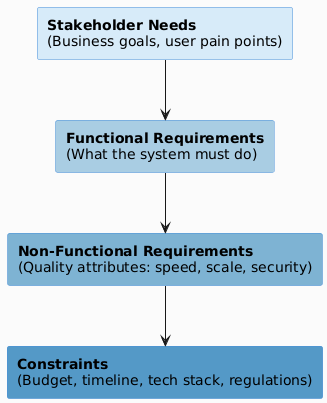
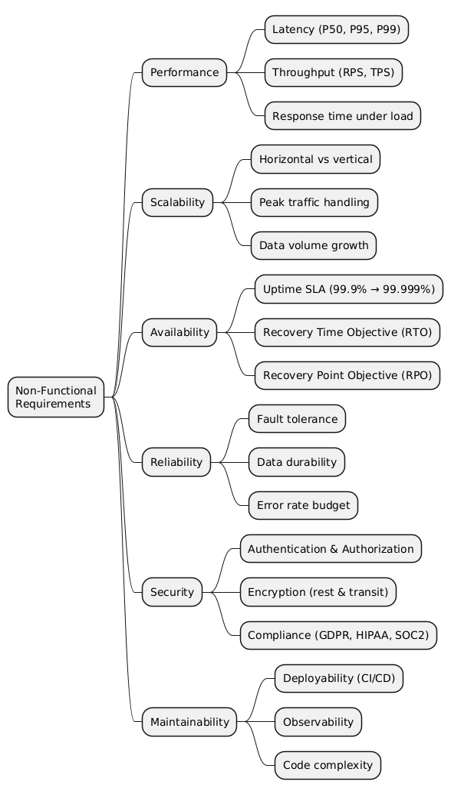
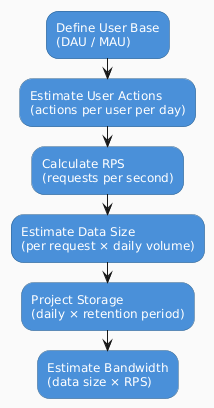

# 02 — Requirements & Scoping

> **Garbage in, garbage out. Vague requirements produce vague systems.**  
> This step is the most undervalued in system design — getting it right saves weeks of rework.

---

## The Requirements Funnel



---

## Functional Requirements

These describe **what** the system does — the features and behaviors visible to users.

### Writing Good Functional Requirements

| ❌ Vague | ✅ Precise |
|---------|----------|
| "Users can upload files" | "Authenticated users can upload files up to 5GB in formats: JPG, PNG, MP4, PDF" |
| "Fast search" | "Search results must return within 300ms for queries on up to 100M records" |
| "The system sends emails" | "The system sends transactional emails (confirmation, reset) via SMTP within 30 seconds of trigger" |

### Requirement Priority Matrix (MoSCoW)

| Priority | Label | Meaning |
|----------|-------|---------|
| 🔴 | **Must Have** | System cannot launch without this |
| 🟠 | **Should Have** | Important, but not launch-blocking |
| 🟡 | **Could Have** | Nice to have; include if time allows |
| ⚪ | **Won't Have (Now)** | Explicitly deferred to future version |

---

## Non-Functional Requirements (NFRs)

These describe **how well** the system performs its functions.

### NFR Categories



### Availability SLA Reference Table

| SLA | Downtime/Year | Downtime/Month | Downtime/Week | Suitable For |
|-----|--------------|----------------|---------------|--------------|
| 99% | 3.65 days | 7.2 hours | 1.68 hours | Internal tools |
| 99.9% | 8.76 hours | 43.8 min | 10.1 min | Standard web apps |
| 99.95% | 4.38 hours | 21.9 min | 5 min | Business-critical apps |
| 99.99% | 52.6 min | 4.38 min | 1 min | E-commerce, payments |
| 99.999% | 5.26 min | 26.3 sec | 6 sec | Financial, telecom |

---

## Capacity Estimation

> A back-of-the-envelope calculation is not about precision — it's about **order of magnitude**.

### Estimation Framework



### Useful Estimation Constants

| Constant | Value | Notes |
|----------|-------|-------|
| Seconds in a day | ~86,400 | Use 100K for easy math |
| Seconds in a month | ~2.6M | |
| 1 KB | 1,000 bytes | |
| 1 MB | 1,000 KB | |
| 1 GB | 1,000 MB | |
| 1 TB | 1,000 GB | |
| Avg tweet size | ~300 bytes | Text only |
| Avg image (compressed) | ~200 KB | JPEG thumbnail |
| Avg 4K video minute | ~100 MB | |
| SSD read speed | ~500 MB/s | Local NVMe ~3 GB/s |
| Network (1 Gbps) | ~125 MB/s | |
| Memory access | ~100 ns | |
| SSD read latency | ~100 µs | 1000x slower than RAM |
| HDD read latency | ~10 ms | 100x slower than SSD |
| Round trip (same DC) | ~0.5 ms | |
| Round trip (cross-continent) | ~100 ms | |

### Example: Estimating a Twitter-like System

| Parameter | Calculation | Result |
|-----------|------------|--------|
| Daily Active Users | Given | 200M DAU |
| Tweets per user/day | Assumption | 5 tweets/day |
| Total tweets/day | 200M × 5 | 1B tweets/day |
| Write RPS | 1B / 86,400 | ~11,600 RPS |
| Read/write ratio | Assumption | 100:1 |
| Read RPS | 11,600 × 100 | ~1.16M RPS |
| Tweet size | 300 bytes text + 200KB media | ~200 KB avg |
| Storage/day | 1B × 200 KB | ~200 TB/day |
| Storage/5 years | 200 TB × 365 × 5 | ~365 PB |

---

## Constraints Checklist

| Constraint Type | Examples |
|-----------------|---------|
| **Technical** | Must use existing stack (Java/K8s); no vendor lock-in; must support mobile |
| **Regulatory** | GDPR (EU data residency), HIPAA (health data encryption), PCI-DSS (payment card) |
| **Operational** | On-call team size; deployment frequency; incident response SLA |
| **Budget** | Cloud spend cap; number of engineers available |
| **Timeline** | MVP in 3 months; full launch in 9 months |

---

## Requirements Gathering Template

Use this template at the start of any system design:

```markdown
## System: [Name]

### Functional Requirements
- Must: 
- Should: 
- Could: 
- Won't (now): 

### Non-Functional Requirements
- Availability: ___% SLA
- Latency: P99 < ___ ms
- Throughput: ___ RPS (peak)
- Data Durability: ___
- Scale: ___ DAU, ___ MAU

### Capacity Estimates
- Users: ___ DAU / ___ MAU
- Read RPS: ___
- Write RPS: ___
- Storage/day: ___
- Total storage (5yr): ___

### Constraints
- Technical: 
- Regulatory: 
- Budget: 
- Timeline: 
```

---

*Previous: [01 — How To: System Design Process](./01-how-to-system-design.md)*  
*Next: [03 — Architecture Patterns →](./03-architecture-patterns.md)*
