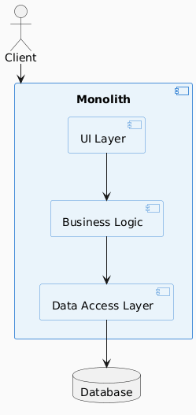
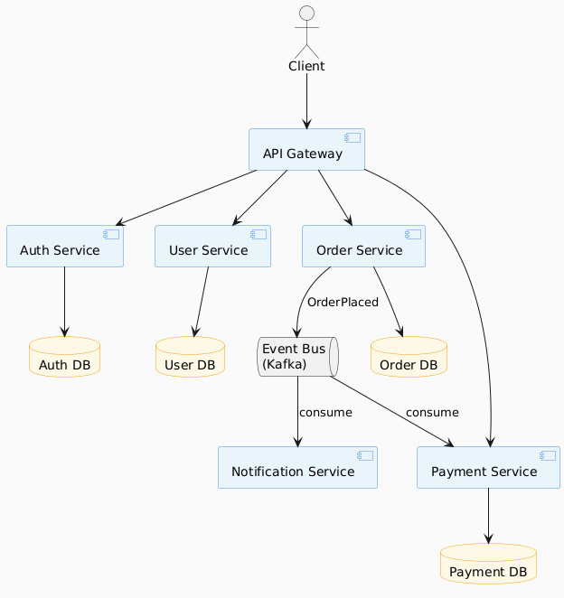
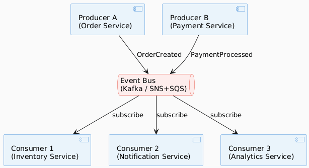
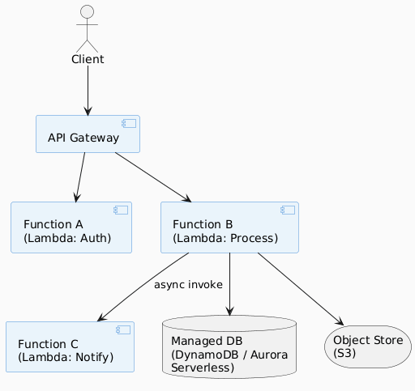
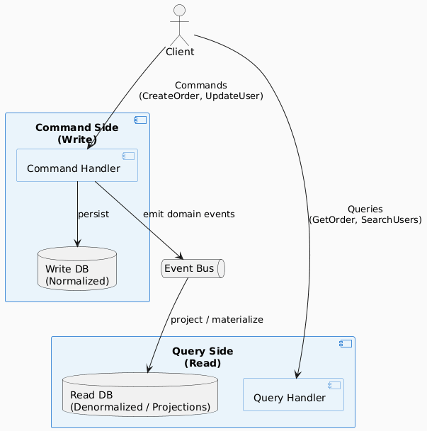
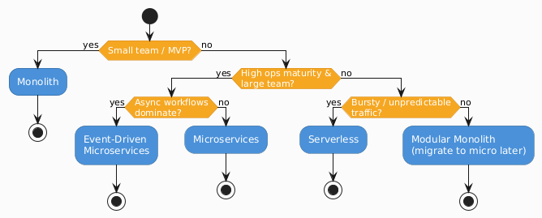

# 03 — High-Level Architecture Patterns

> **Architecture is the set of decisions that are hard to change later.**  
> Choose patterns based on your requirements — not hype.

---

## Pattern Comparison Overview

| Pattern | Best For | Avoid When | Complexity |
|---------|---------|------------|------------|
| **Monolith** | Early-stage, small teams, MVPs | Team > 10 engineers, need independent scaling | Low |
| **Microservices** | Large teams, independent scaling, polyglot | Small team, low traffic, high ops maturity needed | High |
| **Event-Driven** | Async workflows, loose coupling, auditing | Low latency required, simple CRUD apps | Medium–High |
| **Serverless** | Bursty traffic, short tasks, low ops overhead | Long-running jobs, cost-sensitive at high volume | Low–Medium |
| **CQRS** | High read/write asymmetry, complex domain | Simple apps, small teams | High |
| **Lambda / Hexagonal** | Domain-rich apps, testability | Simple services | Medium |

---

## 1. Monolithic Architecture

### Pros & Cons

| ✅ Pros | ❌ Cons |
|--------|--------|
| Simple to develop and debug | Hard to scale individual components |
| Easy local development | Long build/deploy cycles |
| Low operational overhead | Team coupling and merge conflicts |
| Fast inter-module calls | Tech stack lock-in |
| Great for MVPs | Reliability: one bug can crash everything |

**When to Use:** Early product, < 5 engineers, unclear domain boundaries.

---

## 2. Microservices Architecture

### Pros & Cons

| ✅ Pros | ❌ Cons |
|--------|--------|
| Independent deployment & scaling | Distributed systems complexity |
| Technology flexibility per service | Network latency between services |
| Team autonomy (Conway's Law) | Distributed tracing required |
| Fault isolation | Data consistency challenges |
| Smaller codebases per service | High operational overhead |

### Microservices Design Principles

| Principle | Description |
|-----------|-------------|
| **Single Responsibility** | Each service owns one bounded context |
| **Database per Service** | No shared databases between services |
| **Smart Endpoints, Dumb Pipes** | Logic in services, not in the message bus |
| **Design for Failure** | Circuit breakers, retries, timeouts |
| **Decentralized Governance** | Teams choose their own tech within guidelines |

---

## 3. Event-Driven Architecture

### Event Types

| Type | Description | Example |
|------|-------------|---------|
| **Event Notification** | Lightweight signal, minimal data | `UserSignedUp { userId }` |
| **Event-Carried State Transfer** | Contains full entity state | `OrderUpdated { id, items, total, status }` |
| **Event Sourcing** | Events *are* the source of truth | Full audit log of all state changes |

### Pros & Cons

| ✅ Pros | ❌ Cons |
|--------|--------|
| Loose coupling | Eventual consistency |
| Highly scalable consumers | Harder to debug (async flow) |
| Natural audit trail | Message ordering challenges |
| Easy to add new consumers | Idempotency required |
| Resilient to downstream failures | Schema evolution complexity |

---

## 4. Serverless Architecture

### Pros & Cons

| ✅ Pros | ❌ Cons |
|--------|--------|
| No server management | Cold start latency |
| Scales to zero (cost efficient) | Execution time limits |
| Pay-per-execution pricing | Vendor lock-in |
| Fast to deploy small functions | Difficult local development |
| Great for bursty/unpredictable traffic | Expensive at constant high volume |

---

## 5. CQRS — Command Query Responsibility Segregation

### When to Use CQRS

| Use CQRS | Avoid CQRS |
|----------|------------|
| High read/write asymmetry | Simple CRUD applications |
| Complex query projections needed | Small teams or early-stage product |
| Event sourcing (natural pairing) | Low data volume |
| Multiple read models required | Strong consistency required everywhere |

---

## Architecture Selection Guide

---

## Key Principle: Conway's Law

> *"Organizations which design systems are constrained to produce designs which are copies of the communication structures of those organizations."*  
> — Melvin Conway, 1967

**Implication:** Your architecture will mirror your team structure. Design your teams and architecture together.

| Team Structure | Natural Architecture |
|---------------|---------------------|
| 1 small team | Monolith |
| Multiple product teams | Microservices |
| Platform + product teams | Platform (shared infra) + product services |
| Federated teams | Domain-driven microservices |

---

*Previous: [02 — Requirements & Scoping](./02-requirements-and-scoping.md)*  
*Next: [04 — Data Layer Design →](./04-data-layer.md)*
