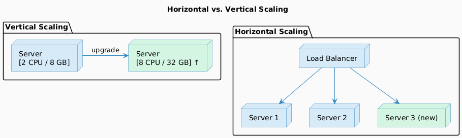
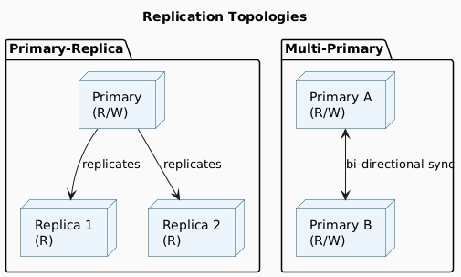
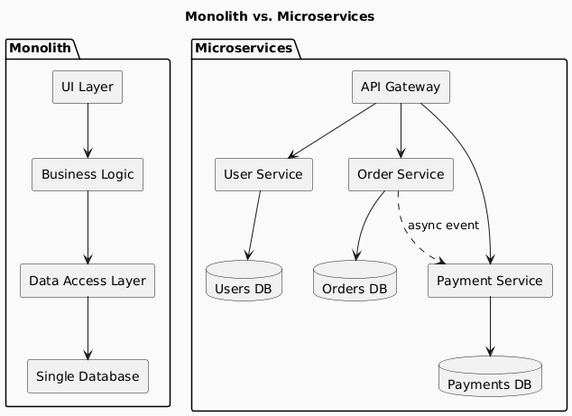
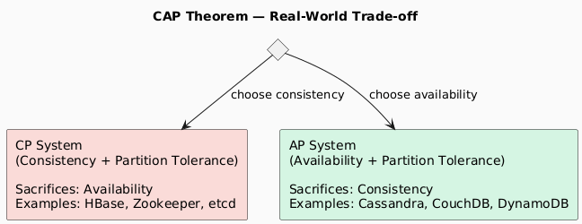
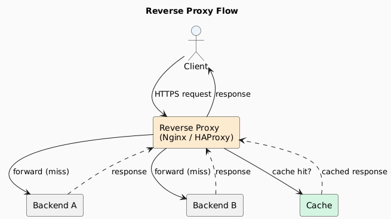
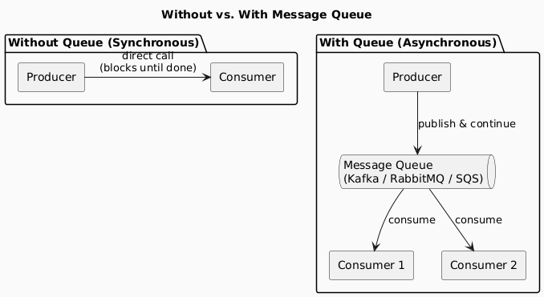
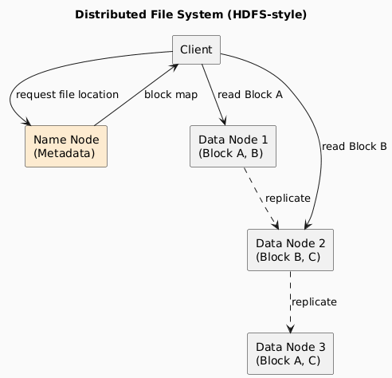

# 01 — Fundamentals

> Core building blocks every system designer must internalize before tackling patterns or examples.

---

## Contents
1. [Horizontal vs. Vertical Scaling](#1-horizontal-vs-vertical-scaling)
2. [Redundancy and Replication](#2-redundancy-and-replication)
3. [Microservices Architecture](#3-microservices-architecture)
4. [CAP Theorem](#4-cap-theorem)
5. [Proxy Servers](#5-proxy-servers)
6. [Message Queues](#6-message-queues)
7. [File Systems](#7-file-systems)

---

## 1. Horizontal vs. Vertical Scaling

### Definitions

| Dimension | Horizontal Scaling (Scale Out) | Vertical Scaling (Scale Up) |
|-----------|-------------------------------|----------------------------|
| **Mechanism** | Add more nodes/servers | Add more CPU/RAM/storage to existing node |
| **Cost curve** | Near-linear; commodity hardware | Exponential; premium hardware |
| **Downtime** | None (rolling additions) | Often required during upgrade |
| **Ceiling** | Practically unlimited | Hard hardware ceiling |
| **Complexity** | Higher (distributed coordination) | Lower (single machine) |
| **Failure domain** | Partial — one node failure is non-fatal | Total — single point of failure |
| **Best for** | Stateless services, web tiers, caches | Databases, legacy monoliths |
| **Common tools** | Load balancers, Kubernetes, sharding | Cloud instance type upgrades |

### Architecture Diagram

### When to Choose Which

- **Start vertical** when you have a single database or stateful service and need a quick capacity boost.
- **Move horizontal** when you hit hardware ceilings, need zero-downtime scaling, or run stateless workloads.
- In practice, **most production systems combine both**: a handful of large vertical nodes behind a horizontally scalable load-balanced tier.

---

## 2. Redundancy and Replication

### Definitions

| Concept | Purpose | Scope |
|---------|---------|-------|
| **Redundancy** | Eliminate single points of failure by duplicating components | Infrastructure (servers, power, network) |
| **Replication** | Keep multiple up-to-date copies of data | Data (databases, file systems) |

These are complementary: redundancy keeps the *service* alive; replication keeps the *data* safe and consistent.

### Replication Topologies

| Topology | Consistency | Write Throughput | Conflict Risk |
|----------|-------------|-----------------|---------------|
| **Primary–Replica** | Strong (synchronous) or eventual (async) | Limited to primary | None |
| **Multi-Primary** | Eventual | High | Yes — needs conflict resolution |

> **Rule of thumb:** Use primary–replica for most OLTP systems. Use multi-primary only when geographic write latency is a hard requirement.

---

## 3. Microservices Architecture

### Monolith vs. Microservices

### Trade-off Matrix

| Concern | Monolith | Microservices |
|---------|----------|--------------|
| **Development simplicity** | ✅ Simple | ❌ Complex (distributed systems) |
| **Deployment** | ✅ Single artifact | ❌ Many moving parts |
| **Independent scaling** | ❌ Scale all-or-nothing | ✅ Scale per service |
| **Independent deployment** | ❌ Full redeploy required | ✅ Deploy individual services |
| **Fault isolation** | ❌ One bug can crash all | ✅ Failures are contained |
| **Data consistency** | ✅ Single database transactions | ❌ Distributed transactions needed |
| **Latency** | ✅ In-process calls | ❌ Network hops between services |
| **Observability** | ✅ Easier to trace | ❌ Requires distributed tracing |

> **Start with a monolith.** Extract microservices only when clear scalability or team boundaries demand it. Premature decomposition is a common and costly mistake.

---

## 4. CAP Theorem

### Statement

> A distributed system can satisfy **at most two** of the following three guarantees simultaneously:

| Guarantee | Symbol | Definition |
|-----------|--------|-----------|
| **Consistency** | C | Every read returns the most recent write (or an error) |
| **Availability** | A | Every request receives a (non-error) response |
| **Partition Tolerance** | P | The system continues operating despite network partitions |

### The Inescapable Reality

**Network partitions happen.** In any real distributed system, P is non-negotiable. Therefore, the real choice is:

| System Type | Behaviour During Partition | Examples |
|-------------|--------------------------|---------|
| **CP** | Returns error or waits until consistent | HBase, ZooKeeper, etcd, MongoDB (strong) |
| **AP** | Returns potentially stale data | Cassandra, DynamoDB, CouchDB |

> **CA (Consistency + Availability without Partition Tolerance)** is only possible in a single-node system — irrelevant for distributed design.

### Nuance: PACELC

CAP only describes behaviour during partitions. PACELC extends this:

> If Partitioned → trade-off between **A** and **C**.  
> Else (normal operation) → trade-off between **L**atency and **C**onsistency.

---

## 5. Proxy Servers

### Types

| Type | Direction | Common Uses |
|------|-----------|-------------|
| **Forward Proxy** | Client → Internet | Anonymization, content filtering, caching for clients |
| **Reverse Proxy** | Internet → Backend servers | Load balancing, SSL termination, caching, WAF |
| **API Gateway** | Clients → Microservices | Auth, rate limiting, routing, request aggregation |

### Reverse Proxy Architecture

### Key Capabilities

| Capability | Description |
|------------|-------------|
| **Load balancing** | Distribute requests across backend instances |
| **SSL termination** | Decrypt TLS once at the proxy; backends use plain HTTP |
| **Caching** | Store responses; reduce backend load |
| **Compression** | Gzip/Brotli responses at the edge |
| **Rate limiting** | Throttle abusive clients |
| **Web Application Firewall** | Block malicious payloads |

---

## 6. Message Queues

### Why Message Queues?

Direct synchronous calls between services create tight coupling. Message queues introduce **asynchrony** and **buffering**:

### Comparison of Popular Message Queues

| Feature | Kafka | RabbitMQ | AWS SQS |
|---------|-------|----------|---------|
| **Model** | Log-based pub/sub | AMQP broker | Managed queue |
| **Message retention** | Configurable (days/forever) | Until consumed | Up to 14 days |
| **Ordering** | Per-partition | Per-queue (optional) | Best-effort (FIFO queue for strict) |
| **Throughput** | Very high (millions/sec) | High | High |
| **Replay** | ✅ Yes | ❌ No | ❌ No |
| **Consumer groups** | ✅ Yes | ✅ (via exchanges) | ❌ Single consumer per message |
| **Best for** | Event streaming, audit logs | Task queues, RPC | Simple decoupling on AWS |

### Properties Enabled

| Property | How Queues Help |
|----------|----------------|
| **Decoupling** | Producer/consumer are unaware of each other |
| **Buffering** | Queue absorbs traffic spikes; consumer processes at own rate |
| **Fault tolerance** | Messages persist if consumer is temporarily down |
| **Scalability** | Add more consumers to scale processing horizontally |

---

## 7. File Systems

### Local vs. Distributed

| Dimension | Local File System | Distributed File System |
|-----------|-----------------|------------------------|
| **Storage scope** | Single device | Multiple nodes across a network |
| **Fault tolerance** | Low (single disk failure = data loss) | High (replication across nodes) |
| **Scalability** | Limited by hardware | Scales horizontally |
| **Latency** | Very low (local I/O) | Higher (network I/O) |
| **Examples** | ext4, NTFS, APFS | HDFS, GlusterFS, Ceph, Amazon S3 |
| **Best for** | Local dev, single-server apps | Big data, media storage, backups |

### Distributed File System Architecture

> **S3 as the de facto standard:** For most modern cloud applications, object storage (AWS S3, GCS, Azure Blob) has replaced traditional distributed file systems for unstructured data. It offers 11 nines of durability, infinite scale, and pay-per-use pricing.

---

*Next: [02 — Architecture Patterns](./02-architecture-patterns.md)*