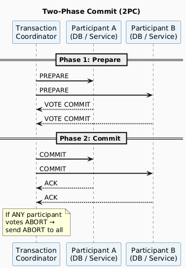
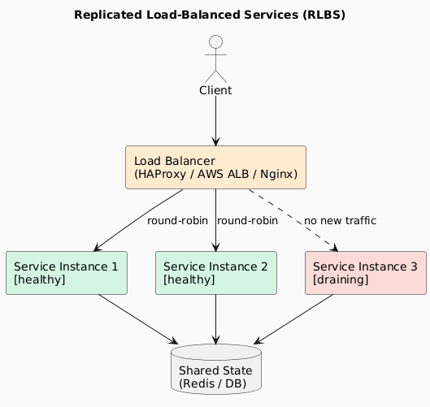
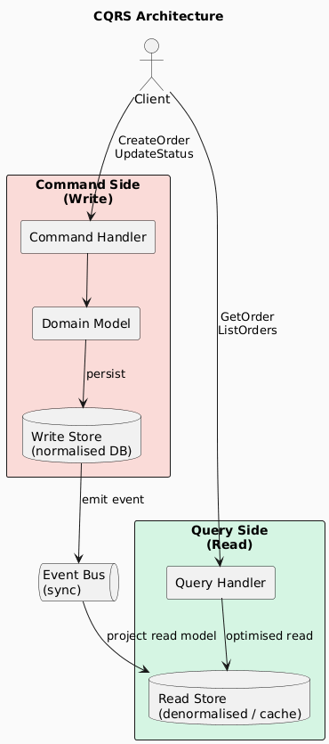
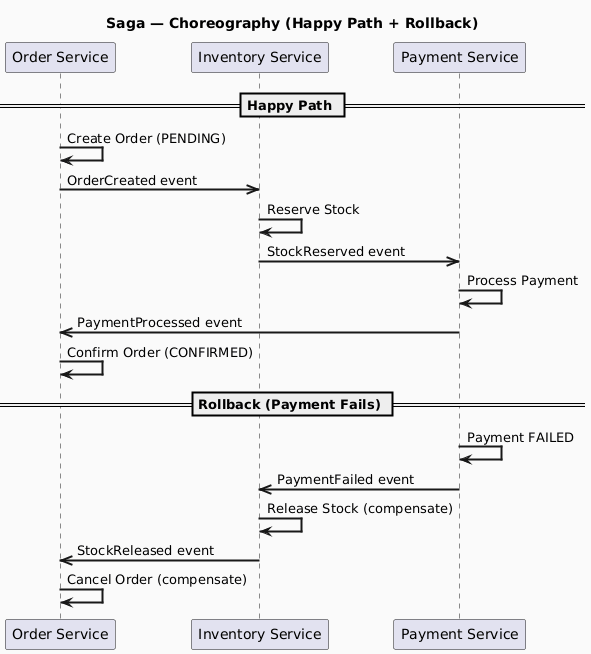
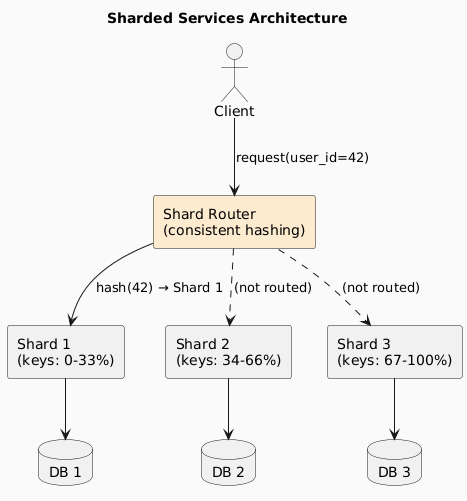

# 02 — Architecture Patterns

> Proven structural blueprints for solving recurring distributed systems problems.

---

## Contents
1. [Two-Phase Commit (2PC)](#1-two-phase-commit-2pc)
2. [Replicated Load-Balanced Services (RLBS)](#2-replicated-load-balanced-services-rlbs)
3. [Command and Query Responsibility Segregation (CQRS)](#3-command-and-query-responsibility-segregation-cqrs)
4. [Saga Pattern](#4-saga-pattern)
5. [Sharded Services](#5-sharded-services)
6. [Pattern Comparison](#6-pattern-comparison)

---

## 1. Two-Phase Commit (2PC)

### What It Solves
In a distributed transaction spanning multiple services/databases, how do you guarantee **all-or-nothing atomicity** without a central single database?

### How It Works

### Phases in Detail

| Phase | Action | Outcome |
|-------|--------|---------|
| **Prepare** | Coordinator asks each participant: "Can you commit?" | Each participant locks resources and votes YES/NO |
| **Commit** | If all voted YES → coordinator sends COMMIT to all | All participants commit and release locks |
| **Abort** | If any voted NO → coordinator sends ABORT to all | All participants rollback and release locks |

### Limitations

| Limitation | Description |
|------------|-------------|
| **Blocking protocol** | If the coordinator crashes after Prepare, participants are stuck holding locks |
| **Single point of failure** | Coordinator failure can halt the entire transaction |
| **High latency** | Two round-trips required before any participant can commit |
| **Not suitable for microservices** | Requires synchronous coupling; breaks independent deployability |

> **When to use 2PC:** Tightly-coupled systems (e.g., a single organisation's databases) where strong consistency is mandatory and latency is acceptable. For microservices, prefer the **Saga pattern**.

---

## 2. Replicated Load-Balanced Services (RLBS)

### What It Solves
A single service instance is a bottleneck and a single point of failure. RLBS solves both.

### Architecture

### Load Balancing Algorithms

| Algorithm | How It Works | Best For |
|-----------|-------------|---------|
| **Round Robin** | Requests distributed sequentially | Uniform request cost |
| **Least Connections** | Routes to instance with fewest active connections | Variable request duration |
| **IP Hash** | Routes based on client IP hash | Session affinity (sticky sessions) |
| **Weighted Round Robin** | Instances assigned weights proportional to capacity | Heterogeneous hardware |
| **Random** | Randomly selects an instance | Simple, low overhead |

### Health Check Strategies

| Type | Mechanism | Recovery |
|------|-----------|----------|
| **Active** | LB probes `/health` endpoint periodically | Remove instance if N consecutive failures |
| **Passive** | LB monitors error rates on live traffic | Circuit breaker triggers removal |

---

## 3. Command and Query Responsibility Segregation (CQRS)

### What It Solves
In systems with high read/write asymmetry, a single model serving both reads and writes creates contention. CQRS separates them.

### Core Concept

### Trade-offs

| Benefit | Cost |
|---------|------|
| Read and write sides scale independently | Added complexity — two models to maintain |
| Read store can be highly denormalised for performance | Eventual consistency between write and read stores |
| Write model can enforce strict invariants | Requires an event bus / synchronisation mechanism |
| Different storage engines for reads vs. writes | Harder to debug — data lives in two places |

### When to Use CQRS

✅ High read/write ratio (e.g., 100:1 reads to writes)  
✅ Complex domain with many aggregate invariants  
✅ Reporting or analytics that require different data shapes  
✅ Paired with Event Sourcing  

❌ Simple CRUD applications  
❌ Small teams or early-stage products  

---

## 4. Saga Pattern

### What It Solves
Long-lived distributed transactions that span multiple microservices, where 2PC is impractical. Saga trades **strict ACID atomicity** for **eventual consistency** with a rollback mechanism.

### Two Saga Implementations

| Type | Mechanism | Coordination | Coupling |
|------|-----------|-------------|---------|
| **Choreography** | Services emit and react to events | Decentralised | Loose |
| **Orchestration** | Central saga orchestrator directs services | Centralised | Tighter |

### Choreography-Based Saga (e-Commerce Example)

### Local Transactions and Compensating Actions

| Service | Forward Transaction | Compensating Action |
|---------|--------------------|--------------------|
| **Order Service** | Create & reserve order | Cancel order, release reservation |
| **Inventory Service** | Deduct stock for order | Revert stock levels |
| **Payment Service** | Charge customer | Issue refund |

> **Key insight:** Compensating actions must be **idempotent** — they may be executed more than once due to retries.

### Saga vs. 2PC

| Dimension | 2PC | Saga |
|-----------|-----|------|
| **Consistency model** | Strong (ACID) | Eventual |
| **Coupling** | Tight (requires lock coordination) | Loose (event-driven) |
| **Availability** | Lower (blocking) | Higher (non-blocking) |
| **Failure handling** | Automatic rollback | Explicit compensating actions |
| **Suitable for** | Tightly coupled systems | Microservices |

---

## 5. Sharded Services

### What It Solves
A single instance can't hold all the data or handle all the traffic. Sharding partitions data horizontally across multiple instances.

### Sharding Strategies

| Strategy | How It Works | Pros | Cons |
|----------|-------------|------|------|
| **Hash-based** | `shard = hash(key) % N` | Even distribution | Resharding requires migrating all data |
| **Range-based** | Keys A–M → Shard 1, N–Z → Shard 2 | Easy range queries | Hotspot risk (e.g., all users start with 'A') |
| **Directory-based** | Lookup table maps keys to shards | Flexible | Lookup table is a bottleneck/SPOF |
| **Geographic** | Shard by user location | Low latency for regional data | Uneven distribution across regions |

### Architecture

### Consistent Hashing

Consistent hashing minimises data movement when shards are added or removed:

- Keys and nodes are placed on a virtual **hash ring**
- Each key is assigned to the next node clockwise on the ring
- Adding a node only migrates keys from the adjacent node (≈ 1/N of data)
- vs. modular hashing: adding a node remaps ≈ all keys

### Challenges

| Challenge | Description | Mitigation |
|-----------|-------------|-----------|
| **Cross-shard queries** | JOINs across shards are expensive | Denormalise or use a scatter-gather pattern |
| **Rebalancing** | Moving data when shard count changes | Consistent hashing, virtual nodes |
| **Hot shards** | One shard receives disproportionate traffic | Better key distribution; add replicas to hot shards |
| **Transactions** | Atomic operations across shards are complex | Saga pattern; avoid cross-shard transactions |

---

## 6. Pattern Comparison

| Pattern | Problem Solved | Consistency | Coupling | Complexity |
|---------|---------------|-------------|----------|-----------|
| **2PC** | Distributed atomicity | Strong (ACID) | Tight | Medium |
| **RLBS** | Availability & throughput | N/A (stateless) | Loose | Low |
| **CQRS** | Read/write scalability | Eventual | Medium | High |
| **Saga** | Long-lived distributed transactions | Eventual | Loose | High |
| **Sharding** | Data/throughput scalability | Depends on impl. | Medium | Medium |

---

*Previous: [01 — Fundamentals](./01-fundamentals.md) | Next: [03 — Tools and Techniques](./03-tools-and-techniques.md)*