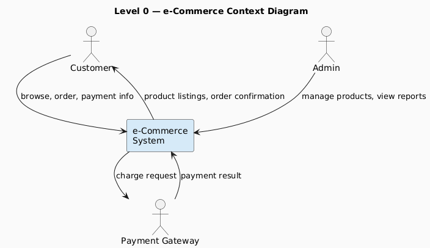
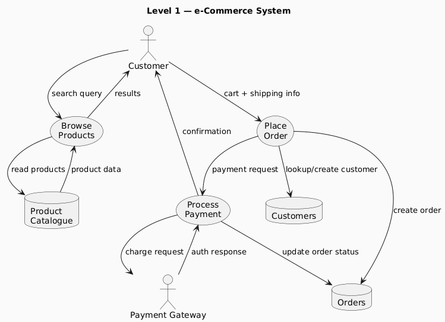
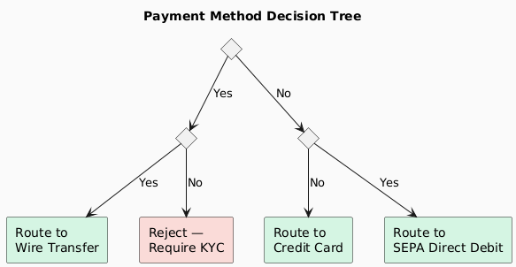
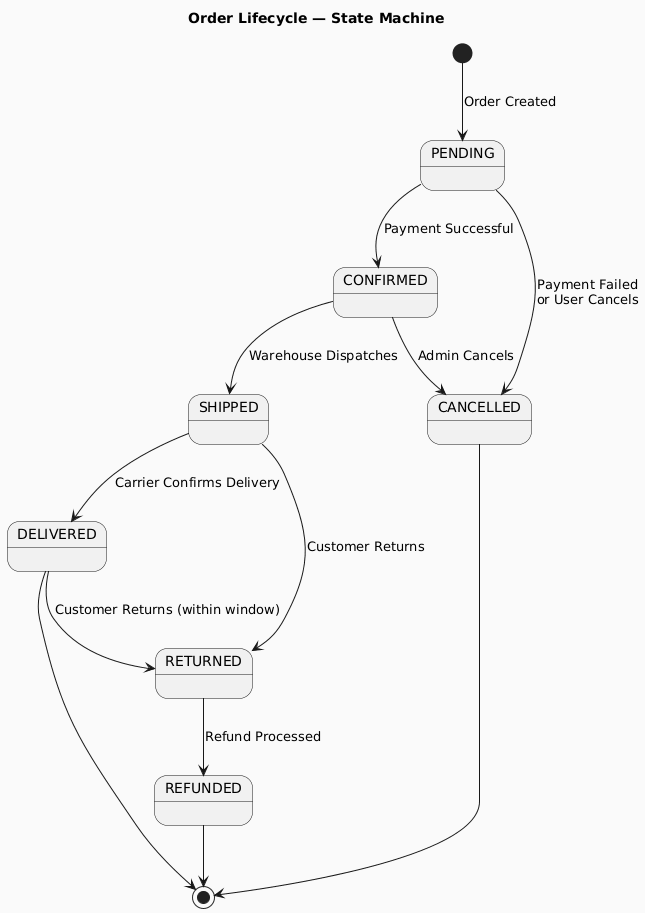
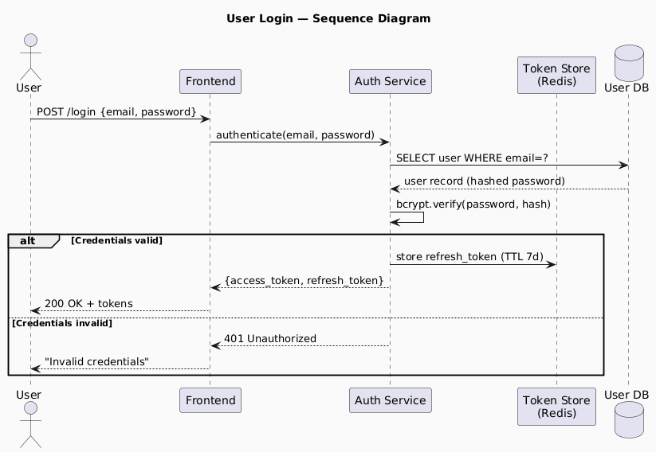
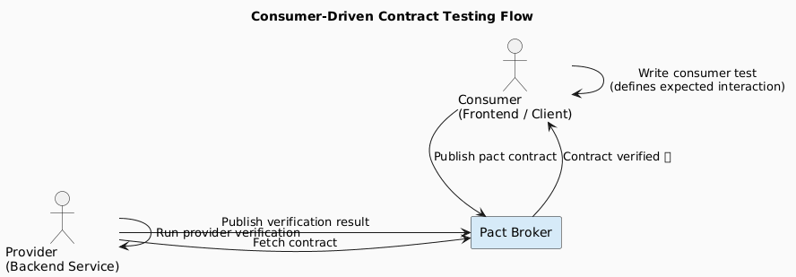

# 03 — Tools and Techniques

> The instruments a system designer uses to think, communicate, and document a design.

---

## Contents
1. [Data Flow Diagrams (DFD)](#1-data-flow-diagrams-dfd)
2. [Architecture Diagrams](#2-architecture-diagrams)
3. [Data Dictionaries](#3-data-dictionaries)
4. [Decision Trees](#4-decision-trees)
5. [Decision Tables](#5-decision-tables)
6. [Pseudocode](#6-pseudocode)
7. [Unified Modelling Language (UML)](#7-unified-modelling-language-uml)
8. [APIs and Contracts](#8-apis-and-contracts)
9. [Tool Selection Guide](#9-tool-selection-guide)

---

## 1. Data Flow Diagrams (DFD)

### Purpose
DFDs show **how data moves** through a system — between processes, external actors, and data stores. They answer: *"Where does data come from, where does it go, and what transforms it?"*

### DFD Notation

| Symbol | Represents | PlantUML/Drawing |
|--------|-----------|-----------------|
| **Rectangle** | External entity (actor outside the system) | `actor` / `rectangle` |
| **Rounded rectangle / circle** | Process (transforms data) | `usecase` |
| **Open-ended rectangle** | Data store (persistent storage) | `database` |
| **Arrow** | Data flow (labelled with data type) | `-->` |

### Levels

| Level | Name | Shows |
|-------|------|-------|
| **Level 0** | Context Diagram | Entire system as one process + all external entities |
| **Level 1** | System DFD | Major processes, data stores, data flows |
| **Level 2+** | Detailed DFD | Decomposition of individual processes |

### Example: Level 0 Context Diagram (e-Commerce)



### Example: Level 1 DFD (e-Commerce)



---

## 2. Architecture Diagrams

### Purpose
Architecture diagrams show the **structural organisation** of a system — components, layers, and their relationships. They are the primary communication tool between architects, developers, and stakeholders.

### Common Diagram Types

| Type | Shows | Audience |
|------|-------|---------|
| **System Context** | System boundaries and external actors | Business stakeholders |
| **Container** | Deployable units (services, databases, queues) | Engineering leads |
| **Component** | Internal structure of a single container | Developers |
| **Deployment** | Infrastructure (servers, cloud regions, networks) | DevOps/SRE |
| **Sequence** | Runtime interaction order between components | Developers |

> The **C4 Model** (Context, Container, Component, Code) provides a disciplined hierarchy for these diagram types.

---

## 3. Data Dictionaries

### Purpose
A data dictionary is a **structured catalogue** of every data element in the system: its name, type, constraints, and relationships. It is the single source of truth for data definitions.

### Template

| Field | Description |
|-------|-------------|
| **Name** | Canonical identifier for the element |
| **Alias(es)** | Other names used in code or business |
| **Data Type** | e.g., `UUID`, `VARCHAR(255)`, `BIGINT`, `BOOLEAN` |
| **Length / Precision** | Max size or decimal precision |
| **Nullable** | Whether null is a valid value |
| **Default Value** | Value if not explicitly provided |
| **Constraints** | PK, FK, UNIQUE, CHECK, NOT NULL |
| **Description** | Business meaning |
| **Relationships** | FK references / related entities |
| **Owner** | Team/service responsible for this data |

### Example: Orders Table

| Name | Type | Nullable | Default | Constraints | Description |
|------|------|----------|---------|-------------|-------------|
| `order_id` | UUID | No | `gen_random_uuid()` | PK | Unique order identifier |
| `customer_id` | UUID | No | — | FK → customers.id | Owning customer |
| `status` | ENUM | No | `PENDING` | CHECK IN (PENDING, CONFIRMED, SHIPPED, DELIVERED, CANCELLED) | Lifecycle state |
| `total_amount` | DECIMAL(10,2) | No | — | > 0 | Order total in base currency |
| `currency` | CHAR(3) | No | `USD` | ISO 4217 | Currency code |
| `created_at` | TIMESTAMPTZ | No | `NOW()` | — | Creation timestamp (UTC) |
| `updated_at` | TIMESTAMPTZ | No | `NOW()` | — | Last update timestamp (UTC) |

---

## 4. Decision Trees

### Purpose
Decision trees model **branching logic** where the outcome depends on a series of conditions. They make implicit business rules explicit and testable.

### Example: Payment Method Routing



### When to Use Decision Trees

✅ Complex conditional routing logic  
✅ Communicating business rules to non-technical stakeholders  
✅ Generating test cases (each leaf = one test scenario)  
❌ Logic with more than ~5 levels deep (use decision tables instead)

---

## 5. Decision Tables

### Purpose
Decision tables represent **all combinations** of conditions and their resulting actions in a compact, verifiable format. They eliminate ambiguity in complex rule sets.

### Structure

| | Rule 1 | Rule 2 | Rule 3 | Rule 4 |
|-|--------|--------|--------|--------|
| **Conditions** | | | | |
| User is Premium? | Y | Y | N | N |
| Stock Available? | Y | N | Y | N |
| **Actions** | | | | |
| Process Order | ✅ | ❌ | ✅ | ❌ |
| Notify Backorder | ❌ | ✅ | ❌ | ✅ |
| Apply Discount | ✅ | ✅ | ❌ | ❌ |

> **Completeness check:** With `n` binary conditions, there should be `2^n` rules. Missing rules indicate undefined behaviour.

---

## 6. Pseudocode

### Purpose
Pseudocode bridges the gap between a concept and actual implementation. It captures **intent and logic** without committing to a specific language syntax.

### Good Pseudocode Conventions

| Convention | Example |
|-----------|---------|
| **Meaningful names** | `totalCost` not `x` |
| **Structured indentation** | Reflect loops/conditionals visually |
| **Language-neutral constructs** | `IF`, `FOR EACH`, `RETURN` |
| **State side effects explicitly** | `EMIT OrderCreated event` |
| **Error paths documented** | `IF payment fails → COMPENSATE` |

### Example: Order Processing Logic

```
FUNCTION processOrder(customerId, cartItems):

  order ← OrderService.create(customerId, cartItems)
  
  FOR EACH item IN cartItems:
    IF InventoryService.reserve(item.productId, item.quantity) FAILS:
      OrderService.cancel(order.id)
      RETURN Error("Insufficient stock for " + item.productId)
  
  paymentResult ← PaymentService.charge(customerId, order.totalAmount)
  
  IF paymentResult.status = FAILED:
    FOR EACH item IN cartItems:
      InventoryService.release(item.productId, item.quantity)
    OrderService.cancel(order.id)
    RETURN Error("Payment declined: " + paymentResult.reason)
  
  OrderService.confirm(order.id)
  NotificationService.send(customerId, "OrderConfirmed", order.id)
  RETURN Success(order.id)
```

---

## 7. Unified Modelling Language (UML)

### Overview
UML is a standardised notation for modelling software systems. It covers both **structural** (static) and **behavioural** (dynamic) views.

### Diagram Types

#### Structural Diagrams

| Diagram | Shows | Common Use |
|---------|-------|-----------|
| **Class Diagram** | Classes, attributes, methods, relationships | Domain model, OOP design |
| **Component Diagram** | Software components and interfaces | Service dependencies |
| **Deployment Diagram** | Physical/cloud infrastructure | DevOps, infra planning |
| **Package Diagram** | Logical groupings of model elements | Module structure |

#### Behavioural Diagrams

| Diagram | Shows | Common Use |
|---------|-------|-----------|
| **Sequence Diagram** | Message exchange order between objects | API flow, protocol design |
| **Activity Diagram** | Workflow / business process flow | Business logic, concurrency |
| **Use Case Diagram** | Actors and system functions | Requirements capture |
| **State Machine Diagram** | Object lifecycle states and transitions | Order status, session management |

### Example: Order State Machine



### Example: Sequence Diagram (User Login)



---

## 8. APIs and Contracts

### APIs

An API (Application Programming Interface) defines **how components communicate** — the rules, endpoints, data formats, and error conventions.

| API Style | Protocol | Format | Best For |
|-----------|----------|--------|---------|
| **REST** | HTTP/1.1 | JSON / XML | Public APIs, CRUD services |
| **GraphQL** | HTTP | JSON | Flexible queries, frontend-driven |
| **gRPC** | HTTP/2 | Protocol Buffers | Internal microservices, low latency |
| **WebSocket** | WS/WSS | JSON / binary | Real-time (chat, live feeds) |
| **AsyncAPI** | AMQP/Kafka | JSON | Event-driven / message-based |

### API Design Principles

| Principle | Description |
|-----------|-------------|
| **Versioning** | Version your API (`/v1/`, `Accept: application/vnd.api+json;v=2`) |
| **Idempotency** | `PUT`/`DELETE`/`PATCH` must be safe to retry |
| **Pagination** | Never return unbounded collections; use cursor or offset pagination |
| **Error semantics** | Use standard HTTP status codes; include machine-readable error codes |
| **Rate limiting** | Protect backends; communicate limits via `X-RateLimit-*` headers |
| **Documentation** | OpenAPI / Swagger spec is mandatory for REST APIs |

### Contracts

A contract is a **formal, verifiable specification** of an API's behaviour.

| Contract Type | Tool | Approach |
|---------------|------|---------|
| **OpenAPI / Swagger** | Swagger UI, Redoc | REST contract for HTTP APIs |
| **Protocol Buffers** | protoc | gRPC contract (schema + binary encoding) |
| **Pact** | Pact framework | Consumer-driven contract testing |
| **AsyncAPI** | AsyncAPI Studio | Contract for event-driven APIs |
| **JSON Schema** | AJV, jsonschema | Validate request/response payloads |

### Consumer-Driven Contract Testing



---

## 9. Tool Selection Guide

| Situation | Recommended Tool(s) |
|-----------|-------------------|
| Communicating system scope to business stakeholders | Context Diagram (C4 Level 1) |
| Documenting data flow through a system | DFD Level 0 → Level 1 |
| Specifying a database schema | Data Dictionary + ERD |
| Modelling complex business rules | Decision Table + Decision Tree |
| Describing a runtime interaction | UML Sequence Diagram |
| Documenting an object's lifecycle | UML State Machine |
| Defining an API for other teams to consume | OpenAPI Spec + Example payloads |
| Expressing algorithm logic without code | Pseudocode |
| Full system architecture overview | Architecture Diagram (C4 Container) |

---

*Previous: [02 — Architecture Patterns](./02-architecture-patterns.md) | Next: [04 — System Examples](./04-system-examples.md)*