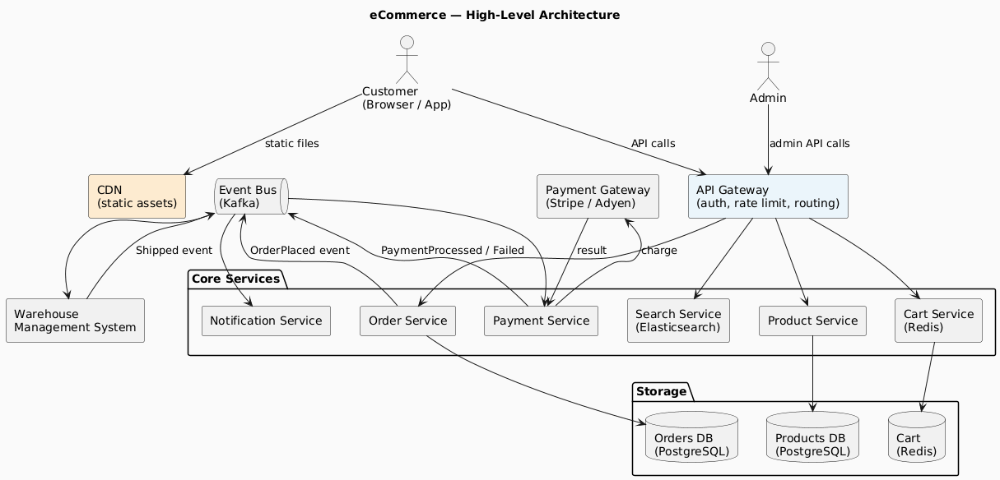
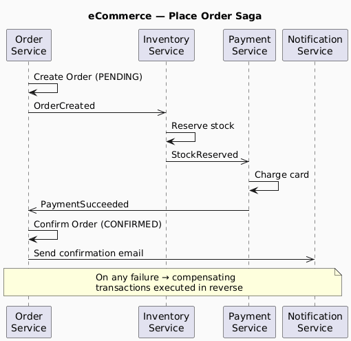
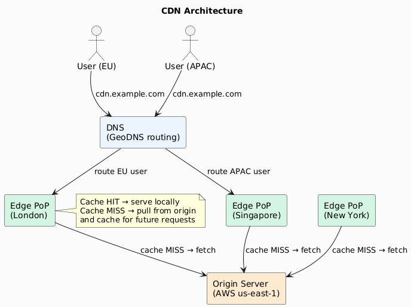
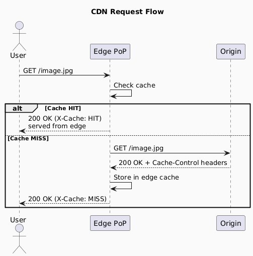
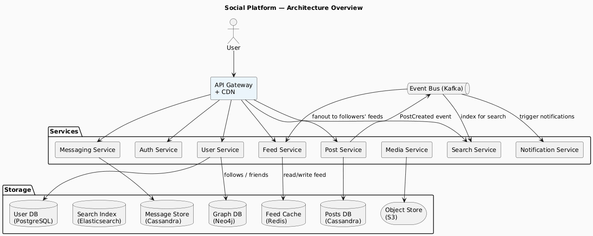
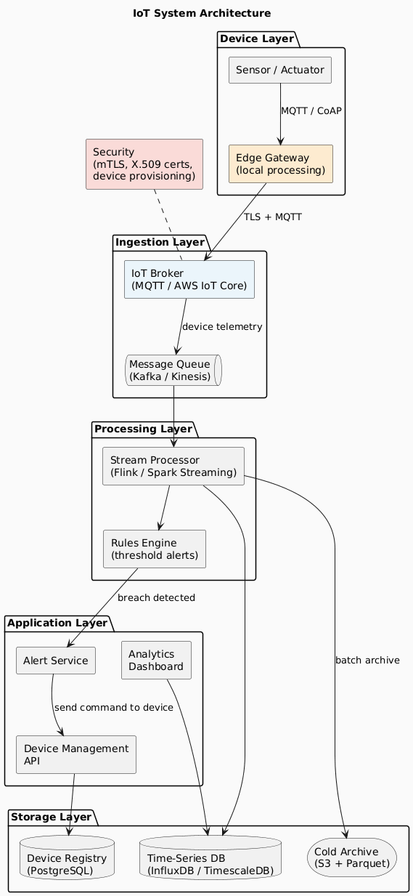
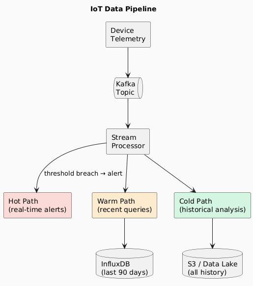

# 04 — System Design Examples

> Applying the fundamentals and patterns from previous sections to real-world systems.

---

## Contents
1. [eCommerce System](#1-ecommerce-system)
2. [Content Delivery Network (CDN)](#2-content-delivery-network-cdn)
3. [Social Networking Platform](#3-social-networking-platform)
4. [Internet of Things (IoT) System](#4-internet-of-things-iot-system)
5. [Cross-Cutting Concerns Summary](#5-cross-cutting-concerns-summary)

---

## 1. eCommerce System

### Key Requirements

| Requirement | Category |
|-------------|----------|
| Browse and search product catalogue | Functional |
| Add to cart, checkout, process payment | Functional |
| Track order status | Functional |
| Warehouse / fulfilment management | Functional |
| Handle Black Friday traffic spikes (10–100× normal load) | Non-functional (scalability) |
| Payment data PCI-DSS compliance | Non-functional (security) |
| 99.99% uptime on checkout flow | Non-functional (availability) |
| Page load < 200ms at P95 | Non-functional (performance) |

### High-Level Architecture

### Design Decisions

| Concern | Decision | Rationale |
|---------|----------|-----------|
| **Cart storage** | Redis (in-memory) | Sub-millisecond reads; carts are ephemeral; TTL auto-expiry |
| **Product catalogue** | PostgreSQL + Elasticsearch | Relational integrity in PG; full-text/faceted search in ES |
| **Order consistency** | Saga pattern (Choreography) | Spans Order, Inventory, Payment services without 2PC |
| **Traffic spikes** | Horizontal scaling + queue buffering | Scale stateless services; queue absorbs order bursts |
| **Payment isolation** | Separate Payment Service + PG | Minimises PCI-DSS scope |
| **Static assets** | CDN | Offload bandwidth; reduce origin latency globally |

### Saga Flow: Place Order

---

## 2. Content Delivery Network (CDN)

### What a CDN Does

A CDN is a **globally distributed network of edge servers** (Points of Presence / PoPs) that cache content close to end users, reducing latency and origin load.

### Key Requirements

| Requirement | Category |
|-------------|----------|
| Serve images, video, JS, CSS globally | Functional |
| Minimise latency for end users | Non-functional (performance) |
| Reduce origin server load | Non-functional (scalability) |
| Survive origin failure (serve from cache) | Non-functional (availability) |
| Protect against DDoS at the edge | Non-functional (security) |

### Architecture

### CDN Request Flow

### Cache Control Strategy

| Content Type | `Cache-Control` | `max-age` | Invalidation Strategy |
|-------------|----------------|-----------|----------------------|
| HTML pages | `no-cache` | 0 | Serve fresh; validate with ETag |
| CSS / JS (versioned) | `public, immutable` | 1 year | Filename includes content hash |
| Images (static) | `public` | 30 days | Purge API on update |
| API responses | `private` or `no-store` | 0 | Never cache on CDN |
| Video segments | `public` | 1 hour | CDN purge on re-encode |

---

## 3. Social Networking Platform

### Key Subsystems

| Subsystem | Responsibility | Key Challenges |
|-----------|---------------|---------------|
| **User Authentication** | Sign-up, login, sessions, OAuth | Security, session management at scale |
| **Profile Management** | User profiles, connections/follows | Relationship graph queries |
| **News Feed** | Generate personalised feed | Fanout at scale (celebrities with 100M followers) |
| **Messaging** | Direct messages, group chats | Real-time delivery, message ordering |
| **Media Storage** | Photos, videos, stories | Large object storage, transcoding |
| **Search** | Find users, posts, hashtags | Full-text search, relevance ranking |
| **Notifications** | Push, email, in-app | High throughput, deduplication |

### Architecture Overview

### News Feed: Fanout Strategies

The news feed is the hardest scaling problem in social platforms.

| Strategy | Description | Pros | Cons |
|----------|-------------|------|------|
| **Fanout on Write (Push)** | When user posts, pre-compute and push to all followers' feed caches | O(1) read | O(followers) write — catastrophic for celebrities |
| **Fanout on Read (Pull)** | Fetch and merge latest posts from followees at read time | No write amplification | Slow for users following thousands |
| **Hybrid** | Push for normal users; pull for celebrities (>N followers) | Balanced | Complex implementation |

> **Instagram / Twitter use the hybrid model.** Accounts above a threshold (e.g., 1M followers) are not fanned out on write; their posts are fetched and merged at read time.

---

## 4. Internet of Things (IoT) System

### Key Requirements

| Requirement | Category |
|-------------|----------|
| Ingest data from millions of devices | Functional |
| Command and control devices remotely | Functional |
| Store time-series sensor readings | Functional |
| Trigger alerts on threshold breaches | Functional |
| Handle millions of concurrent device connections | Non-functional (scalability) |
| Secure device identity and data in transit | Non-functional (security) |
| Low-latency command delivery | Non-functional (performance) |
| Operate when cloud is unreachable (edge mode) | Non-functional (resilience) |

### Architecture

### Communication Protocols

| Protocol | Transport | QoS | Best For |
|----------|-----------|-----|---------|
| **MQTT** | TCP | 0 / 1 / 2 | Low-power devices, pub/sub |
| **CoAP** | UDP | Optional | Constrained devices, RESTful IoT |
| **AMQP** | TCP | High | Enterprise IoT, reliable delivery |
| **HTTP/REST** | TCP | None | Occasional reporting, non-constrained |
| **WebSocket** | TCP | None | Real-time bidirectional, browser clients |

### Data Pipeline

| Path | Latency | Storage | Use Case |
|------|---------|---------|---------|
| **Hot** | < 1s | In-memory / streaming | Real-time alerting, anomaly detection |
| **Warm** | Seconds–minutes | InfluxDB / TimescaleDB | Dashboards, recent trend queries |
| **Cold** | Hours–days | S3 / Data Lake (Parquet) | Historical analysis, ML training |

---

## 5. Cross-Cutting Concerns Summary

Every system in this section — and every real system you will design — must address these concerns regardless of domain.

| Concern | eCommerce | CDN | Social Platform | IoT |
|---------|-----------|-----|----------------|-----|
| **Scalability** | Horizontal services + sharding | Geographic PoPs | Hybrid feed fanout | Kafka + stream processing |
| **Availability** | 99.99% checkout SLA | Serve from cache during origin failure | Multi-region | Edge gateway operates offline |
| **Consistency** | Eventual (Saga) | Eventual (cache TTL) | Eventual (feed) | Eventual (time-series) |
| **Security** | PCI-DSS, JWT auth | DDoS protection, HTTPS | OAuth, content moderation | mTLS, device certificates |
| **Performance** | Redis cart, CDN assets | Edge caching, GeoDNS | Feed cache (Redis) | Stream processing < 1s |
| **Observability** | Distributed tracing (Jaeger) | Cache hit rate, origin error rate | Engagement metrics, error rates | Device health, pipeline lag |

---

*Previous: [03 — Tools and Techniques](./03-tools-and-techniques.md) | Back to [README](./README.md)*