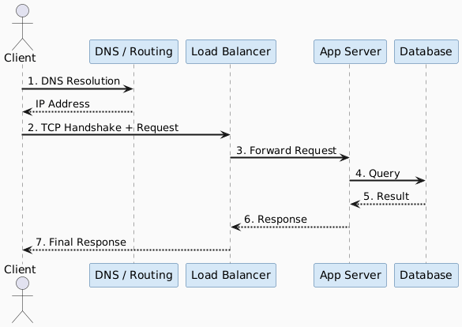
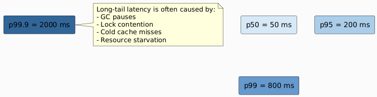
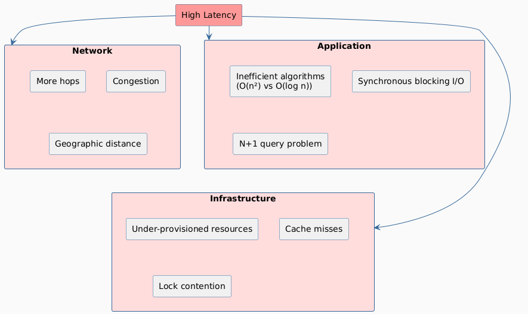

# Latency

## Definition

> **Latency** is the total time elapsed from the moment a request is initiated to the moment a response is received.

Latency is measured in units of time: **milliseconds (ms)**, **microseconds (µs)**, or **clock periods** in hardware contexts.

---

## Mental Model: The Pipeline Analogy

Think of water flowing through a pipe. Latency is **how long it takes for one drop of water to travel from one end to the other** — regardless of how much water is flowing.

---

## Components of Latency

Every request passes through multiple stages. Total latency is the **sum of all stage delays**.

| Stage | Typical Contribution | Notes |
|---|---|---|
| DNS Resolution | 1 – 100 ms | Cached: < 1 ms |
| TCP Handshake | 1 – 3 RTTs | TLS adds 1–2 more RTTs |
| Network Transit | 1 ms / 100 km | Bounded by speed of light |
| Load Balancer | < 1 ms | Should be negligible |
| Application Processing | Variable | Dominant for compute-heavy tasks |
| Database Query | 1 ms – seconds | Index misses are expensive |
| Serialization / Deserialization | < 1 ms – 10s ms | JSON >> Protobuf |

---

## Latency Numbers Every Engineer Must Know

| Operation | Approximate Latency |
|---|---|
| L1 cache reference | 0.5 ns |
| L2 cache reference | 7 ns |
| RAM access | 100 ns |
| SSD random read | 100 µs |
| HDD seek | 10 ms |
| Same datacenter round-trip | 0.5 ms |
| Cross-region (US ↔ EU) | ~100 ms |
| Cross-continent (US ↔ Asia) | ~200 ms |

> Source: Jeff Dean's "Numbers Every Engineer Should Know"

---

## Types of Latency

| Type | Description | Example |
|---|---|---|
| **Network Latency** | Time for data to travel across the network | Ping, RTT |
| **Processing Latency** | Time for the server to compute a response | Algorithm execution |
| **Queueing Latency** | Time a request spends waiting in a queue | Overloaded server backlog |
| **Storage Latency** | Time to read from or write to disk/DB | DB query, disk seek |
| **Propagation Latency** | Physical travel time through medium | Fiber optics, speed of light |

---

## Measuring Latency: Percentiles

**Never rely solely on average latency.** Percentiles reveal the tail behavior that averages hide.

| Metric | What It Tells You |
|---|---|
| **p50 (median)** | Typical user experience |
| **p95** | 95% of users experience this or better |
| **p99** | The "long tail" — worst 1% of users |
| **p99.9** | Critical for SLA violations |

> **Rule of thumb:** Design your SLAs around **p99**, not p50. The average lies.

---

## Root Causes of High Latency

---

## Key Insight

Latency has a **hard floor** set by the speed of light and hardware physics. You can only optimize **above** that floor — by removing unnecessary work, reducing hops, or moving computation closer to the user.
