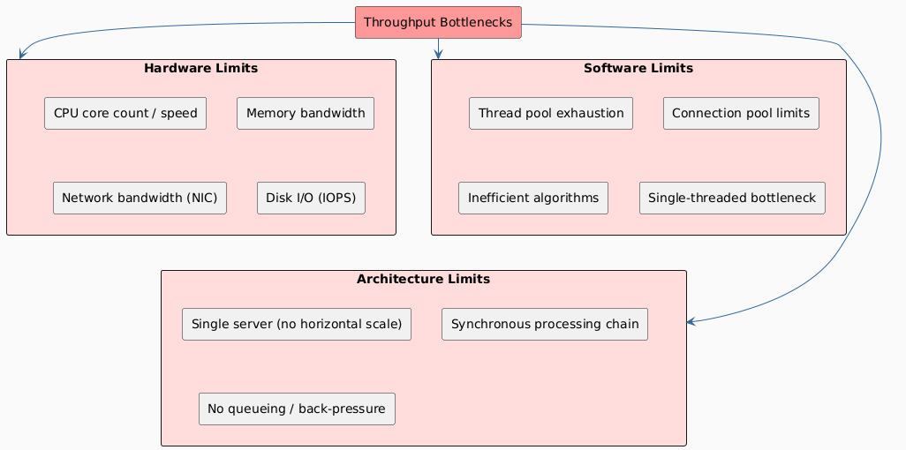
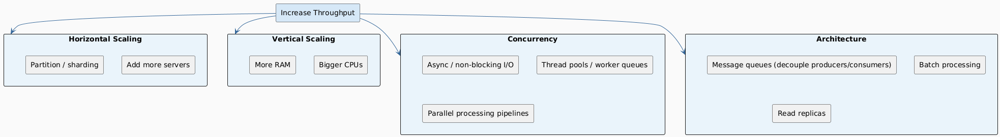

# Throughput

## Definition

> **Throughput** is the number of operations (requests, transactions, messages, bits) a system can process per unit of time.

Common units: **requests/sec (RPS)**, **transactions/sec (TPS)**, **bits/sec (bps)**, **words/clock-period**.

---

## Mental Model: The Pipeline Analogy (cont.)

Continuing the water analogy: throughput is **how much water flows through the pipe per second** — regardless of how long any single drop takes.

---

## Manufacturing Example (Classic)

> An assembly line takes **8 hours** to produce one car and outputs **120 cars/day**.

| Metric | Value |
|---|---|
| Latency | 8 hours |
| Throughput | 120 cars/day = **5 cars/hour** |

Note that these two numbers are **independent**. Throughput measures the rate; latency measures the delay per unit.

---

## Hardware Design Example

A communications device has these specs:

| Parameter | Value |
|---|---|
| Clock Frequency | 100 MHz |
| Time Budget | 1000 ns |
| Required Throughput | 640 Mbits/sec |
| Word Width | 64 bits |

**Converting to hardware-meaningful units:**

**Latency:**
```
1000 ns × (1 s / 10⁹ ns) × (100 × 10⁶ cycles / 1 s) = 100 clock cycles
```

**Throughput:**
```
640 × 10⁶ bits/s × (1 word / 64 bits) × (1 s / 100 × 10⁶ cycles)
= 0.1 words/cycle  →  1 word every 10 clock cycles
```

| Metric | Human Units | Hardware Units |
|---|---|---|
| Latency | 1000 ns | 100 clock cycles |
| Throughput | 640 Mbits/sec | 0.1 words/cycle (1 word per 10 cycles) |

> ⚠️ Some tools report throughput **in clock cycles** (e.g. "10") rather than words/cycle. This is informal shorthand — always clarify units.

---

## What Limits Throughput?



---

## Throughput in Different System Layers

| Layer | Measured As | Bottleneck |
|---|---|---|
| **CPU** | Instructions/sec, FLOPS | Core speed, IPC |
| **Memory** | GB/s (bandwidth) | Bus width, frequency |
| **Disk** | MB/s, IOPS | Seek time (HDD), queue depth (SSD) |
| **Network** | Mbps / Gbps | NIC, switch capacity, congestion |
| **Database** | TPS (transactions/sec) | Lock contention, index scans |
| **Web Server** | RPS (requests/sec) | Thread pool, I/O wait |
| **Message Queue** | Messages/sec | Consumer count, partition count |

---

## Little's Law

The fundamental theorem connecting throughput, latency, and concurrency:

```
L = λ × W
```

| Variable | Meaning |
|---|---|
| `L` | Average number of requests in the system |
| `λ` (lambda) | Throughput (arrival/departure rate) |
| `W` | Average latency (time in system) |

**Example:** A web server handles 500 RPS with average latency of 200 ms.

```
L = 500 req/s × 0.2 s = 100 concurrent requests in-flight
```

This tells you how many concurrent connections / threads you need to sustain a given throughput at a given latency.

---

## Throughput Scaling Patterns



---

## Key Insight

Throughput is ultimately governed by your **slowest bottleneck** (the narrowest part of the pipe). Identify and widen the bottleneck first before adding capacity elsewhere — this is the core of the **Theory of Constraints**.
