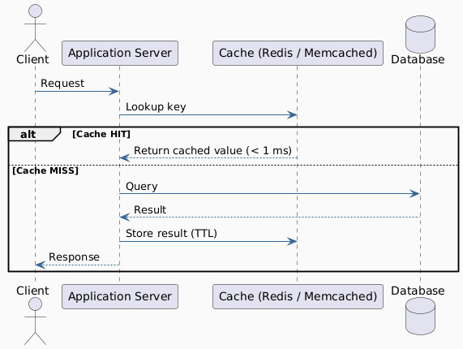
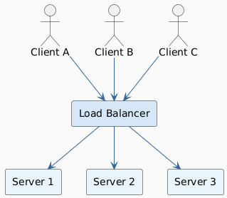
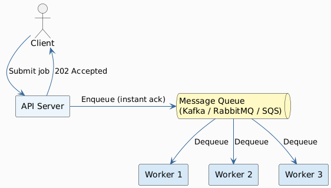
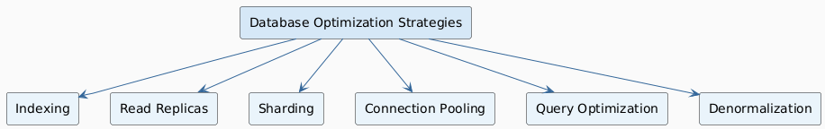
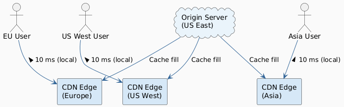
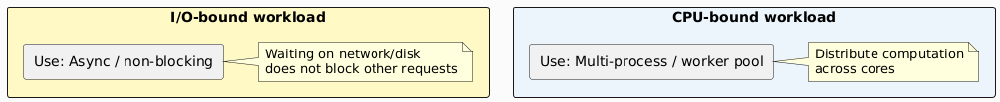
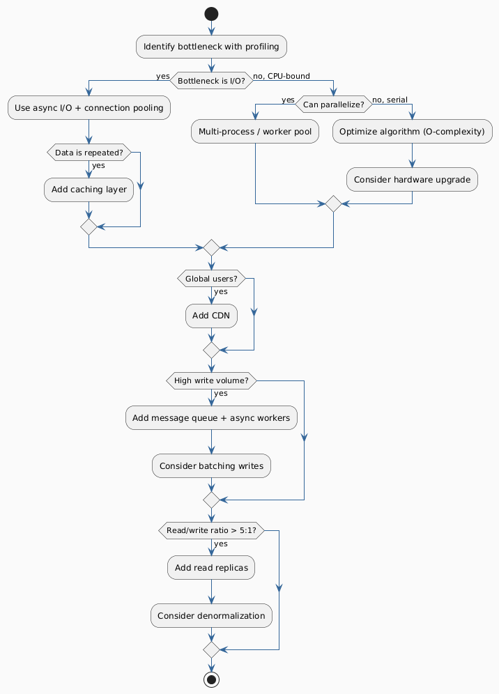

# Techniques: Optimizing Latency & Throughput

## Overview

The techniques below are organized by **primary benefit**. Most techniques improve both metrics to some degree — the dominant effect is noted.

---

## 1. Caching

**Primary benefit: Latency ↓, Throughput ↑**

Store results of expensive operations so repeated requests are served from fast memory.

| Cache Type | Where | Latency Benefit | Use Case |
|---|---|---|---|
| **In-process** | Application memory | Sub-millisecond | Computed config, small lookup tables |
| **Distributed** | Redis, Memcached | 1–5 ms | Session data, hot DB rows |
| **CDN** | Edge nodes globally | 10–50 ms → < 1 ms | Static assets, HTML pages |
| **Browser** | Client | Network eliminated | CSS, JS, images |
| **Read-through** | Cache layer auto-fills | Transparent to app | ORM-level caching |

**Key cache metrics to monitor:**
- **Hit rate** (target > 90% for effectiveness)
- **Eviction rate** (high eviction → cache too small)
- **TTL vs. staleness** trade-off

---

## 2. Load Balancing

**Primary benefit: Throughput ↑, single-server Latency ↓**

Distribute incoming requests across multiple servers to prevent any one from becoming a bottleneck.

| Algorithm | Best For | Trade-off |
|---|---|---|
| **Round Robin** | Homogeneous servers | Ignores server load |
| **Least Connections** | Variable request cost | Slightly more overhead |
| **IP Hash** | Session affinity needed | Uneven distribution risk |
| **Weighted Round Robin** | Mixed-capacity servers | Requires manual tuning |
| **Random** | Simple, low overhead | No load awareness |

---

## 3. Asynchronous Processing & Message Queues

**Primary benefit: Throughput ↑↑, perceived Latency ↓ for producers**

Decouple producers and consumers. The producer gets an instant acknowledgment; work is done in the background.

| Queue Property | Impact |
|---|---|
| Partitioning (Kafka topics/partitions) | Increases parallelism → ↑ throughput |
| Consumer groups | Multiple consumers → ↑ throughput |
| Back-pressure | Prevents consumers from being overwhelmed |
| Acknowledgment / retries | Durability at cost of slight latency |

**When to use async:**
- Email/notification sending
- Image/video processing
- Report generation
- Any work > 200 ms that doesn't need a synchronous result

---

## 4. Database Optimization

**Primary benefit: Latency ↓↓, Throughput ↑**

| Technique | Latency Impact | Throughput Impact | Notes |
|---|---|---|---|
| **Indexing** | ↓↓ (O(log n) vs O(n) scans) | ↑ (fewer full scans) | Write overhead increases |
| **Read replicas** | ↑ slightly (replication lag) | ↑↑ (distribute reads) | Eventual consistency |
| **Connection pooling** | ↓ (no reconnect cost) | ↑ (reuse sockets) | PgBouncer, HikariCP |
| **Query optimization** | ↓ (explain analyze) | ↑ | Avoid N+1 queries |
| **Horizontal sharding** | ↑ slightly (routing) | ↑↑ | Operational complexity |
| **Denormalization** | ↓ (fewer JOINs) | ↑ | Consistency trade-off |
| **In-memory DB (Redis)** | ↓↓↓ | ↑↑ | Not for primary store |

---

## 5. Content Delivery Networks (CDN)

**Primary benefit: Latency ↓↓ for geographically distributed users**

Move static (and increasingly dynamic) content to edge nodes close to the user.

| CDN Use Case | Latency Reduction |
|---|---|
| Static assets (JS, CSS, images) | 100–200 ms → < 5 ms |
| Video streaming | Eliminates buffering |
| API responses (cacheable) | Significant for read-heavy global APIs |
| TLS termination at edge | Removes TLS RTTs from origin path |

---

## 6. Concurrency & Parallelism

**Primary benefit: Throughput ↑↑**

| Model | Description | Best For |
|---|---|---|
| **Multi-threading** | Multiple threads share memory | CPU-bound tasks |
| **Multi-processing** | Separate processes, isolated memory | CPU-bound, avoids GIL (Python) |
| **Async / Event loop** | Single-threaded, non-blocking I/O | I/O-bound tasks (Node.js, Python asyncio) |
| **Actor model** | Message-passing between isolated actors | Distributed systems (Erlang/Akka) |
| **Data parallelism** | Same operation on partitioned data | Batch processing, MapReduce |

---

## 7. Protocol & Serialization Optimization

**Primary benefit: Latency ↓, Throughput ↑ (less data over wire)**

| Protocol / Format | Relative Size | Latency | Use Case |
|---|---|---|---|
| JSON (text) | 1× (baseline) | Baseline | Human-readable APIs |
| MessagePack | ~0.5× | ↓ | Binary JSON replacement |
| Protocol Buffers | ~0.3× | ↓↓ | Internal microservices |
| FlatBuffers | ~0.3× | ↓↓↓ (zero-copy) | Real-time, gaming |
| HTTP/1.1 | — | Baseline | Standard web |
| HTTP/2 | — | ↓ (multiplexing) | Concurrent streams, gRPC |
| HTTP/3 / QUIC | — | ↓↓ (0-RTT, no HOL blocking) | Mobile, lossy networks |
| WebSocket | — | ↓↓ (persistent) | Real-time bidirectional |
| gRPC | Binary (protobuf) | ↓↓ | Microservice-to-service |

---

## 8. Batching & Micro-batching

**Primary benefit: Throughput ↑↑ (amortizes per-request overhead)**

Group multiple operations into a single system call or network round-trip.

| Example | Overhead Reduced | Latency Cost |
|---|---|---|
| Bulk DB inserts | Per-row commit overhead | Slight delay until batch fills |
| Kafka producer batching | Per-message TCP overhead | Configurable `linger.ms` |
| HTTP request batching (GraphQL) | Round-trips | 1 RTT vs N RTTs |
| GPU mini-batches | Kernel launch overhead | Throughput >> single-sample |

---

## 9. Prefetching & Speculative Execution

**Primary benefit: Perceived Latency ↓ (start work before it's needed)**

| Technique | Description |
|---|---|
| **Read-ahead / prefetch** | Load next pages/records before user requests them |
| **Speculative execution** | Execute multiple branches in parallel, discard losers |
| **Connection warm-up** | Pre-establish DB/service connections at startup |
| **Predictive caching** | Cache based on access patterns (e.g., ML-driven prefetch) |

---

## Techniques Summary Table

| Technique | Latency ↓ | Throughput ↑ | Complexity Added |
|---|---|---|---|
| Caching | ✅✅ | ✅ | Medium |
| Load balancing | ✅ | ✅✅ | Low–Medium |
| Async / message queues | ✅ (perceived) | ✅✅ | Medium |
| DB indexing | ✅✅ | ✅ | Low |
| Read replicas | ➖ | ✅✅ | Medium |
| CDN | ✅✅ | ✅ | Low |
| HTTP/2 or gRPC | ✅ | ✅ | Low–Medium |
| Binary serialization | ✅ | ✅ | Medium |
| Connection pooling | ✅ | ✅ | Low |
| Horizontal sharding | ➖ | ✅✅ | High |
| Batching | ❌ (increases) | ✅✅ | Low |
| Prefetching | ✅ | ➖ | Medium |
| Async non-blocking I/O | ✅ | ✅✅ | Medium |

---

## Decision Guide: Which Technique to Apply?

