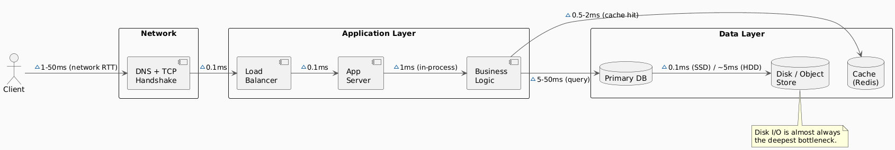

# Performance

> "Performance is about how fast the system serves **one unit of work**."

---

## 1. What is Performance?

Performance measures the **speed and efficiency** of a system in completing a single unit of work. It is observed from the perspective of one user, one request, one transaction.

| Metric | Definition | Unit | Goal |
|---|---|---|---|
| **Latency** | Time to complete one request | ms / sec | Minimize |
| **Throughput** | Work completed per unit of time | req/sec, msg/sec | Maximize |
| **Response Time** | Latency + network + queue wait | ms / sec | Minimize |
| **CPU Utilization** | % of CPU time doing useful work | % | Balance (not too high) |
| **Memory Footprint** | RAM consumed per operation | MB / GB | Minimize |
| **Error Rate** | % of requests that fail | % | Minimize |

> **Latency ≠ Response Time.** Latency is the processing time. Response time includes queuing delay, network round-trips, and middleware overhead.

---

## 2. Measuring Performance Correctly

### 2.1 Percentiles Over Averages

Averages hide the worst user experiences. Always track **percentile latency**.

| Percentile | Meaning | Importance |
|---|---|---|
| **p50** (median) | Half of requests are faster than this | General baseline |
| **p95** | 95% of requests are faster than this | Typical "slow" user |
| **p99** | 99% of requests are faster than this | Power users / SLA boundary |
| **p999** | 999 in 1000 requests are faster than this | Tail latency — worst experience |

> A system with p50=10ms and p99=4000ms is **not a fast system**. That 1% of users exists — and it is often your most active users hitting the worst paths.

### 2.2 The Latency–Throughput Curve

As concurrency increases, latency eventually rises even if throughput is still increasing.

```
Latency
  │
  │                                         ╭─────
  │                                    ╭────╯
  │                              ╭─────╯
  │                        ╭─────╯
  │────────────────────────╯
  └─────────────────────────────────────────────── Concurrency / Load
        Stable          Knee         Collapse
```

| Zone | Behavior |
|---|---|
| **Stable** | Latency flat; resources idle between requests |
| **Knee** | Latency starts rising; queuing begins |
| **Collapse** | Latency unbounded; system saturated |

---

## 3. Where Performance is Lost



### Typical Latency Budget

| Layer | SSD System | HDD System |
|---|---|---|
| L1 Cache (CPU) | ~0.5 ns | ~0.5 ns |
| L3 Cache (CPU) | ~10 ns | ~10 ns |
| RAM Access | ~100 ns | ~100 ns |
| SSD Random Read | ~100 µs | — |
| HDD Random Read | — | ~10 ms |
| Network (same DC) | ~0.5 ms | ~0.5 ms |
| Network (cross-region) | ~50–150 ms | ~50–150 ms |
| DB Query (indexed) | ~1–5 ms | ~5–50 ms |
| DB Query (full scan) | ~100ms–10s | Seconds |

---

## 4. Common Performance Bottlenecks

| Bottleneck | Symptom | Mitigation |
|---|---|---|
| **Slow database queries** | High DB CPU, long query logs | Add indexes, optimize queries, denormalize |
| **N+1 query problem** | Many small DB calls per request | Eager loading, batching, JOINs |
| **Synchronous blocking I/O** | Threads blocked waiting | Async I/O, connection pooling |
| **Memory pressure / GC** | Latency spikes at intervals | Tune GC, reduce allocations, off-heap storage |
| **Serialization overhead** | High CPU on encode/decode | Use efficient formats (Protobuf > JSON) |
| **Lock contention** | Threads stalled, low CPU but slow | Reduce critical section size, use lock-free structures |
| **Cold start** | First request is slow | Warm-up routines, pre-initialization |
| **Large payloads** | High bandwidth, slow transfer | Compression, pagination, field selection |

---

## 5. Optimization Strategies

### 5.1 Profiling First — Always

```
Measure → Identify Bottleneck → Optimize → Measure Again
```

Never optimize without a profiler. Gut-feel optimization is usually wrong.

### 5.2 Techniques by Layer

| Layer | Technique | Impact |
|---|---|---|
| **Database** | Index on query predicates | High |
| **Database** | Query result caching | High |
| **Database** | Connection pooling | Medium |
| **Application** | Async / non-blocking I/O | High |
| **Application** | In-process caching (memoization) | High |
| **Application** | Batch processing | Medium |
| **Network** | Keep-alive connections | Medium |
| **Network** | Compression (gzip, br) | Medium |
| **Network** | HTTP/2 multiplexing | Medium |
| **Serialization** | Protobuf / Avro over JSON | Medium |
| **Compute** | Algorithm complexity reduction | Very High |

### 5.3 Amdahl's Law — The Optimization Ceiling

Even if you perfectly optimize one part of the system, the overall speedup is bounded by the parts you *cannot* parallelize.

```
Speedup = 1 / ( (1 - P) + P/N )

Where:
  P = proportion of work that can be parallelized
  N = number of processors / parallel units
```

| P (parallelizable) | N=2 | N=4 | N=16 | N=∞ |
|---|---|---|---|---|
| 50% | 1.33x | 1.6x | 1.88x | 2x |
| 75% | 1.6x | 2.28x | 3.2x | 4x |
| 90% | 1.82x | 3.08x | 6.4x | 10x |
| 95% | 1.90x | 3.48x | 8.38x | 20x |

> Even at 90% parallelizable code, you can never exceed 10x speedup — no matter how many cores you add.

---

## 6. Performance SLAs and SLOs

| Term | Meaning | Example |
|---|---|---|
| **SLI** (Service Level Indicator) | The metric being measured | p99 latency |
| **SLO** (Service Level Objective) | Internal target | p99 < 200ms |
| **SLA** (Service Level Agreement) | External contract with penalties | p99 < 500ms, 99.9% uptime |
| **Error Budget** | Allowed violation headroom | 0.1% of requests may breach SLO |

---

## 7. Summary

- Performance = speed of a **single request**, not aggregate throughput
- Always measure **percentile latency** (p95, p99) — not averages
- Bottlenecks are almost always in **I/O** (disk, network, DB), not CPU
- **Profile first.** Optimize the actual bottleneck, not the assumed one
- Amdahl's Law sets a hard ceiling — some problems cannot be made fast by throwing hardware at them

---

*See also: [Scalability](scalability.md) · [Performance vs. Scalability](performance-vs-scalability.md)