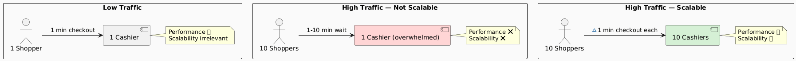
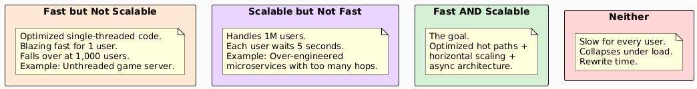
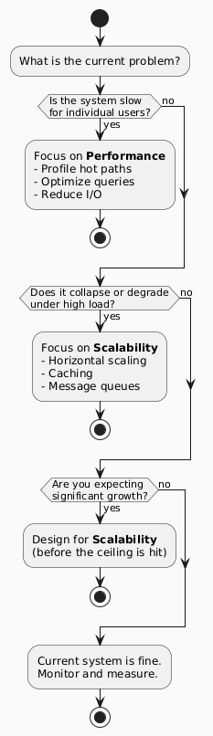

# Performance vs. Scalability — Comparison & Trade-offs

> "A system can be fast for one user and fall apart for a million. A system can handle a million users and feel slow to each one. The goal is both."

---

## 1. Side-by-Side Comparison

| | **Performance** | **Scalability** |
|---|---|---|
| **Measures** | Speed of one unit of work | System behavior as load grows |
| **Perspective** | Single user / single request | The system as a whole |
| **Key metric** | Latency (ms), p99 response time | Throughput (req/sec), resource efficiency |
| **Improved by** | Faster algorithms, caching, better hardware | Horizontal scaling, partitioning, queuing |
| **Visible to** | End user immediately | Observed under load / growth |
| **Failure mode** | Slow response for every user | Collapse when load exceeds capacity |
| **Hard ceiling** | Amdahl's Law | CAP Theorem, network limits |

---

## 2. The Supermarket Mental Model

The simplest intuition for both concepts:



| Scenario | Performance | Scalability | What Happened |
|---|---|---|---|
| 1 cashier, 1 shopper | ✅ Fast | N/A | No scaling needed |
| 1 cashier, 10 shoppers | ❌ Slow | ❌ Overloaded | No scalability designed in |
| 10 cashiers, 10 shoppers | ✅ Fast | ✅ Handles load | Horizontal scaling works |
| 10 cashiers, 10 shoppers + receipts | ✅✅ Faster | ✅ Handles more | Caching + scaling combined |

---

## 3. The Relationship: They Are Not the Same



---

## 4. Trade-offs: When Scalability Hurts Performance

Many techniques that improve scalability **add overhead** to individual requests. This is expected and acceptable.

| Technique | Scalability Gain | Performance Cost | Net |
|---|---|---|---|
| **Load balancer** | Distributes across N servers | +1–5ms routing overhead | ✅ Worth it |
| **Message queue** | Decouples producers/consumers | Adds async delay (no instant response) | ✅ Worth it for async work |
| **Database sharding** | Handles larger datasets, more writes | Cross-shard queries are expensive | ⚠️ Trade-off by design |
| **Read replicas** | Offloads read traffic | Replication lag (stale reads possible) | ✅ Worth it for read-heavy |
| **Caching** | Reduces DB load, scales reads | Cache miss costs extra time | ✅ Worth it at high hit rate |
| **Geographic distribution** | Survives regional failure, reduces latency globally | Cross-region writes are slow | ✅ Worth it for global products |
| **Microservices** | Independent scaling per service | Network hops add latency; serialization cost | ⚠️ Only if you need independent scale |
| **Consistent hashing** | Easy node add/remove | Slightly more complex routing | ✅ Worth it |

> **The golden rule:** It is acceptable to slow down a single request slightly if it means the system stays fast for millions of requests.

---

## 5. Trade-offs: When Performance Optimization Hurts Scalability

| Optimization | Performance Gain | Scalability Problem |
|---|---|---|
| **In-memory session state** | Fast reads (no network hop) | Server becomes stateful; can't freely scale out |
| **Local file cache** | Extremely fast | Not shared across servers; inconsistent |
| **Tight coupling** | Fewer network calls | Cannot scale components independently |
| **Large batch sizes** | High throughput per batch | Increases latency for individual items in batch |
| **Pre-computed global state** | Fast reads | Single node bottleneck for writes |
| **Single large DB instance** | Simple, fast queries | Vertical ceiling; single point of failure |

---

## 6. Decision Framework: Which to Prioritize?



| Situation | Priority | Reasoning |
|---|---|---|
| Prototype / MVP | Performance | No users yet; don't over-engineer |
| Product-market fit reached | Scalability | Growth is coming; design before crisis |
| User complaints about slowness | Performance | Fix what users feel |
| System crashes at peak | Scalability | Architectural problem, not code speed |
| Latency is fine, cost is high | Scalability efficiency | Better resource utilization |
| Intermittent spikes | Both | Queue to absorb spikes, cache to reduce load |

---

## 7. Little's Law — The Unifying Formula

Both performance and scalability are described by a single queueing theory law:

```
L = λ × W

L = average number of requests in the system
λ = arrival rate (requests/sec)
W = average time a request spends in the system (latency)
```

| What Happens | Effect on W (Latency) | Effect on L (Queue Depth) |
|---|---|---|
| λ increases (more users) | Increases | Increases rapidly |
| Service rate increases (faster code) | Decreases | Decreases |
| More workers added (scaling out) | Decreases | Decreases |
| Cache added (fewer DB calls) | Decreases W for cache hits | Decreases overall |

> **Implication:** You can control `W` (latency) through performance work, or you can reduce the effective `λ` through caching and queuing, or you can add workers to increase service rate. All three matter.

---

## 8. Checklist: Questions to Ask at Design Time

### Performance
- [ ] What is the expected p99 latency target?
- [ ] Where are the I/O boundaries in the request path?
- [ ] Are there N+1 query risks?
- [ ] Is there unnecessary serialization / deserialization?
- [ ] Are connections pooled?

### Scalability
- [ ] Is application state externalized? (Stateless servers)
- [ ] What is the bottleneck axis? (X / Y / Z)
- [ ] Can the database handle 10x current write load?
- [ ] Are there any global locks or shared mutable singletons?
- [ ] Can each service scale independently?
- [ ] Is there a queue in front of any slow consumers?
- [ ] What happens when one node fails?

### Both
- [ ] Are SLOs defined for latency and throughput?
- [ ] Is there a load testing strategy?
- [ ] Are p95/p99 latencies tracked in production?
- [ ] Is there a capacity plan for 3/6/12 months of growth?

---

## 9. Summary

```
┌─────────────────────────────────────────────────────────┐
│                                                         │
│  Performance  →  How fast is ONE request?               │
│  Scalability  →  Does it stay fast as load grows?       │
│                                                         │
│  They are related but not the same.                     │
│  Improving one can hurt the other.                      │
│  The goal is to design systems that are both.           │
│                                                         │
│  Start with performance. Design for scalability.        │
│  Measure everything. Optimize what you measure.         │
│                                                         │
└─────────────────────────────────────────────────────────┘
```

---

*See also: [Performance](performance.md) · [Scalability](scalability.md)*