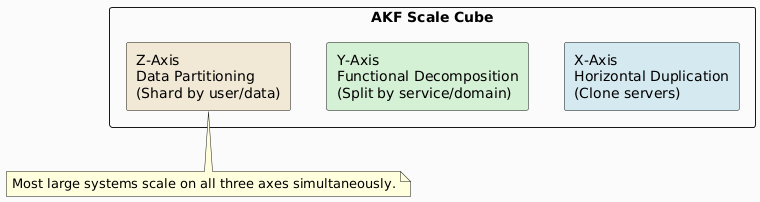
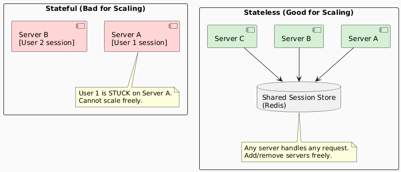
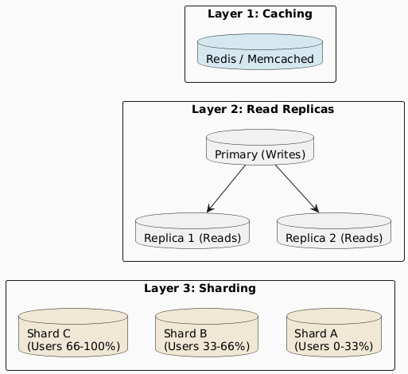
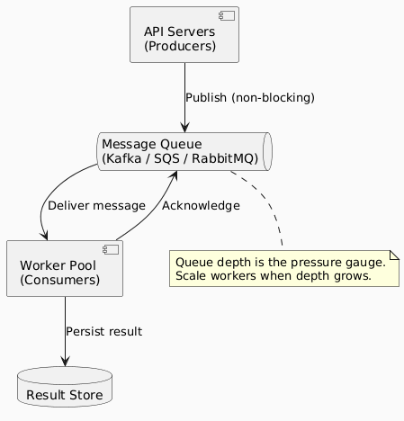
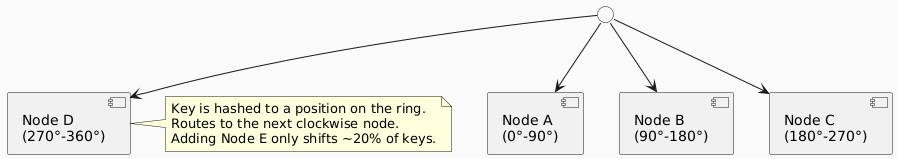

# Scalability

> "A service is scalable if increasing resources results in increased performance **proportional** to resources added."

---

## 1. What is Scalability?

Scalability is the property of a system to handle **growing amounts of work** — more users, more data, more traffic — by adding resources, without a disproportionate loss of performance.

There are two distinct reasons to add resources to a system:

| Reason | Goal | Scalability Requirement |
|---|---|---|
| **Handle more load** | Increase throughput | Adding resources → proportional throughput gain |
| **Improve reliability** | Introduce redundancy | Adding redundancy → must not degrade performance |

> "Scalable" used as a magic incantation to end an argument — *"that doesn't scale"* — usually means the architecture has hit a hard ceiling. Good scalability means that ceiling is pushed far out, or doesn't exist at all.

---

## 2. The Three Axes of Scale

Every system scales along one or more dimensions. Identify **which axis** is your actual constraint before choosing a strategy.

| Axis | Strategy | Example | Limitation |
|---|---|---|---|
| **X — Horizontal** | Clone identical services | Multiple app servers behind LB | Shared state must be external |
| **Y — Functional** | Split by domain/responsibility | Microservices, separate DBs per service | Distributed transactions get complex |
| **Z — Data** | Shard by data partition key | User ID-based DB sharding | Cross-shard queries become expensive |

---

## 3. Scale Up vs. Scale Out

| | **Scale Up (Vertical)** | **Scale Out (Horizontal)** |
|---|---|---|
| **What it means** | Bigger machine | More machines |
| **Cost curve** | Superlinear — hardware premium increases sharply | Roughly linear |
| **Hard ceiling** | Yes — hardware limits exist | Effectively none |
| **Complexity** | Low — single machine | High — distributed system |
| **Failure mode** | Single point of failure | Graceful degradation |
| **Best for** | Stateful workloads, DBs (initially) | Stateless services, large web traffic |

> Scale up first to buy time. Design for scale out from the beginning.

---

## 4. Designing for Scalability

### 4.1 Statelessness Is the Foundation

The single most important property for horizontal scalability.

**Rules for stateless services:**
- No in-process session state
- No local disk as source of truth
- All state lives in an external store (DB, cache, object storage)
- Servers are interchangeable and disposable

### 4.2 Database Scalability

The database is almost always the first bottleneck. A layered approach:

| Technique | Solves | Introduces |
|---|---|---|
| **Connection pooling** | Too many DB connections | Minimal complexity |
| **Caching** | Read-heavy load on DB | Stale data, invalidation logic |
| **Read replicas** | Read-heavy traffic | Replication lag |
| **Vertical scaling** | General DB load | Cost, hard ceiling |
| **Sharding** | Write-heavy, huge datasets | Cross-shard queries, rebalancing |
| **CQRS** | Read/write contention | Eventual consistency |

### 4.3 Asynchronous Processing via Message Queues

Decouple producers from consumers. Absorb spikes. Enable independent scaling of each side.

**Properties:**
- API servers respond immediately (async acknowledgement)
- Workers scale independently of producers
- Queue absorbs traffic spikes (backpressure buffer)
- Failed jobs can be retried without re-invoking the producer

---

## 5. Handling Heterogeneity

As you scale out, nodes diverge. New hardware is faster. Some nodes are geographically distant. You cannot assume uniformity.

| Problem | What Breaks | Solution |
|---|---|---|
| Newer, faster nodes | Naive round-robin underutilizes them | Weighted load balancing |
| Nodes with different storage | Simple partitioning wastes space | Consistent hashing with virtual nodes |
| Nodes at different latencies | Uniform timeouts cause failures | Adaptive timeouts, hedged requests |
| Node failure mid-operation | Data loss or partial writes | Quorum writes, idempotent operations |

### Consistent Hashing

Distributes load across a ring of nodes. Adding or removing one node only remaps `1/N` of keys — not a full reshuffle.

---

## 6. Redundancy and Reliability

Scalability must accommodate redundancy **without degrading performance**.

| Redundancy Type | Purpose | Performance Impact |
|---|---|---|
| **Active-Active** | Both nodes serve traffic | None — doubles capacity |
| **Active-Passive** | Standby node takes over on failure | Failover adds latency spike |
| **N+1 Redundancy** | One extra node absorbs failures | ~(N/(N+1)) utilization per node |
| **Geographic replication** | Survive regional outages | Write latency increases (cross-region sync) |

---

## 7. Scalability Anti-Patterns

| Anti-Pattern | Description | Why It Fails |
|---|---|---|
| **Shared mutable state** | Global lock or singleton in critical path | Becomes serialization bottleneck |
| **Synchronous fan-out** | One request triggers N downstream sync calls | Latency multiplies; one slow node blocks all |
| **Chatty services** | Microservices with too many inter-service calls | Network overhead dominates |
| **Naive monolith** | Everything in one process, one DB | Vertical ceiling hit; no independent scaling |
| **Fat sessions** | Large server-side session objects | Cannot move user to a new server |
| **Assuming uniform nodes** | All nodes in round-robin regardless of capacity | Slower nodes become bottlenecks |
| **Missing backpressure** | No queue; producers overwhelm consumers | Consumer crashes, data loss |

---

## 8. When to Scale

Use these signals — not intuition:

| Signal | Meaning | Action |
|---|---|---|
| CPU > 70% sustained | Compute-bound | Scale out app servers |
| DB query latency rising | DB bottleneck | Add read replica, then cache, then shard |
| p99 latency rising but CPU low | I/O wait / lock contention | Profile I/O, check slow query log |
| Queue depth growing unbounded | Consumer too slow | Scale out workers |
| Memory usage > 80% | Memory pressure | Scale up or reduce memory footprint |
| Error rate rising under load | Hard capacity ceiling | Immediate horizontal scale or rate limit |

---

## 9. Summary

- Scalability = proportional performance gain when resources are added
- It must be **designed in** — retrofitting is expensive and painful
- The three axes: **X (clone), Y (decompose), Z (partition)**
- **Statelessness** is the prerequisite for horizontal scaling
- Scale the database in layers: cache → replicas → sharding
- Design for **heterogeneity** — nodes will not be uniform at scale
- Redundancy for reliability must not degrade throughput

---

*See also: [Performance](performance.md) · [Performance vs. Scalability](performance-vs-scalability.md)*