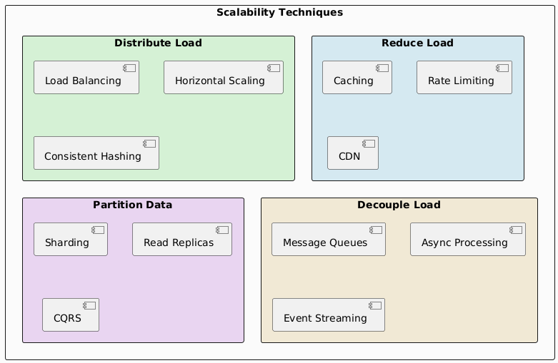
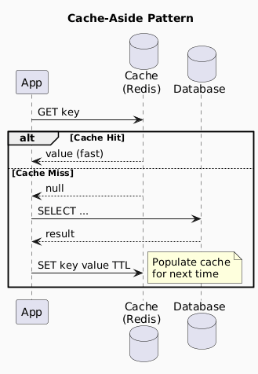
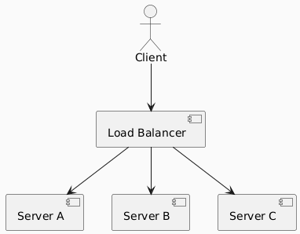
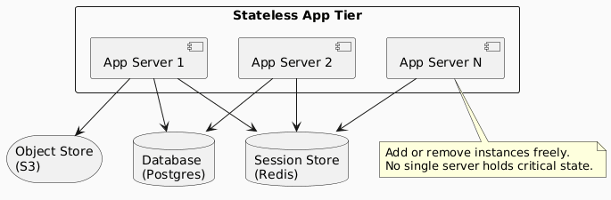
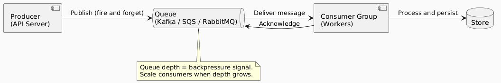
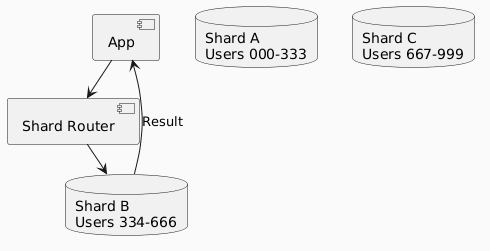
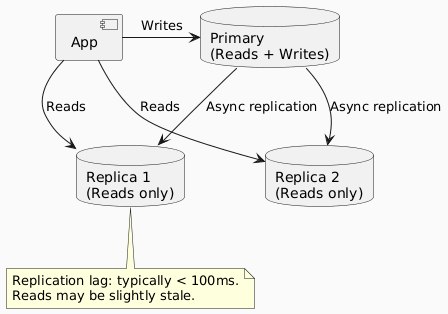
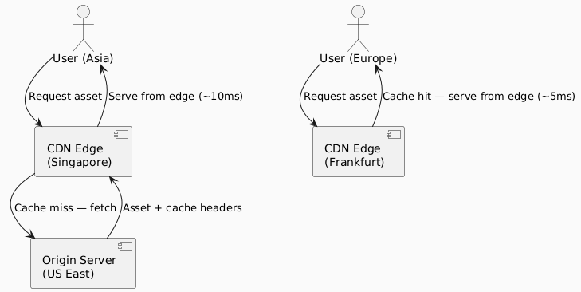
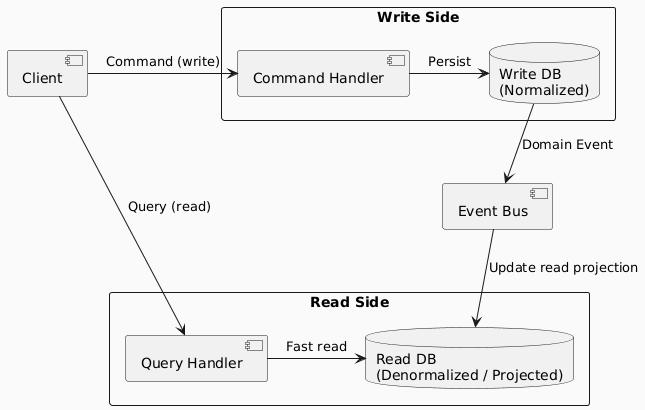

# Scalability Techniques

> A reference for the most common techniques used to scale systems, when to use them, and what trade-offs they introduce.

---

## 1. Overview

---

## 2. Caching

**Goal:** Serve repeated results without recomputing or re-querying.

### Patterns

| Pattern | How It Works | Use When |
|---|---|---|
| **Cache-Aside** | App checks cache first; on miss, loads from DB and populates cache | Most common; flexible | 
| **Write-Through** | Write to cache and DB simultaneously | Read-heavy, needs consistency |
| **Write-Behind** | Write to cache immediately; async flush to DB | Write-heavy, tolerates brief lag |
| **Read-Through** | Cache sits between app and DB; fetches on miss automatically | Transparent to application |

### Cache Invalidation Strategies

| Strategy | Description | Risk |
|---|---|---|
| **TTL (Time-To-Live)** | Expire after fixed duration | Stale data up to TTL window |
| **Event-driven** | Invalidate on write events | Complexity; missed events = stale data |
| **Write-through** | Update cache on every write | Higher write latency |
| **Cache busting** | Use versioned keys (`user:v2:123`) | Old keys linger, wasting memory |

### When Caching Fails

| Failure Mode | Cause | Mitigation |
|---|---|---|
| **Cache miss storm** | Cache cold start or full eviction | Warm-up strategy, staggered TTL |
| **Thundering herd** | Popular key expires; all requests hit DB | Mutex/lock on miss, probabilistic early refresh |
| **Stale data** | TTL too long or invalidation missed | Shorter TTL, event-driven invalidation |
| **Cache stampede** | Simultaneous writes on rebuild | Use a single background refresh job |

---

## 3. Load Balancing

**Goal:** Distribute incoming traffic across multiple servers so no single server is the bottleneck.

### Algorithms

| Algorithm | How It Works | Best For |
|---|---|---|
| **Round Robin** | Rotate through servers in order | Homogeneous servers, short requests |
| **Least Connections** | Route to server with fewest active connections | Long-lived connections, variable request cost |
| **Weighted Round Robin** | Round-robin with capacity weights | Heterogeneous servers |
| **IP Hash** | Hash client IP to consistent server | Sticky sessions (use sparingly) |
| **Least Response Time** | Route to fastest-responding server | Latency-sensitive workloads |
| **Random** | Pick a server randomly | Simple, surprisingly effective at scale |

### Layer 4 vs. Layer 7

| | **Layer 4 (Transport)** | **Layer 7 (Application)** |
|---|---|---|
| **Operates on** | TCP/UDP | HTTP, gRPC, WebSocket |
| **Speed** | Faster (less inspection) | Slower (content-aware) |
| **Routing basis** | IP + port | URL, headers, cookies, content |
| **SSL termination** | Sometimes | Yes |
| **Use case** | Raw TCP load balancing | HTTP routing, A/B testing, auth |

---

## 4. Horizontal Scaling

**Goal:** Add more instances of a service rather than upgrading one machine.

**Prerequisite:** Services must be **stateless**. All state must live in external stores.

---

## 5. Message Queues

**Goal:** Decouple producers and consumers. Buffer load spikes. Enable async processing.

### Comparison of Queue Systems

| System | Model | Ordering | Retention | Best For |
|---|---|---|---|---|
| **Kafka** | Log / stream | Per-partition | Configurable (days–forever) | High-throughput event streaming, replay |
| **RabbitMQ** | Push / AMQP | Per-queue | Until consumed | Task queues, complex routing |
| **AWS SQS** | Pull | Best-effort (FIFO option) | Up to 14 days | Decoupled AWS workloads |
| **Redis Streams** | Log | Yes | Configurable | Lightweight streaming |

### Key Properties

| Property | Description |
|---|---|
| **At-most-once** | Message delivered 0 or 1 times. Fast, can lose messages. |
| **At-least-once** | Message delivered 1 or more times. Can cause duplicates. |
| **Exactly-once** | Message delivered exactly once. Most complex, highest overhead. |
| **Idempotency** | Consumer handles duplicate delivery safely. Required for at-least-once. |

---

## 6. Database Sharding

**Goal:** Partition data across multiple database instances so no single instance holds all data.

### Sharding Strategies

| Strategy | How | Pros | Cons |
|---|---|---|---|
| **Range-based** | Shard by value range (A–M, N–Z) | Simple | Hot spots if data skewed |
| **Hash-based** | `shard = hash(key) % N` | Even distribution | Rebalancing is hard |
| **Consistent hashing** | Hash ring; add nodes gracefully | Minimal rebalancing | More complex routing |
| **Directory-based** | Lookup table maps key → shard | Flexible | Lookup table is a bottleneck |

### Sharding Pitfalls

| Problem | Description | Mitigation |
|---|---|---|
| **Hot shard** | One shard gets disproportionate traffic | Better partition key; sub-sharding |
| **Cross-shard query** | JOIN across shards requires scatter-gather | Denormalize; avoid cross-shard joins |
| **Rebalancing** | Adding a shard requires migrating data | Consistent hashing; virtual nodes |
| **Distributed transactions** | Transactions across shards are complex | Sagas pattern; avoid if possible |

---

## 7. Read Replicas

**Goal:** Offload read traffic from the primary database to one or more replicas.

| Aspect | Detail |
|---|---|
| **Replication type** | Usually asynchronous (low write latency) |
| **Consistency** | Eventual — replicas may lag behind primary |
| **Use for** | Analytics, reporting, non-critical reads |
| **Avoid for** | Reads immediately after writes (read-your-writes consistency) |

---

## 8. CDN (Content Delivery Network)

**Goal:** Serve static and cacheable content from edge nodes geographically close to users.

| CDN Use Case | Example |
|---|---|
| Static assets | JS, CSS, images, fonts |
| Video streaming | HLS segments |
| API caching | Read-only, public API responses |
| DDoS protection | Absorb traffic before origin |

---

## 9. CQRS (Command Query Responsibility Segregation)

**Goal:** Separate the read model from the write model so each can be optimized and scaled independently.

| Aspect | Detail |
|---|---|
| **Write model** | Normalized, consistent, handles commands |
| **Read model** | Denormalized, optimized for specific queries |
| **Consistency** | Eventual — read side may lag write side |
| **Complexity** | High — two models to maintain |
| **When to use** | High read/write ratio mismatch, complex query needs |

---

## 10. Quick Reference: Technique Selection

| Problem | First Reach For | Then Consider |
|---|---|---|
| Read-heavy load on DB | Read replicas + caching | CQRS |
| Write-heavy load | Sharding | Async queue + write-behind cache |
| Stateful servers blocking scale-out | Externalize session to Redis | Stateless redesign |
| Traffic spikes | Message queue | Auto-scaling |
| Global users with high latency | CDN | Geographic DB replication |
| Single node bottleneck | Horizontal scaling | Load balancer algorithm tuning |
| Expensive repeated computation | Cache-aside | Write-through if data changes |
| Slow consumers causing backpressure | Scale consumer workers | Partition queue by key |

---

*See also: [Performance](performance.md) · [Scalability](scalability.md) · [Performance vs. Scalability](performance-vs-scalability.md)*