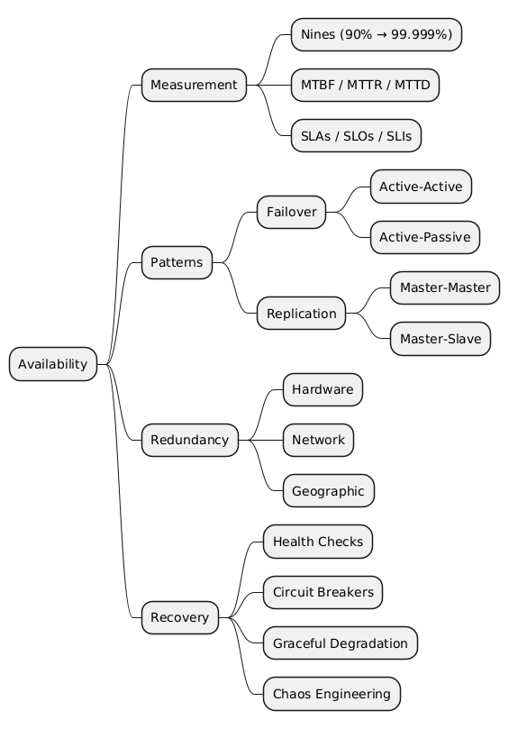

# Availability — System Design Notes

> **One-line definition:** Availability is the fraction of time a system correctly serves requests.  
> **Formula:** `Availability = Uptime / (Uptime + Downtime)`

---

## Quick-Reference Cheatsheet

| Nines | Uptime % | Downtime / year | Downtime / month | Downtime / week |
|-------|----------|-----------------|------------------|-----------------|
| One nine | 90% | 36.5 days | 72 hrs | 16.8 hrs |
| Two nines | 99% | 3.65 days | 7.2 hrs | 1.68 hrs |
| Three nines | 99.9% | 8.76 hrs | 43.8 min | 10.1 min |
| Four nines | 99.99% | 52.6 min | 4.38 min | 1.01 min |
| Five nines | 99.999% | 5.26 min | 26.3 sec | 6.05 sec |

> **Interview rule of thumb:** Most production web services target **99.9–99.99%**. Five-nines is reserved for telephony, power grids, and life-critical systems.

---

## File Index

| File | Contents |
|------|----------|
| [01-fundamentals.md](01-fundamentals.md) | Definitions, metrics (MTBF/MTTR/MTTR), SLAs, factors affecting availability |
| [02-failover-patterns.md](02-failover-patterns.md) | Active-Active, Active-Passive, failover mechanics, trade-offs |
| [03-replication-patterns.md](03-replication-patterns.md) | Master-Master, Master-Slave, sync vs async replication, consistency trade-offs |
| [04-redundancy-and-fault-tolerance.md](04-redundancy-and-fault-tolerance.md) | Hardware/network/geographic redundancy, bulkheads, blast radius |
| [05-health-monitoring-and-recovery.md](05-health-monitoring-and-recovery.md) | Health checks, circuit breakers, chaos engineering, graceful degradation |
| [06-availability-in-numbers.md](06-availability-in-numbers.md) | Availability in numbers, mathematical formulas |

---

## Concept Map



---

## Availability Is Multiplicative Across Dependencies

If Service A (99.9%) depends on Service B (99.9%):

```
Combined availability = 0.999 × 0.999 = 99.8%
```

Every dependency you add **degrades** your overall availability. Design to minimize the critical path.

---

## Key Trade-offs at a Glance

| Strategy | Availability Gain | Cost | Complexity | Risk |
|---|---|---|---|---|
| Active-Passive Failover | High | Medium | Low | Data loss window |
| Active-Active Failover | Very High | High | High | Split-brain |
| Async Replication | Medium | Low | Low | Replication lag |
| Sync Replication | High | High | Medium | Write latency |
| Geographic Distribution | Very High | Very High | Very High | Consistency |
| Circuit Breaker | Medium | Low | Low | False positives |

---
