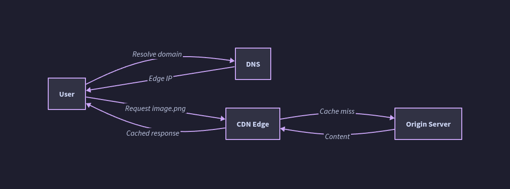
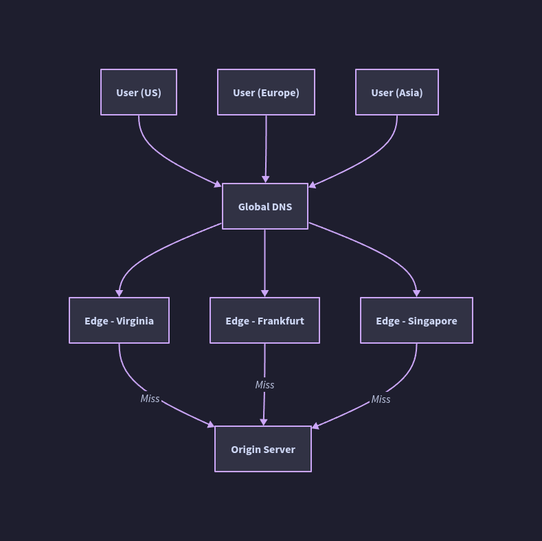
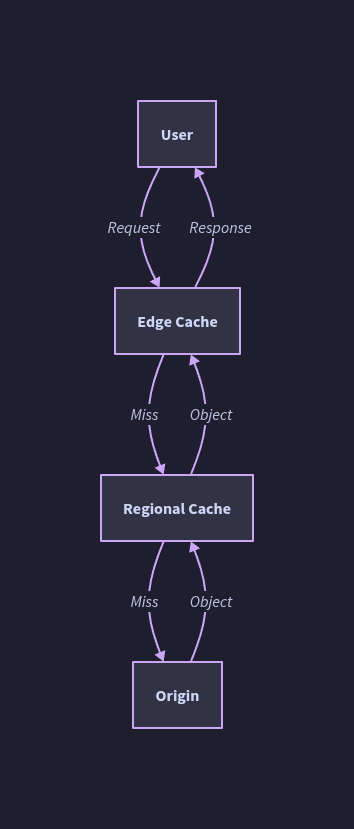

# Content Delivery Networks (CDN) — Overview

---

## What Is a CDN?

A **Content Delivery Network (CDN)** is a globally distributed network of proxy servers (edge nodes / PoPs) that cache and serve content from locations physically closer to end users, rather than from a single origin server.

- The site's **DNS resolution** directs clients to the nearest/optimal CDN edge node
- CDNs serve **static content** (HTML, CSS, JS, images, video, fonts, binaries) by default; modern CDNs like CloudFront and Fastly also support **dynamic content acceleration**
- CDN operators pay ISPs and carriers to co-locate servers inside their data centers — edge nodes sit at the literal edge of the last mile



---

## Why CDNs Exist: The Core Problems They Solve

| Problem | Without CDN | With CDN |
|---|---|---|
| Geographic latency | Every request travels to origin regardless of user location | User served from nearest PoP, RTT drops dramatically |
| Origin overload | Origin handles 100% of traffic | CDN absorbs cache hits; origin only handles misses + dynamic requests |
| Bandwidth costs | Origin pays for all egress | CDN offloads majority of transfer; origin egress reduced |
| Single point of failure | Origin down = site down | CDN edge continues serving cached content |
| DDoS surface | Attack funnels directly to origin | CDN absorbs and filters volumetric attacks at the edge |

---

## Core CDN Architecture Concepts

| Concept | Description |
|---|---|
| **Origin Server** | The authoritative source of content; CDN fetches from here on cache miss |
| **Edge Node / PoP (Point of Presence)** | A CDN server co-located near end users; serves cached content |
| **Origin Shield** | An intermediate caching tier between edge nodes and origin; collapses many edge misses into a single origin request (reduces origin fan-out) |
| **CDN Selector** | In multi-CDN setups, a service that routes requests across multiple CDN providers based on performance, cost, or availability |
| **CDN Footprint** | Geographic coverage area where edge nodes can effectively serve users |
| **CDN Offloading** | Percentage of total requests served by CDN vs. origin; higher = better |

```
User → DNS → Edge Node (cache hit? serve)
                    ↓ miss
              Origin Shield (cache hit? serve)
                    ↓ miss
              Origin Server → response propagates back and is cached
```

### Global CDN Architecture



### Multi-Level CDN Cache



---

## Two Fundamental CDN Models

| Dimension | Pull CDN | Push CDN |
|---|---|---|
| **Content population** | Lazy: fetched on first user request | Eager: operator uploads content proactively |
| **TTL/expiry control** | Set via Cache-Control / TTL headers | Set by operator at upload time |
| **Storage on CDN** | Minimal; only recently-requested content stays | Higher; all uploaded content persists |
| **Origin traffic** | Bursts on cache miss; redundant re-fetches on TTL expiry | Minimal; origin only contacted at publish time |
| **Operational effort** | Low — URL rewrite + cache headers | Higher — explicit upload pipeline required |
| **Best for** | High-traffic sites with unpredictable demand | Low-traffic or infrequently-updated assets |

---

## Request Routing Mechanisms

CDNs use multiple techniques to direct a user request to the optimal edge node:

- **DNS-based routing** — DNS resolver returns the IP of the nearest/best PoP. Most common mechanism. Relies on the client's DNS resolver IP to approximate location.
- **Anycast routing** — Multiple PoPs share the same IP prefix; BGP routing naturally sends the packet to the topologically nearest one. Common in DNS and DDoS mitigation CDNs (Cloudflare).
- **HTTP redirect** — Origin or DNS responds with a redirect to an edge URL.
- **Global Server Load Balancing (GSLB)** — Health-aware, latency-aware, capacity-aware DNS that dynamically adjusts which PoP is returned.
- **EDNS Client Subnet (ECS)** — Extension that passes the client's actual subnet in the DNS query, allowing the CDN to geo-locate the real user rather than their resolver. Critical when users use public resolvers (Google 8.8.8.8, Cloudflare 1.1.1.1) far from their actual location.

**ECS Trade-offs:**

| Pro | Con |
|---|---|
| Accurate geo-routing for public DNS users | Reduces resolver cache effectiveness (more unique queries) |
| Reduces RTT for users with non-local resolvers | Exposes client subnet (privacy concern) |
| CDNs can route to truly nearest PoP | Increases total DNS resolution traffic |

---

## Caching Mechanics

### Cache Population Strategies

| Strategy | How it works |
|---|---|
| **Pull (reactive)** | Edge fetches from origin on first miss; subsequent requests served from cache |
| **Push (proactive)** | Content pre-loaded to edge nodes before any user requests it |
| **Prefetch** | Edge node speculatively fetches content predicted to be needed soon |

### Cache Invalidation

| Method | Description | Latency |
|---|---|---|
| **TTL expiry** | Cache entry expires naturally; next request triggers re-fetch | Up to full TTL |
| **Purge API** | Operator explicitly invalidates a URL or tag across all PoPs | Seconds to minutes |
| **Surrogate keys / Cache tags** | Tag assets with logical keys (e.g., `product-123`); invalidate entire tag group atomically | Fast with CDN support |
| **Versioned URLs** | Embed content hash in filename (`app.a3f2c1.js`); new deploy = new URL = always fresh | Instant (no invalidation needed) |

### Cache-Control Headers

```
Cache-Control: public, max-age=31536000, immutable   ← static assets with versioned URLs
Cache-Control: public, max-age=300, stale-while-revalidate=60  ← semi-dynamic
Cache-Control: private, no-store                     ← authenticated/sensitive responses
Vary: Accept-Encoding, Accept-Language               ← serve different cached versions per header
```

---

## CDN Layers and Content Types

| Content Type | Cacheable? | Typical TTL | Notes |
|---|---|---|---|
| Static assets (JS/CSS/images) | Yes | Days–years | Version in filename; set `immutable` |
| HTML pages | Sometimes | Minutes–hours | `stale-while-revalidate` useful here |
| API responses (public) | Sometimes | Seconds–minutes | Vary carefully; cache keys matter |
| Authenticated API responses | No | — | Must be `private` or `no-store` |
| Video (VOD) | Yes | Long | Chunked; range-request aware |
| Live streaming | Partial | Seconds | Short TTLs; edge buffering |
| Dynamic personalized content | No (raw) | — | ESI can cache partial page fragments |

**Edge Side Includes (ESI):** A markup language allowing edges to assemble pages from cacheable fragments + uncacheable dynamic fragments, avoiding full-page no-cache constraints.

---

## Performance Impact

Two primary performance gains:

1. **Reduced RTT** — Edge node is physically closer to user; speed-of-light latency drops from e.g. 200ms (cross-continental) to 10–20ms (regional PoP)
2. **Reduced origin load** — CDN handles cache hits; origin only processes misses and dynamic requests

Additional gains:
- **Protocol optimization** — Modern CDNs terminate TLS at the edge and maintain persistent, optimized connections to origin (HTTP/2, HTTP/3, QUIC)
- **TCP connection reuse** — Edge keeps warm connections to origin; eliminates TCP handshake cost per user
- **Compression** — Brotli/gzip at the edge; reduces transfer size
- **Image optimization** — Transcode/resize at edge on-the-fly per device/browser capability (WebP, AVIF)

---

## CDN Security Functions

| Feature | Description |
|---|---|
| **DDoS mitigation** | Absorbs volumetric attacks at the edge; scrubs traffic before it reaches origin |
| **Web Application Firewall (WAF)** | Inspects and filters HTTP requests at edge (SQLi, XSS, OWASP Top 10) |
| **Bot management** | Identifies and rate-limits or challenges malicious bots |
| **TLS termination** | CDN handles certificate management, TLS offload |
| **Token authentication** | Signed URLs or cookies prevent unauthorized access to CDN-served assets |
| **Hotlink protection** | Blocks other sites from embedding your CDN-served assets |
| **Subresource Integrity (SRI)** | Browser verifies CDN-served script hash matches expected; prevents CDN compromise attacks |

**GDPR / Privacy concern:** CDN operators collect user IP addresses (and potentially behavioral data) via their edge nodes. This has been ruled a GDPR violation in some jurisdictions (e.g., German court ruling, 2021) when the user's IP is transmitted to a CDN without explicit consent.

---

## CDN Topologies

### Single CDN
```
Origin → CDN Provider A (global PoPs) → Users
```
Simple, but creates vendor dependency and single point of failure at CDN level.

### Multi-CDN
```
Origin → CDN Selector → CDN Provider A
                      → CDN Provider B
                      → CDN Provider C
```
- **Benefits:** No single CDN failure takes down delivery; can route to cheapest/fastest CDN per region; negotiate better pricing
- **CDN selection criteria:** Performance (latency/throughput measured in real-time), availability (health checks), cost (per-GB pricing)
- **Methods:** Client-side selection (JavaScript), DNS-based selection, server-side selection at origin

### Origin Shield
```
Edge Node (miss) → Origin Shield (shared cache for that region) → Origin
```
- Prevents N edge nodes all hammering origin simultaneously on a cache miss
- Critical for high fan-out CDN topologies (100+ PoPs)
- Adds ~1 extra network hop on miss, but dramatically reduces origin request rate

### Private CDN / eCDN
- Built and operated by the content owner (or enterprise)
- Common for internal video delivery, software distribution
- Consists of caching servers, reverse proxies, or ADCs entirely under operator control

---

## CDN Variants

| Type | Description | Examples |
|---|---|---|
| **Traditional CDN** | General-purpose static/dynamic content | Akamai, Cloudflare, Fastly, CloudFront |
| **Video CDN / Streaming CDN** | Optimized for adaptive bitrate (ABR) video, live/VOD | Akamai, Fastly, Qwilt |
| **Image CDN** | On-the-fly image transformation + delivery | Cloudinary, Imgix, ImageEngine, Cloudflare Polish |
| **Telco CDN** | Operated by ISPs; caches deep in last-mile network | AT&T, Telefonica, NTT |
| **Peer-to-peer CDN** | Clients contribute bandwidth to serve other clients | BitTorrent-based; Web3/crypto incentive models |
| **Virtual CDN (vCDN)** | Software-defined, container/VM-based dynamic placement | Research/enterprise deployments |
| **Edge Compute CDN** | CDN + serverless compute at edge nodes | Cloudflare Workers, Fastly Compute@Edge, Lambda@Edge |

---

## CDN Disadvantages and Trade-offs

| Disadvantage | Detail |
|---|---|
| **Cost** | Per-GB egress pricing; at high scale can be significant (though typically offsets origin costs) |
| **Stale content** | Content served from cache may lag behind origin if TTL is long and purge is not immediate |
| **URL changes required** | Static assets must point to CDN URLs; affects deployment pipelines |
| **Cache poisoning risk** | Malicious content can be injected into cache if cache key logic is flawed (e.g., caching on wrong Vary headers) |
| **Debugging complexity** | Cache hits/misses add complexity to diagnosing 404s, stale data, or region-specific issues |
| **Vendor lock-in** | CDN-specific features (edge compute, WAF rules) create migration friction |
| **Privacy/GDPR** | User data (IPs, behavior) flows through third-party CDN infrastructure |

---

## Decision Framework: Do You Need a CDN?

| Signal | Recommendation |
|---|---|
| Global user base, latency-sensitive | Strong yes |
| High static asset volume (images, video, JS bundles) | Strong yes |
| Traffic spikes (live events, product launches) | Strong yes |
| Purely internal app, single region | Probably not; local caching layer may suffice |
| Highly dynamic, personalized, no cacheable content | Limited benefit; evaluate edge compute options |
| Regulatory requirements preventing third-party data access | Private CDN or no CDN |

---

## Common CDN Providers

| Provider | Strengths |
|---|---|
| **Cloudflare** | Anycast network, strong security/WAF, Workers edge compute, aggressive pricing |
| **Akamai** | Largest footprint, enterprise-grade, deep telco partnerships, mature image/video CDN |
| **Amazon CloudFront** | Deep AWS integration, dynamic content support, Lambda@Edge |
| **Fastly** | Instant purge, VCL programmability, Compute@Edge, favored by engineering-heavy teams |
| **Google Cloud CDN** | GCP-native integration, HTTP/3, global anycast |
| **Bunny CDN** | Cost-effective, simple API, good for smaller/mid-size workloads |

---

## Anti-Patterns

| Anti-Pattern | Problem | Fix |
|---|---|---|
| Serving all content from origin, CDN only for images | Leaves JS/CSS/fonts on slow origin paths | Route all static assets through CDN |
| No versioned URLs on long-TTL assets | Deploy new JS → users get stale cached file | Embed content hash in filename |
| Caching authenticated responses | User A sees User B's data | Use `Cache-Control: private` or `no-store` on auth'd responses |
| Not using an Origin Shield | 200 edge PoPs × cache miss = 200 simultaneous origin requests | Enable Origin Shield as intermediate cache tier |
| Ignoring Vary headers | Cache serves gzip response to client that can't decompress | Set `Vary: Accept-Encoding` correctly |
| Single CDN provider for critical traffic | CDN outage = site outage | Multi-CDN with health-based switching |
| Long TTL without purge capability | Bug in JS cached for 1 year | Always have a purge API path or use versioned URLs |