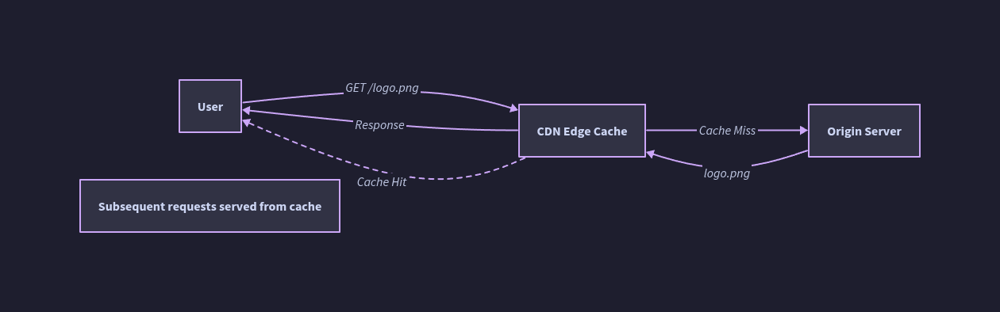

# Pull CDN

---

## What Is a Pull CDN?

A **Pull CDN** populates its cache lazily — on demand. Content stays on the origin server. The CDN only fetches ("pulls") content from origin when a user requests it and the edge node does not already have a valid cached copy.

- The operator rewrites static asset URLs to point to the CDN domain (e.g., `cdn.example.com/logo.png` instead of `www.example.com/logo.png`)
- The CDN inspects its cache on each request: **hit** → serve immediately; **miss** → fetch from origin, cache, then serve
- How long a cached object lives is governed by **TTL** (Time-To-Live), set via HTTP `Cache-Control` headers or CDN-level configuration


---

## How Pull CDN Works: Request Lifecycle

```
First request (cache MISS):
User → CDN Edge Node → Cache lookup: MISS
                     → Fetch from Origin
                     ← Origin responds with content + Cache-Control headers
                     → Edge stores response in local cache
                     ← Edge serves response to User
                       (slightly slower — origin round-trip included)

Subsequent requests (cache HIT):
User → CDN Edge Node → Cache lookup: HIT
                     ← Serve cached content directly
                       (fast — no origin contact)

After TTL expiry (cache STALE):
User → CDN Edge Node → Cache lookup: EXPIRED
                     → Re-fetch from Origin (conditional GET or full fetch)
                     ← Origin: 304 Not Modified (if unchanged) or 200 + new content
                     → Cache updated, TTL reset
                     ← Serve to User
```

### Conditional Requests (Revalidation)

When a cached object's TTL expires, the edge can issue a **conditional GET** to avoid re-downloading unchanged content:

- `If-None-Match: "etag-value"` — Origin returns `304 Not Modified` if ETag matches → edge resets TTL, no body re-transferred
- `If-Modified-Since: <date>` — Similar; time-based rather than ETag-based
- Result: **bandwidth-efficient revalidation** when content hasn't actually changed

---

## TTL: The Core Knob

TTL (Time-To-Live) is the single most important configuration parameter in a Pull CDN. It controls the trade-off between **freshness** and **origin load**.

### How TTL Is Determined (Priority Order)

1. CDN-level override rule (configured by operator — highest priority)
2. `Cache-Control: max-age=<seconds>` header from origin response
3. `Expires: <date>` header from origin (legacy)
4. CDN heuristic (if none of the above: some CDNs cache briefly; others don't cache at all)

### TTL Trade-off Table

| TTL Setting | Effect on Freshness | Effect on Origin Load | Use Case |
|---|---|---|---|
| Very short (1–60s) | Near-real-time freshness | High; frequent re-fetches | Semi-dynamic content, news feeds |
| Short (1–5 min) | Slightly stale acceptable | Moderate | Public API responses |
| Medium (1 hr) | Acceptable for most static | Low | HTML pages, infrequently updated assets |
| Long (1 day – 1 year) | Stale until purged or URL changes | Very low | Versioned static assets (JS/CSS with hash in filename) |
| `immutable` + long TTL | Never re-fetches until URL changes | Near zero | Ideal for hashed filenames |

### `stale-while-revalidate` and `stale-if-error`

- `Cache-Control: max-age=60, stale-while-revalidate=30` — Serve stale content for up to 30s while asynchronously revalidating in the background; user sees no latency penalty on TTL expiry
- `Cache-Control: max-age=60, stale-if-error=3600` — If origin is down, continue serving stale content for up to 1 hour; improves resilience

---

## Cache Miss Stampede (Thundering Herd)

**Problem:** A highly-requested object's TTL expires. Hundreds of simultaneous requests all arrive at the edge with a cache miss at the same instant. All of them fan out to origin simultaneously, overwhelming it.

**Solutions:**

| Technique | How it works |
|---|---|
| **Request coalescing (collapse)** | Edge holds concurrent miss requests; only one goes to origin; response is fanned out to all waiters once received |
| **Origin Shield** | A regional intermediate cache tier. All edge PoPs in a region miss to the Shield, not directly to origin. Only one request reaches origin per region. |
| **Probabilistic early expiry (jitter)** | Expire cache entries slightly early at random, so re-fetch is triggered before TTL expires and traffic is spread out |
| **Stale-while-revalidate** | Serve stale instantly; revalidate in background — eliminates the synchronous miss entirely for most users |

---

## Cache Key Design

A **cache key** is what the CDN uses to uniquely identify a cached object. Correct cache key design is critical for both correctness and efficiency.

### Default Cache Key
Usually: `scheme + hostname + path + query string`
Example: `https://cdn.example.com/api/products?category=shoes`

### Cache Key Customization

| Scenario | Problem | Fix |
|---|---|---|
| `Vary: Accept-Encoding` | Gzip and Brotli responses must be cached separately | CDN varies cache key on `Accept-Encoding` |
| `Vary: Accept-Language` | Localized content for same URL | Vary cache key on `Accept-Language` or use separate URL paths |
| `Vary: Cookie` | **Never use this broadly** — every unique cookie = separate cache entry = 0% hit rate | Strip/ignore session cookies from CDN; only vary on specific meaningful cookies |
| Query string normalization | `?a=1&b=2` and `?b=2&a=1` are the same content but different cache keys | Sort/normalize query params in cache key |
| Unnecessary query params | Tracking params (`?utm_source=...`) bloat cache key space | Strip known tracking params from cache key |

### Cache Poisoning Risk
If cache key logic is wrong (e.g., doesn't include `Host` header), a request for `evil.com` might poison the cache for `example.com`. CDNs must always include the host in the cache key.

---

## TTL Expiry and Redundant Traffic

**The core Pull CDN inefficiency:** If a file expires from cache but hasn't actually changed on origin, the CDN re-fetches it unnecessarily — **redundant traffic**.

Mitigation strategies:
- **Conditional GET revalidation** (ETags / Last-Modified) — avoids full re-download if unchanged
- **Versioned URLs** — `app.[hash].js` never needs to expire; set `max-age=31536000, immutable`. When content changes, the URL changes → CDN naturally fetches new version
- **Long TTL + explicit purge** — Set long TTLs; use CDN purge API on deploy to invalidate stale content

---

## Cache Invalidation / Purge

Pull CDN content can become stale before TTL expires. Purge mechanisms allow operators to force cache eviction.

| Method | Granularity | Speed | Notes |
|---|---|---|---|
| **URL purge** | Single object | Fast (seconds) | Most CDNs support this |
| **Prefix/wildcard purge** | All objects under a path | Fast–medium | `purge /images/*` |
| **Surrogate-Key / Cache-Tag purge** | Logical group of objects | Fast | Tag assets at origin with `Surrogate-Key: product-42`; purge the tag atomically |
| **Full cache flush** | Everything | Seconds–minutes | Nuclear option; use rarely |
| **Versioned URL deploy** | Implicit per-file | Instant (no purge needed) | Best practice for JS/CSS/assets |

**Instant Purge (Fastly):** Fastly built its architecture around the ability to purge content in ~150ms globally — a key differentiator from CDNs that can take minutes.

---

## Vary Header: Serve Different Content for Same URL

`Vary` tells the CDN (and browsers) to cache separate versions of a response based on a request header.

```
Vary: Accept-Encoding          ← Cache separate gzip / brotli / identity versions
Vary: Accept-Language          ← Cache per language
Vary: Accept                   ← Cache per content type (JSON vs HTML)
```

**Warning:** `Vary: Cookie` or `Vary: Authorization` causes the CDN to cache a unique copy per user — cache hit rate collapses to near zero. CDNs typically strip these Vary directives and force a cache bypass instead.

---

## Pull CDN and Dynamic Content

Pull CDNs are primarily for cacheable content, but modern CDNs extend to dynamic content via:

- **Dynamic Site Acceleration (DSA):** Even uncacheable requests benefit from CDN's optimized backbone routing, TCP connection reuse to origin, and TLS termination at the edge
- **Edge Compute (Lambda@Edge, Cloudflare Workers):** Run code at the edge to dynamically assemble or personalize responses without hitting origin
- **API caching:** Short-TTL caching of public API responses (e.g., 5s TTL on a product catalog API) can dramatically reduce origin load during traffic spikes

---

## Operational Checklist for Pull CDN

- [ ] All static asset URLs rewritten to CDN domain or CDN is set as reverse proxy
- [ ] Static assets with content-hashed filenames → `Cache-Control: public, max-age=31536000, immutable`
- [ ] HTML pages → short TTL with `stale-while-revalidate`
- [ ] Authenticated/session-specific responses → `Cache-Control: private, no-store`
- [ ] `Vary: Accept-Encoding` set on compressible responses
- [ ] Query string normalization configured (strip tracking params, sort remaining)
- [ ] Origin Shield enabled (if CDN supports it) to collapse multi-PoP misses
- [ ] Request coalescing enabled at edge
- [ ] Purge API integrated into deploy pipeline for non-versioned assets
- [ ] CDN cache hit ratio monitored (target >90% for static assets)
- [ ] Stale-if-error configured for origin fault tolerance

---

## When to Use Pull CDN

**Ideal scenarios:**
- High-traffic sites with unpredictable or bursty demand
- Large content libraries where pre-uploading all assets is impractical
- Sites where content changes frequently and push pipeline overhead is undesirable
- Typical web apps with standard static asset + dynamic page mix

**Less suitable when:**
- Content is rarely requested but must always be available instantly (cold start miss is acceptable tradeoff — but consider Push CDN)
- Origin cannot handle any pull traffic (severely constrained origin — consider Push CDN + Origin Shield)

---

## Pull CDN Performance Metrics to Monitor

| Metric | What It Indicates | Target |
|---|---|---|
| **Cache Hit Ratio (CHR)** | % of requests served from edge cache | >90% for static, >50% for mixed |
| **TTFB (Time to First Byte)** | Latency for first byte to reach user | <50ms (cache hit), <200ms (miss) |
| **Origin Request Rate** | Volume of cache misses reaching origin | Minimize; monitor for miss storms |
| **Bandwidth Offload %** | % of bytes served by CDN vs origin | Higher is better; target >80% |
| **Purge Propagation Time** | Time for purge to take effect at all PoPs | Seconds (good CDN), minutes (acceptable) |
| **Error Rate at Edge** | 4xx/5xx from edge | Should be low; `stale-if-error` reduces 5xx spikes |

---

## Anti-Patterns

| Anti-Pattern | Problem | Fix |
|---|---|---|
| No TTL / TTL of 0 on static assets | CDN never caches; all requests hit origin | Set appropriate `Cache-Control` headers |
| Same URL for different content versions | Users get stale JS/CSS after deploy | Use content-hashed filenames |
| Not configuring Origin Shield | Miss stampede — N PoPs all hit origin simultaneously | Enable Origin Shield |
| Varying cache on Cookie broadly | Hit rate collapses; CDN caches per-user | Strip session cookies from cache key; `no-store` for personalized responses |
| Ignoring `stale-while-revalidate` | Users experience latency spike on TTL expiry | Serve stale, revalidate async |
| Long TTL without purge pipeline | Bug in production JS cached for days | Integrate CDN purge into CI/CD deploy step |