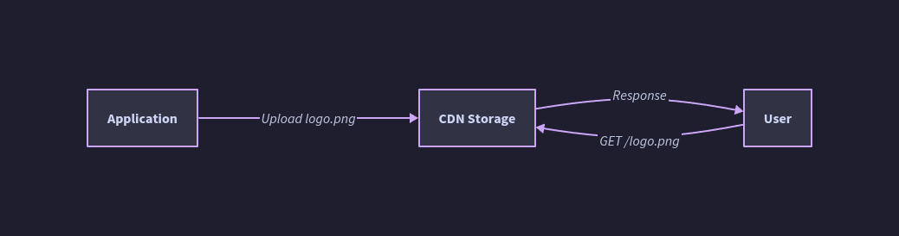

# Push CDN

---

## What Is a Push CDN?

A **Push CDN** is pre-populated by the content operator. Instead of waiting for a user request to trigger a cache fill, the operator **explicitly uploads (pushes) content to CDN edge nodes** in advance. The CDN stores this content until the operator expires or replaces it.

- The operator takes full responsibility for content lifecycle: upload, versioning, expiry, and deletion
- URLs are rewritten (or configured) to point to the CDN, just as with Pull CDNs
- Content is on the CDN before any user requests it — **no cold-start miss**
- The origin server is not contacted by the CDN; it is only the source from which the operator uploads


---

## How Push CDN Works: Lifecycle

```
Content Publish Flow:
Operator/Build Pipeline → Upload to CDN (via API, FTP, S3-compatible bucket, or rsync)
                        → CDN distributes to designated PoPs
                        → CDN assigns URL(s) and applies configured TTL
                        → Content is immediately available globally

User Request Flow:
User → CDN Edge Node → Cache lookup: HIT (always, if content was pushed correctly)
                     ← Serve content directly (no origin contact)

Content Update Flow:
Operator detects change → Explicitly push new version to CDN
                       → Optionally: delete or expire old version
                       → Or: use new URL (versioned path) for new content
```

There is **no origin pull on user request** — the CDN edge never contacts an origin for pushed content; the content is already there.

---

## Push CDN vs Pull CDN: Side-by-Side

| Dimension | Push CDN | Pull CDN |
|---|---|---|
| **Cache population** | Proactive (operator pushes before requests) | Reactive (CDN pulls on first user request) |
| **Cold start miss** | None — content is always pre-loaded | Yes — first request per PoP is slower |
| **Origin involvement** | Only at publish time (operator-initiated) | On every cache miss (user-triggered) |
| **Storage on CDN** | All pushed content persists until explicitly expired | Only recently-requested content |
| **Operator control** | Precise — full control over what is cached and when | Indirect — governed by TTL and cache headers |
| **Operational overhead** | Higher — requires upload/push pipeline | Lower — just set cache headers |
| **Stale content risk** | Lower — operator controls expiry explicitly | Higher — TTL may expire content unnecessarily or not fast enough |
| **Best traffic pattern** | Low-to-moderate, predictable | High-volume, unpredictable demand |
| **Content type fit** | Infrequently-updated, known-in-advance assets | Large dynamic libraries, user-generated content |

---

## When Push CDN Is the Right Choice

| Signal | Reason |
|---|---|
| **Low overall traffic** | Pull CDN's efficiency advantage (caching popular content) doesn't materialize; cold misses add latency unnecessarily |
| **Content updated infrequently** | Worth the upload effort; content stays cached for a long time with no redundant re-fetches |
| **Content must be immediately available globally on publish** | Push pre-positions content at all PoPs before any user request |
| **Controlled, finite asset catalog** | e.g., software releases, game patches, firmware updates — known files, not a growing dynamic library |
| **Strict SLA on first-byte latency** | Cannot tolerate cache miss latency for even the first user per region |
| **Origin is unavailable or not internet-accessible** | CDN cannot pull; content must be pushed via a separate pipeline |
| **Large binary/file distribution** | OS images, installers, video files — upload once, serve many |

---

## Push Mechanisms: How Content Gets to the CDN

| Method | Description | Common With |
|---|---|---|
| **CDN API (REST/HTTP)** | Programmatic uploads via CDN's management API; supports batch, metadata, TTL configuration | Akamai NetStorage, Cloudflare R2, Fastly |
| **S3-compatible object storage** | Push to a bucket (AWS S3, Cloudflare R2, Backblaze B2); CDN origin is pointed at the bucket | CloudFront + S3, Cloudflare R2 |
| **FTP / SFTP / rsync** | Legacy push mechanisms; still used for some CDN providers | BunnyCDN, older Akamai setups |
| **CI/CD pipeline integration** | On deploy: build artifacts → upload to CDN storage → invalidate or version URLs | All modern CDNs |
| **Edge Storage APIs** | Dedicated persistent storage at CDN edge (KV stores, R2, Durable Objects) | Cloudflare R2 + Workers |

### Typical CI/CD Push Pipeline

```
Code commit
    ↓
Build step: compile JS/CSS, compress assets, compute content hashes
    ↓
Upload step: push files to CDN storage bucket (e.g., S3, R2, NetStorage)
    ↓
CDN propagates to PoPs
    ↓
(Optional) Update DNS / CDN routing rules to point to new paths
    ↓
(Optional) Purge old version URLs if versioned URLs not used
```

---

## Content Expiry and Lifecycle Management

Unlike Pull CDNs (where TTL is set by origin response headers), in a Push CDN the **operator explicitly controls expiry**.

| Mechanism | How it works |
|---|---|
| **Explicit TTL at upload** | Set a `max-age` or expiry timestamp at upload time; CDN auto-expires when reached |
| **Manual delete** | Operator calls CDN delete API to remove specific objects |
| **Version-based replacement** | Upload new content to new URL; old URL remains until manually deleted or expired |
| **Bulk purge** | Operator purges a prefix or tag group at deploy time |

**Key advantage over Pull CDN:** No redundant traffic from TTL expiry on unchanged content. Content stays cached exactly as long as the operator intends — no more, no less.

---

## Storage Implications

Push CDN stores **all uploaded content**, regardless of whether it has been requested. This is the primary cost and management trade-off:

| Consideration | Detail |
|---|---|
| **Storage grows with catalog size** | Every pushed file consumes CDN storage, not just popular ones |
| **Unused content still billed** | If a file is pushed and never requested, storage cost is still incurred |
| **Inventory management required** | Operator must track and prune obsolete/expired files to control storage costs |
| **Predictable storage bill** | Unlike Pull CDN (storage fluctuates with traffic patterns), Push CDN storage is determined entirely by what the operator uploads |
| **Cold content doesn't self-evict** | Pull CDN evicts unpopular content under memory pressure (LRU); Push CDN keeps everything until explicitly removed |

---

## Push CDN for Video and Large File Distribution

Push CDN is the natural fit for **large binary distribution** at scale:

- **Software packages / game updates:** Publisher pushes a 10GB patch to CDN storage once; millions of downloads served from the edge without ever re-fetching from origin
- **Video-on-demand (VOD):** Video file uploaded to CDN storage; encoded into multiple bitrate segments (HLS/DASH); player fetches chunks from nearest edge node
- **Firmware / OS images:** Predictable, infrequent releases; push once, available globally with zero miss latency

### Chunked Delivery
Large files are typically segmented:
- CDN serves byte-range requests (`Range: bytes=0-1048575`)
- Each chunk can be independently cached
- Download managers and video players leverage this for parallel download and adaptive streaming

---

## Push CDN and Object Storage Integration

Modern "Push CDN" is often implemented as **Object Storage + CDN origin pointing to that storage**:

```
Developer uploads file → S3 / R2 / GCS bucket (push destination)
CDN origin = bucket URL
User request → CDN edge (miss) → CDN fetches from bucket → caches at edge
```

This hybrid model blurs the line between Push and Pull:
- Content is proactively **placed** in object storage (push behavior)
- CDN edge nodes still **pull from the bucket** on first regional request (pull behavior for PoP population)

**True push CDNs** (e.g., Akamai NetStorage) pre-position content at all PoPs at upload time, eliminating even the bucket-to-edge miss.

---

## Versioning Strategy for Push CDN

Because Push CDN operators control content explicitly, versioning is both more important and easier to manage:

| Strategy | How it works | Pros | Cons |
|---|---|---|---|
| **Path versioning** | `/v2/app.js`, `/v3/app.js` | Simple, human-readable | Must update references throughout app |
| **Content-hash in filename** | `/app.a3f2c1.js` | Immutable; no purge needed; safe to set infinite TTL | Build tooling required |
| **Query-string versioning** | `/app.js?v=2` | No filename change needed | Some CDNs ignore query strings in cache key by default |
| **Timestamp/deploy-ID prefix** | `/2024-06-10/app.js` | Correlates with deploy time | Storage bloat if old versions not cleaned up |

**Best practice:** Use **content-hash filenames** for all assets with indefinite TTLs. On each deploy, only changed files get new URLs — unchanged assets stay cached from previous deploys.

---

## Operational Checklist for Push CDN

- [ ] Push pipeline integrated into CI/CD: build → hash filenames → upload → propagate
- [ ] Explicit TTL or expiry set on all pushed objects
- [ ] Obsolete/stale files purged from CDN storage after each deploy
- [ ] Content-hashed filenames used for immutable asset caching
- [ ] CDN storage inventory monitored; alerts on unexpected growth
- [ ] Upload failures detected and retried in pipeline (push CDN failure = content unavailable)
- [ ] Multi-region push confirmed (verify content is available at all target PoPs)
- [ ] Rollback strategy defined: can you re-push a previous version?
- [ ] Large binary files chunked or using multipart upload for reliability
- [ ] Access control on CDN storage bucket (prevent public write; only pipeline can push)

---

## Failure Modes Unique to Push CDN

| Failure | Impact | Mitigation |
|---|---|---|
| **Upload pipeline failure** | New content not delivered to CDN; users get old version or 404 | Retry logic in pipeline; alerts on push failure; blue/green deploy |
| **Incomplete push** | Some PoPs have new content, others don't | Verify propagation before switching traffic; use atomic versioned URL swaps |
| **Storage quota exceeded** | New uploads rejected | Monitor storage usage; implement automated pruning of old versions |
| **Accidental deletion** | Content deleted from CDN before users stop requesting it | Soft-delete / archival before hard delete; rollback capability |
| **Push to wrong path/environment** | Production content updated with staging data | Environment-scoped CDN credentials; path namespacing per environment |

---

## Push CDN in Multi-CDN Architecture

In a multi-CDN setup, Push CDN requires pushing to **each CDN provider independently**:

```
Build Pipeline → Push to CDN Provider A
              → Push to CDN Provider B
              → Push to CDN Provider C (failover)
```

This multiplies pipeline complexity but ensures content is available regardless of which CDN is selected by the router. Automation (Terraform, CDN management APIs) is essential at this scale.

---

## Cost Considerations

| Cost Driver | Pull CDN | Push CDN |
|---|---|---|
| **Storage** | Low (LRU eviction keeps only popular content) | Higher (all pushed content stored indefinitely until deleted) |
| **Origin egress** | Significant (cache misses hit origin) | Near zero (origin only involved at publish time) |
| **CDN egress (user-facing)** | Same | Same |
| **Operational overhead** | Low (set headers and forget) | Higher (push pipeline, inventory management) |
| **Predictability** | Variable (traffic-driven) | More predictable (controlled by operator) |

---

## Anti-Patterns

| Anti-Pattern | Problem | Fix |
|---|---|---|
| Pushing every file on every deploy (including unchanged) | Storage bloat; unnecessary propagation time; higher CDN API costs | Only push files whose content hash has changed |
| No cleanup of old pushed versions | Unbounded storage growth; ghost content accumulating at CDN | Automated pruning: delete previous version after successful deploy + grace period |
| Pushing without verifying propagation | Traffic switched before content available at all PoPs | Smoke-test CDN URLs at key PoPs before completing deploy |
| Single push destination with no retry | Pipeline failure → content not available → silent broken deploy | Retry with exponential backoff; alert on failure |
| Long TTLs without version control | Old users serve stale content after update | Always version URLs (hash or path version) on Push CDN |
| Pushing dynamic/personalized content | Cache stores one version; all users see same response | Push CDN is for static content only; dynamic content must go through origin or edge compute |