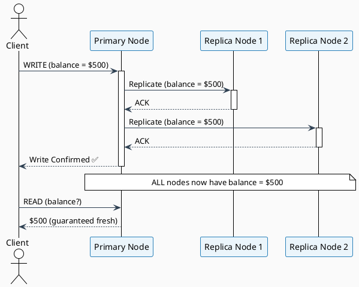
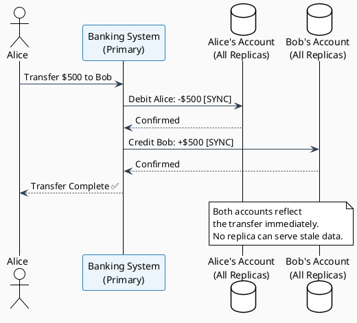
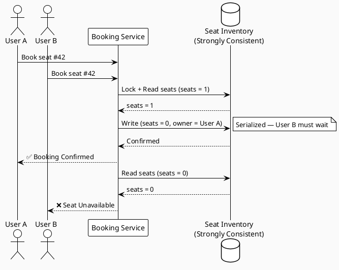
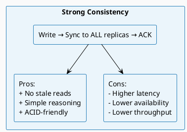

# Strong Consistency

← [Back to README](./README.md)

---

## Definition

> **After an update is made to the data, it will be immediately visible to any subsequent read operations. The data is replicated synchronously, ensuring all copies are updated at the same time.**

Strong consistency is the strictest form of consistency. It guarantees that every read receives the most recent write or an error — no stale data, ever.

---

## How It Works

In a strongly consistent system, a write is not acknowledged to the client until **all replicas** have been updated. Reads can be served from any node with the guarantee that the data is current.



### Key Mechanisms

| Mechanism | Description |
|-----------|-------------|
| **Synchronous Replication** | Write propagates to all replicas before acknowledging the client |
| **Two-Phase Commit (2PC)** | Distributed transaction protocol ensuring all-or-nothing writes |
| **Consensus Protocols** | Paxos / Raft ensure agreement on a single value across nodes |
| **Quorum Writes** | Write must succeed on a majority (`W > N/2`) of nodes |

---

## Trade-offs

| Property | Impact | Explanation |
|----------|--------|-------------|
| ✅ Data Integrity | High | Every read reflects the latest write |
| ✅ No Stale Reads | Guaranteed | All replicas synchronized before ACK |
| ❌ Availability | Reduced | If a replica is unreachable, the write blocks |
| ❌ Latency | Higher | Must wait for all replicas to confirm |
| ❌ Throughput | Lower | Serialized writes limit concurrency |
| ❌ Partition Tolerance | Weaker | Chooses consistency over availability (CP in CAP) |

---

## Real-World Examples

### 1. 🏦 Banking — Fund Transfers

**Scenario:** Alice transfers $500 to Bob. Both account balances must reflect the transaction atomically.



**Why Strong Consistency?**
- Reading Alice's balance as $1000 after a confirmed debit of $500 is unacceptable
- Double-spending must be prevented
- Regulatory compliance requires accurate ledger state at all times

---

### 2. 🎟️ Ticket Booking — Last Seat

**Scenario:** A concert has 1 seat left. Two users try to book it simultaneously.



**Why Strong Consistency?**
- Overbooking causes real-world operational problems
- Users need confirmation that their booking is real, not tentative

---

### 3. 🏥 Hospital Patient Records

**Scenario:** A doctor updates a patient's medication. Any nurse reading the record must see the latest prescription.

| Without Strong Consistency | With Strong Consistency |
|---------------------------|------------------------|
| Nurse A sees old dosage | All staff see updated dosage immediately |
| Risk of double-dosing | Safe, coordinated care |
| Multiple conflicting records | Single source of truth |

---

## Technologies That Implement Strong Consistency

| Technology | Consistency Model | Notes |
|------------|------------------|-------|
| **PostgreSQL** | Serializable / Linearizable | Full ACID transactions |
| **Google Spanner** | External Consistency | Globally distributed, TrueTime API |
| **Apache ZooKeeper** | Linearizable | Coordination service, Zab protocol |
| **etcd** | Linearizable | Raft consensus, used in Kubernetes |
| **HBase** | Strong (CP) | Row-level strong consistency |
| **CockroachDB** | Serializable | Distributed SQL with Raft |

---

## Configuration Pattern: Quorum

Strong consistency can be tuned using quorum settings:

```
N = total replicas
W = replicas that must acknowledge a write
R = replicas that must respond to a read

For Strong Consistency: W + R > N

Example: N=3, W=2, R=2
W + R = 4 > 3 ✅  (guarantees at least one overlap)
```

| Setting | W | R | W+R | Consistent? |
|---------|---|---|-----|-------------|
| Strong | 2 | 2 | 4 | ✅ Yes (N=3) |
| Weak | 1 | 1 | 2 | ❌ No (N=3) |
| Write-heavy | 1 | 3 | 4 | ✅ Yes (slow reads) |
| Read-heavy | 3 | 1 | 4 | ✅ Yes (slow writes) |

---

## When to Use Strong Consistency

✅ **Use it when:**
- Data accuracy is non-negotiable (financial transactions, medical records)
- Operations must be atomic across multiple resources
- Business logic depends on reading your own writes
- Regulatory or compliance requirements demand it

❌ **Avoid it when:**
- The system must remain available during network partitions
- Low latency is critical (e.g., real-time games, live feeds)
- The data is non-critical and eventual convergence is acceptable

---

## Summary



| | |
|--|--|
| **Consistency Level** | Linearizable / Serializable |
| **Replication Mode** | Synchronous |
| **CAP Position** | CP (Consistency + Partition Tolerance) |
| **Latency** | Higher |
| **Availability** | Lower |
| **Use Cases** | Banking, booking systems, medical records, coordination services |

---

← [Back to README](./README.md) | [Weak Consistency →](./weak-consistency.md)
