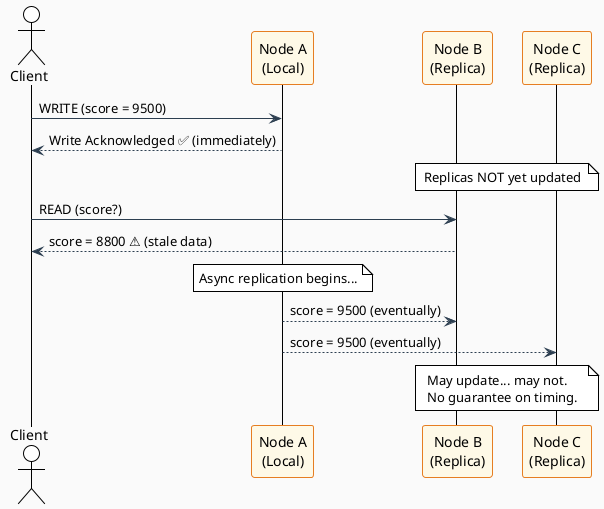
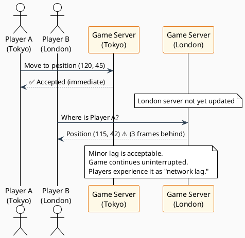
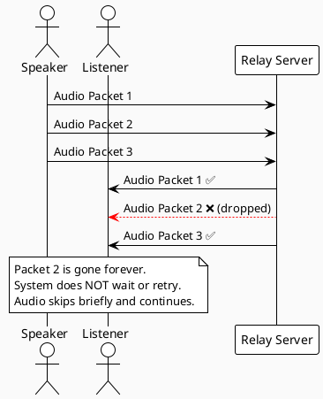
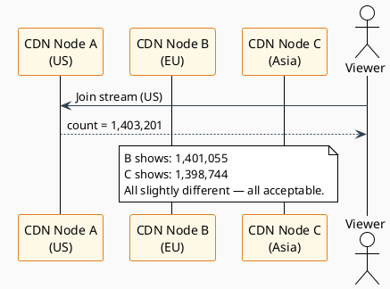

# Weak Consistency

← [Back to README](./README.md)

---

## Definition

> **After an update is made to the data, it is not guaranteed that any subsequent read operation will immediately reflect the changes made. The read may or may not see the recent write.**

Weak consistency is the most relaxed consistency model. The system makes no promises about when — or even *if* — a write will be visible to subsequent readers. It prioritizes speed and availability above all else.

---

## How It Works

In a weakly consistent system, a write is acknowledged as soon as it lands on **one node** (typically the local/primary node). Replicas are updated on a best-effort basis. Reads may return stale or even lost data.

### Key Characteristics

| Characteristic | Description |
|----------------|-------------|
| **Fire-and-Forget Writes** | Write is ACKed immediately after reaching one node |
| **No Replication Guarantee** | Replicas may lag indefinitely or never sync |
| **Best-Effort Propagation** | The system tries to replicate but makes no promises |
| **No Read Guarantees** | A read after a write may return any version of the data |
| **Conflict Handling** | Often left to the application layer (last-write-wins, etc.) |

---

## Trade-offs

| Property | Impact | Explanation |
|----------|--------|-------------|
| ✅ Availability | Highest | Writes always succeed locally |
| ✅ Latency | Lowest | No waiting for replicas |
| ✅ Throughput | Highest | No coordination overhead |
| ❌ Data Integrity | Weakest | Stale, lost, or conflicting reads are possible |
| ❌ Predictability | Low | No defined window for consistency |
| ❌ Debuggability | Hard | Behavior is non-deterministic |

---

## Real-World Examples

### 1. 🎮 Multiplayer Online Gaming

**Scenario:** A player's position and score are updated many times per second. Minor, momentary inconsistencies are tolerable — the game must keep running.

**Why Weak Consistency?**
- Position updates happen 60+ times per second; synchronous replication is impossible
- A few frames of lag is imperceptible or acceptable
- Pausing the game to sync all nodes would ruin the experience
- Network loss must not crash the session

---

### 2. 📞 VoIP & Video Calls (e.g., Zoom, WhatsApp Calls)

**Scenario:** Audio/video packets are streamed in real time. A lost or delayed packet is simply dropped — not retransmitted.

| Behavior | Detail |
|----------|--------|
| Packet dropped | Audio "glitch" for ~50ms, call continues |
| Stale frame used | Previous video frame rendered briefly |
| Node failure | Call degrades gracefully, does not hard-fail |
| No ACK per packet | UDP used — no guarantee of delivery order |

**Why Weak Consistency?**
- Retransmitting a dropped packet would cause more disruption than ignoring it
- Real-time constraints make waiting for consistency impossible
- Users tolerate occasional glitches in live conversations

---

### 3. 📊 Real-Time Metrics & Monitoring Dashboards

**Scenario:** A dashboard shows CPU/memory usage across 10,000 servers. It's okay if a reading is 5 seconds stale.

| System | Acceptable Staleness | Consequence of Stale Read |
|--------|---------------------|--------------------------|
| CPU dashboard | 5–30 seconds | Engineer sees slightly old metric |
| Network traffic graph | ~1 minute | Trend analysis still valid |
| Ad impression counter | Minutes to hours | Minor billing imprecision |
| Error rate alert | ~10 seconds | Alert may fire slightly late |

**Why Weak Consistency?**
- Synchronizing real-time metrics across thousands of nodes is cost-prohibitive
- The consumer (an engineer) is making decisions at human speed, not machine speed
- The cost of near-real-time insight far outweighs the cost of occasional imprecision

---

### 4. 🎵 Live Streaming View Counts (e.g., YouTube Live)

**Scenario:** A viral video shows "1.4M watching." The actual number might differ by thousands.

**Why Weak Consistency?**
- Exact view counts don't affect the user experience
- Coordinating a globally precise count in real time is extremely expensive
- An approximate count serves the social proof purpose equally well

---

## Technologies That Use Weak Consistency

| Technology | Use Case | Consistency Model |
|------------|----------|------------------|
| **Memcached** | Cache layer | No replication guarantee |
| **UDP-based protocols** | VoIP, gaming, DNS | No delivery guarantee |
| **Redis (no persistence)** | Ephemeral data | Fire-and-forget possible |
| **Prometheus** | Time-series metrics | Pull-based, eventually stale |
| **WebRTC** | Real-time video/audio | Best-effort delivery |
| **CDN edge caches** | Static asset serving | May serve stale until TTL |

---

## Weak Consistency vs. Eventual Consistency

This is a common point of confusion:

| Aspect | Weak Consistency | Eventual Consistency |
|--------|-----------------|---------------------|
| **Convergence Guarantee** | ❌ None — data may never sync | ✅ Yes — data *will* eventually sync |
| **Replication** | Best-effort or none | Asynchronous but guaranteed |
| **Use Case** | Real-time streams, ephemeral data | Persistent distributed state |
| **Data Loss** | Possible | Typically prevented |
| **Example** | Live video packets | Social media posts |

> **Key Distinction:** Eventual consistency is a *specific type* of weak consistency that adds the guarantee of eventual convergence. Raw weak consistency has no such promise.

---

## When to Use Weak Consistency

✅ **Use it when:**
- Data is ephemeral or time-bound (live video frames, game state)
- Staleness is acceptable and understood by users
- Real-time performance constraints make synchronization impossible
- The cost of inconsistency is low (approximate counts, non-critical metrics)

❌ **Avoid it when:**
- Writes must be durable (financial records, user data)
- Business logic depends on reading recent state
- Inconsistency has real-world consequences (inventory, bookings)

---

## Summary

| | |
|--|--|
| **Consistency Level** | None guaranteed |
| **Replication Mode** | Best-effort / none |
| **CAP Position** | AP (Availability + Partition Tolerance) |
| **Latency** | Lowest |
| **Availability** | Highest |
| **Use Cases** | Real-time gaming, VoIP, live metrics, CDN caching, live counters |

---

← [Strong Consistency](./strong-consistency.md) | [Back to README](./README.md) | [Eventual Consistency →](./eventual-consistency.md)
