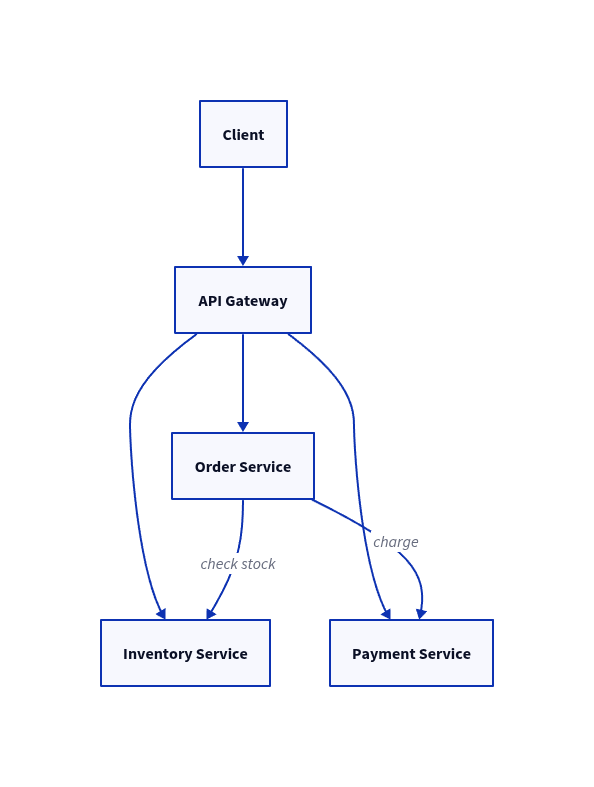
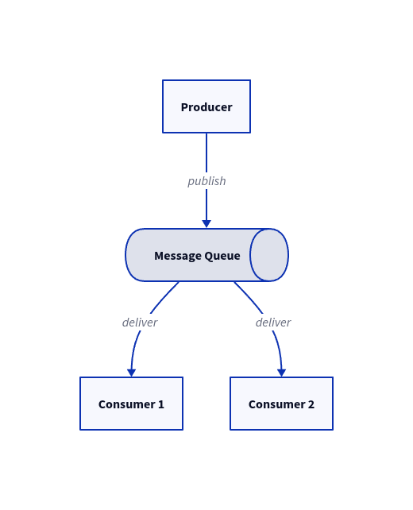
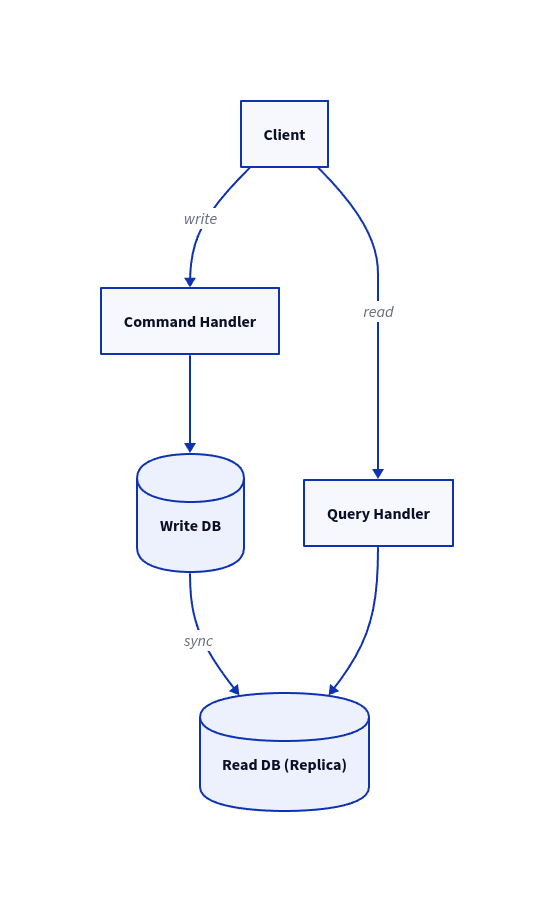

# What Is System Design?

## Definition

System design is the process of **defining the elements of a system — architecture, components, modules, interfaces, and their interactions** — to satisfy a set of specified requirements.

It involves:
- Taking a problem statement and **breaking it down into smaller components**
- Designing each component to work together effectively
- Analyzing the current system (if any) and identifying deficiencies
- Creating a detailed plan, testing it, and refining iteratively

> In software engineering, system design focuses on the **high-level architecture** of a system — not the line-by-line implementation, but the blueprint that guides it.

---

## System Design vs. Software Design

| Aspect | System Design | Software Design |
|---|---|---|
| **Scope** | Entire system (infra, services, data flow) | Individual components or modules |
| **Level** | High-level architecture | Low-level implementation details |
| **Focus** | How components interact and scale | How code is structured and written |
| **Stakeholders** | Engineers, PMs, Infra teams | Developers, code reviewers |
| **Output** | Architecture diagrams, capacity plans | Class diagrams, pseudocode, APIs |

---

## Why System Design Matters

- **Scalability** — Handle millions of users without rewriting the system
- **Reliability** — Ensure uptime and fault tolerance
- **Maintainability** — Enable teams to evolve the system over time
- **Performance** — Meet latency and throughput SLAs
- **Interview signal** — Most top-tier companies (Google, Meta, Amazon) have a dedicated system design round

---

## Core Building Blocks

### Scaling

```
Vertical Scaling (Scale Up)        Horizontal Scaling (Scale Out)
┌─────────────────┐                ┌──────┐ ┌──────┐ ┌──────┐
│  Bigger Server  │                │  S1  │ │  S2  │ │  S3  │
│  More CPU/RAM   │       vs       └──────┘ └──────┘ └──────┘
│  Single node    │                     Load Balancer
└─────────────────┘                     distributes traffic
```

| | Vertical | Horizontal |
|---|---|---|
| **How** | Upgrade existing server | Add more servers |
| **Limit** | Hardware ceiling | Nearly unlimited |
| **Downtime** | Often required | Usually none |
| **Cost** | Expensive at scale | Commodity hardware |
| **Complexity** | Low | Higher (distributed) |

---

### Redundancy & Replication

- **Redundancy** — Duplicate critical components so failure of one doesn't bring down the system
- **Replication** — Maintain multiple copies of data across nodes
- **Goal** — High availability, fault tolerance, durability

```
# D2 Diagram: Replication
primary: Primary DB {shape: cylinder}
replica1: Replica 1 {shape: cylinder}
replica2: Replica 2 {shape: cylinder}

primary -> replica1: sync writes
primary -> replica2: sync writes
```

---

### CAP Theorem

> A distributed system can guarantee only **2 of 3** properties simultaneously.

```
         Consistency
              /\
             /  \
            /    \
           / CA   \
          /        \
         /----CP----|
        /     |     \
  Availability --- Partition
                    Tolerance
```

| Property | Meaning |
|---|---|
| **Consistency (C)** | All nodes return the same data at the same time |
| **Availability (A)** | Every request receives a response (may not be latest) |
| **Partition Tolerance (P)** | System functions despite network failures |

**Real-world choices:**
- **CP systems** — HBase, MongoDB, Couchbase, ZooKeeper (sacrifice availability)
- **AP systems** — Cassandra, DynamoDB, CouchDB (sacrifice consistency)
- **CA systems** — Traditional RDBMS (sacrifice partition tolerance — not viable in distributed systems)

---

### Microservices Architecture

- **Pattern** — Large application split into small, independent, loosely-coupled services
- Each service owns its domain and communicates via **APIs**
- Enables **independent deployment, scaling, and development**



**Pros:** Modularity, independent scaling, fault isolation
**Cons:** Network overhead, distributed tracing complexity, eventual consistency challenges

---

### Proxy Servers

| Type | Direction | Use Case |
|---|---|---|
| **Forward Proxy** | Client → Server | Anonymity, access control, caching |
| **Reverse Proxy** | Server ← Client | Load balancing, SSL termination, DDoS protection |

---

### Message Queues

- **Purpose** — Decouple producers from consumers; enable async processing
- **Benefit** — Producers don't wait for consumers; system is resilient to spikes
- **Tools** — Kafka, RabbitMQ, AWS SQS, Google Pub/Sub



---

### File Systems

| Type | Examples | Use Case |
|---|---|---|
| **Local** | ext4, NTFS | Single-machine storage |
| **Distributed** | HDFS, GFS, S3 | Large-scale, fault-tolerant storage |
| **Object Storage** | S3, GCS, Azure Blob | Unstructured data at scale |

---

## Common Architecture Patterns

### Two-Phase Commit (2PC)

Ensures **atomicity across distributed resources**.

| Phase | What Happens |
|---|---|
| **Prepare** | Coordinator asks all participants: "Can you commit?" |
| **Commit** | If all say yes → commit. If any says no → abort. |

**Drawback** — Blocking protocol; coordinator failure can leave participants in limbo.

---

### CQRS (Command Query Responsibility Segregation)

- **Commands** = write operations (mutate state)
- **Queries** = read operations (return data)
- Separate models for reads and writes → optimize each independently



---

### Saga Pattern

- Manages **long-lived distributed transactions** without 2PC
- Each step has a **compensating transaction** (undo action)
- If step N fails → execute compensating actions for steps N-1, N-2, ...

**E-commerce Example:**

| Step | Action | Compensating Action |
|---|---|---|
| 1 | Create Order | Cancel Order |
| 2 | Reserve Inventory | Release Inventory |
| 3 | Charge Payment | Issue Refund |

---

### Sharding

- Partition data across multiple nodes; each **shard** holds a subset
- **Shard key** determines which shard stores a record
- Use with load balancing + replication for maximum performance

| Strategy | How | Trade-off |
|---|---|---|
| **Hash sharding** | hash(key) % N | Even distribution, hard to range query |
| **Range sharding** | by key range | Easy range queries, hotspot risk |
| **Directory sharding** | lookup table | Flexible, single point of failure |

---

### Replicated Load-Balanced Services (RLBS)

- Multiple identical service instances behind a **load balancer**
- Load balancer distributes requests; instances are interchangeable
- Health checks remove failed instances automatically

---

## Real-World System Examples

| System | Key Challenges | Key Solutions |
|---|---|---|
| **eCommerce** | Flash sales, inventory sync, payments | Queue-based order processing, distributed caching |
| **CDN** | Global low latency, cache invalidation | PoP servers, edge caching, anycast routing |
| **Social Network** | Feed generation, graph traversal at scale | Pre-computed feeds, graph DBs, eventual consistency |
| **IoT Platform** | Millions of devices, high write throughput | Time-series DBs, MQTT protocol, stream processing |

---

## Design Tools & Techniques

| Tool | Purpose |
|---|---|
| **Architecture Diagrams** | Visualize system structure and component interactions |
| **Data Flow Diagrams (DFD)** | Show how data moves through the system |
| **UML** | Standardized notation for class, sequence, and use case diagrams |
| **Data Dictionary** | Document all data elements — types, constraints, relationships |
| **Decision Tables** | Map conditions → actions for complex business logic |
| **Pseudocode** | Language-agnostic logic sketching |
| **APIs & Contracts** | Define interfaces between components formally |

---

> **Key Insight:** System design is not about finding the "perfect" solution — it's about understanding trade-offs and making informed decisions given constraints (time, cost, team size, traffic).