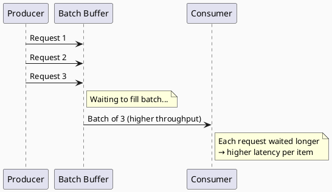
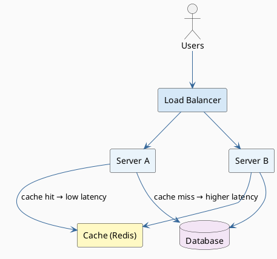
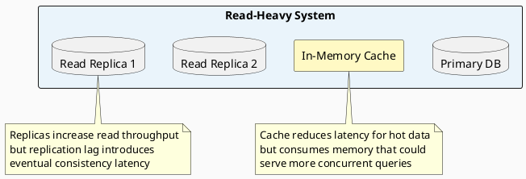

# Latency vs. Throughput

## The Core Rule

> **Aim for maximal throughput with acceptable latency.**

These are two distinct, often competing metrics. Understanding their relationship is essential for making correct system design trade-offs.

---

## Side-by-Side Comparison

| Dimension | Latency | Throughput |
|---|---|---|
| **Definition** | Time per single operation | Operations per unit of time |
| **Unit** | ms, µs, ns, clock cycles | RPS, TPS, Mbps, words/cycle |
| **Question answered** | "How fast does one request complete?" | "How many requests can the system handle?" |
| **User impact** | Responsiveness / perceived speed | Capacity / scalability |
| **Optimization target** | Minimize | Maximize |
| **Analogy** | Travel time for one car | Lanes × cars per hour |

---

## They Are Not the Same Thing

A critical misconception: **low latency ≠ high throughput**, and vice versa.

```plantuml
@startuml
skinparam backgroundColor #FAFAFA

rectangle "Low Latency\nLow Throughput" as Q1 #FFE0B2
note right of Q1 : Single-threaded server\nthat responds fast\nbut handles few requests

rectangle "Low Latency\nHigh Throughput" as Q2 #C8E6C9
note right of Q2 : The ideal:\nfast responses +\nhigh concurrency

rectangle "High Latency\nLow Throughput" as Q3 #FFCDD2
note right of Q3 : Worst case:\nslow and can't scale

rectangle "High Latency\nHigh Throughput" as Q4 #FFF9C4
note right of Q4 : Batch systems:\nslow per-item but\nhigh aggregate volume
@enduml
```



| Quadrant | Latency | Throughput | Typical Scenario |
|---|---|---|---|
| **Ideal** | Low | High | Optimized web API with horizontal scaling |
| **Single-threaded fast** | Low | Low | Simple server, no concurrency |
| **Batch pipeline** | High | High | Kafka consumer, bulk ETL |
| **Broken system** | High | Low | Overloaded, misconfigured server |

---

## The Fundamental Trade-off

Improving throughput often **increases latency**, and reducing latency often **reduces throughput**. Here's why:

### Trade-off 1: Batching



| | No Batching | With Batching |
|---|---|---|
| Latency per item | Low | Higher (wait for batch to fill) |
| Throughput | Lower | Higher (amortized overhead) |

### Trade-off 2: Replication / Horizontal Scaling

Adding more servers increases throughput (more parallel handlers), but can increase latency due to:
- Request routing overhead
- Cross-server data replication (consistency protocols)
- Cache invalidation delays

### Trade-off 3: Caching

Caching frequently accessed data in memory:
- **Reduces latency** for cache hits
- **Reduces throughput headroom for other operations** (memory is finite — cache consumes RAM that could serve other concurrent requests)

---

## System Design Examples

### Example 1: Web Server



| Design Decision | Effect on Latency | Effect on Throughput |
|---|---|---|
| Add more servers | ↑ slightly (routing overhead) | ↑↑ (parallel handling) |
| Add caching layer | ↓↓ (cache hits) | ↑ (fewer DB calls) |
| Async processing | ↑ (deferred response) | ↑↑ (frees threads faster) |
| Connection pooling | ↓ (no reconnect cost) | ↑ (reuse connections) |

### Example 2: Database



| Strategy | Latency Impact | Throughput Impact |
|---|---|---|
| Memory cache for hot data | ↓ significantly | ↑ (fewer disk reads) |
| Read replicas | slight ↑ (replication lag) | ↑↑ (distribute reads) |
| Write-ahead logging (WAL) | ↑ slightly | ↑ (durability without full sync) |
| Index on query columns | ↓↓ | ↑ (faster scans → fewer locks) |

---

## Amdahl's Law: The Ceiling on Throughput Gains

When adding parallelism to increase throughput:

```
Speedup(N) = 1 / (S + (1-S)/N)
```

| Symbol | Meaning |
|---|---|
| `N` | Number of parallel processors/workers |
| `S` | Fraction of work that must be serial |
| `1-S` | Fraction that can be parallelized |

**Implication:** If 20% of your system is serial, maximum speedup = 5×, no matter how many servers you add. Throughput has a ceiling defined by the **serial bottleneck** — and that bottleneck also dictates minimum achievable latency for that serial section.

---

## Design Decision Framework

When facing a latency vs. throughput trade-off, ask:

| Question | Implication |
|---|---|
| Is this user-facing? | Prioritize latency (< 100 ms is the human perception threshold) |
| Is this a background/batch job? | Prioritize throughput |
| Is the system read-heavy or write-heavy? | Read-heavy → caching/replicas; Write-heavy → queueing/batching |
| What is the SLA? | Define acceptable p99 latency first, then maximize throughput within that bound |
| Is the bottleneck I/O or CPU? | I/O → async/non-blocking; CPU → parallelism/sharding |

---

## The Golden Rule

> Measure both. Define your SLA in terms of **p99 latency** and **target RPS**. Then optimize throughput until latency SLA is at risk — and stop there.
