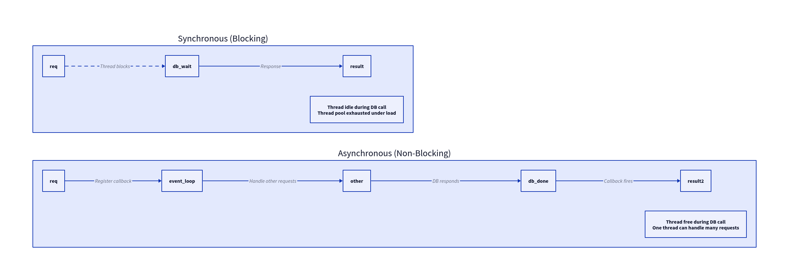
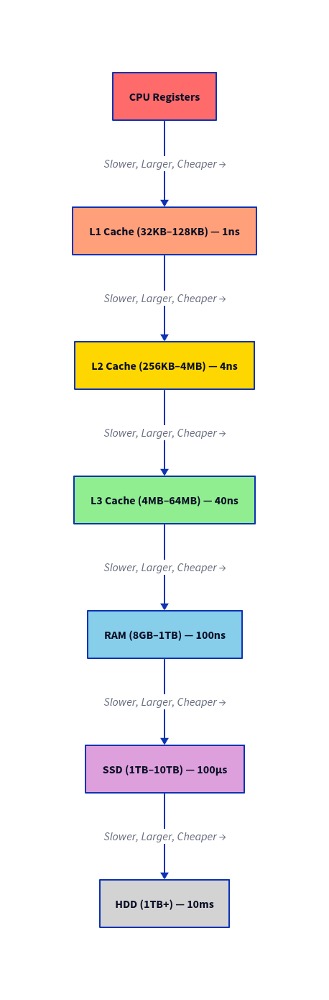
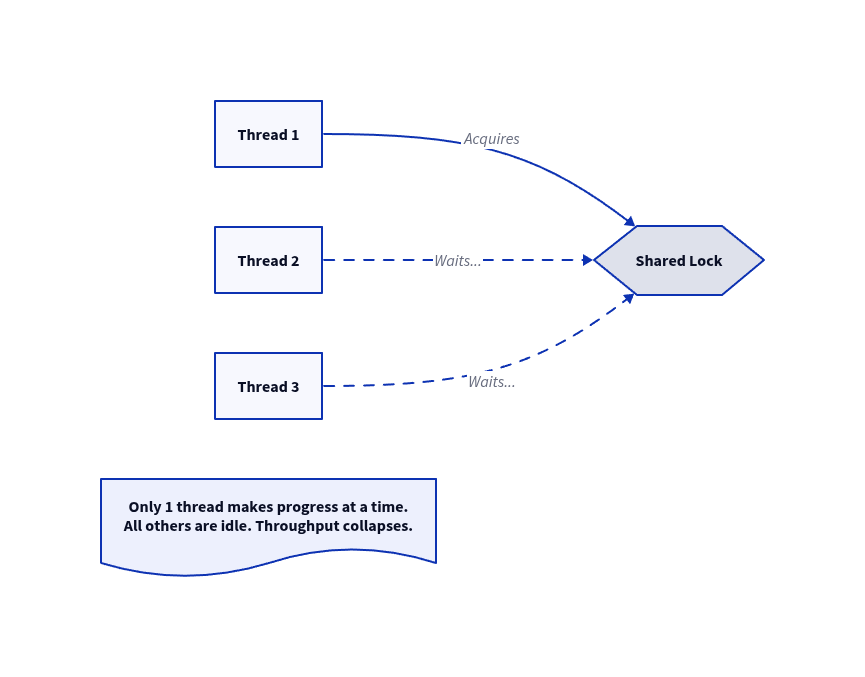
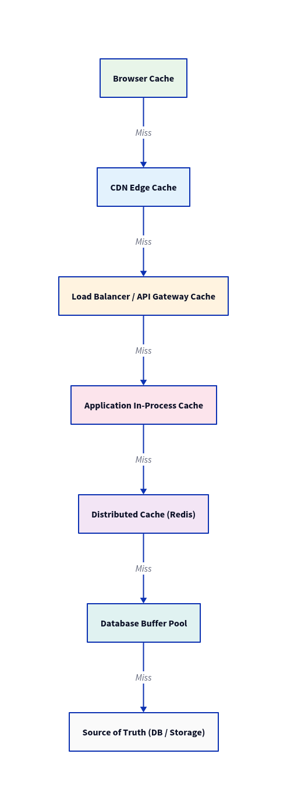
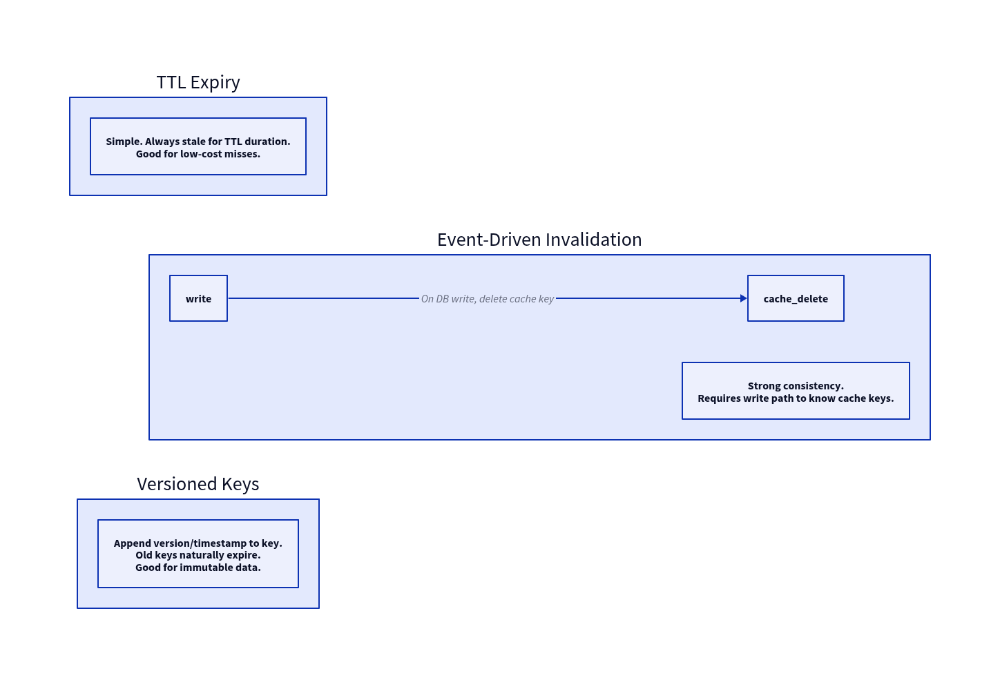
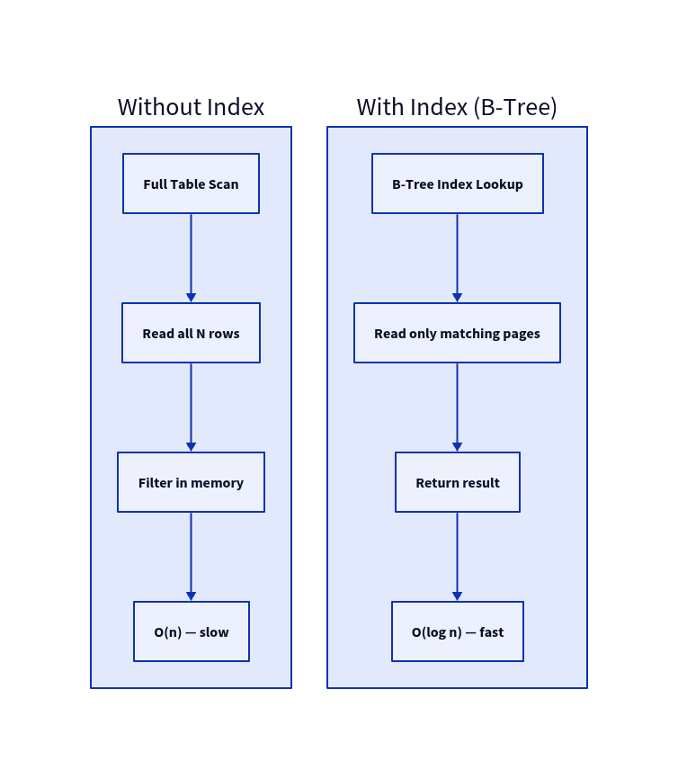
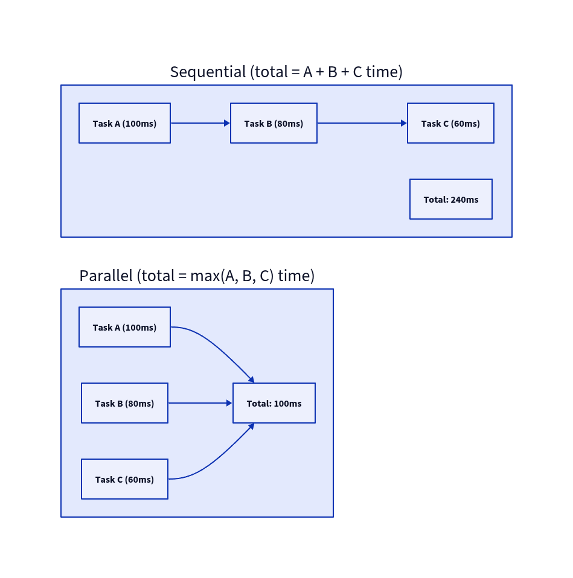
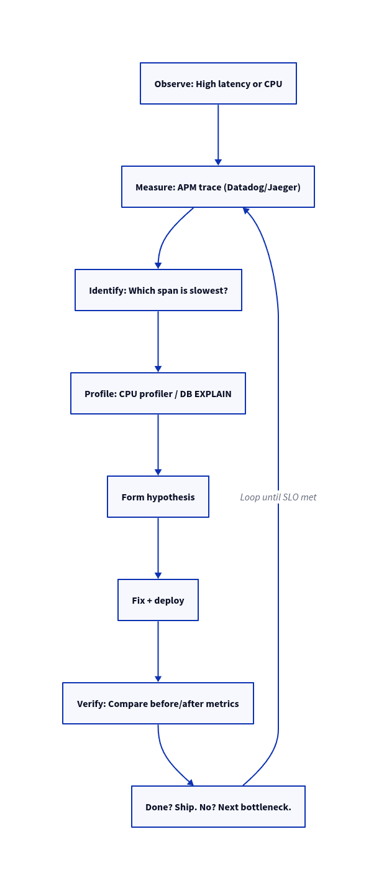

# System Design: Performance

> **Performance** = how fast a system responds to a single request or unit of work. It is measured from the user's perspective — the elapsed time between issuing a request and receiving a complete response. It is **not** about how many users you can serve simultaneously — that is scalability.

---

## Core Metrics

| Metric | Definition | Healthy Target |
|---|---|---|
| **Latency p50** | Median request time | < 100ms (interactive UIs) |
| **Latency p95** | 95th percentile; most users | < 300ms |
| **Latency p99** | Worst 1% of requests | < 1000ms |
| **Latency p999** | Worst 0.1% — "tail latency" | Monitor; don't ignore |
| **Throughput** | Requests completed per second (RPS/QPS) | SLA-dependent |
| **TTFB** | Time To First Byte — network + server processing | < 200ms |
| **Error Rate** | % of requests that fail | < 0.1% |
| **Saturation** | How close a resource is to its limit | CPU < 70%; queue depth near 0 |

> ⚠️ **Never report average latency.** A single slow request (e.g. 10s) among 99 fast ones (10ms) gives a 109ms average — misleading. Always use percentiles. p99 is the standard.

---

## Latency Reference Numbers (Every Engineer Should Memorise)

| Operation | Approximate Latency |
|---|---|
| L1 cache reference | 1 ns |
| L2 cache reference | 4 ns |
| L3 cache reference | 40 ns |
| RAM read | 100 ns |
| SSD random read | 100 µs (100,000 ns) |
| HDD seek | 10 ms (10,000,000 ns) |
| Loopback TCP round trip | 0.5 ms |
| Same datacenter round trip | 1–2 ms |
| Cross-region round trip (US East ↔ EU) | 80–100 ms |
| Cross-continent round trip (US ↔ Asia) | 150–200 ms |

> These numbers explain *why* caching works: serving from RAM is **100,000× faster** than a disk read.

---

## Root Causes of Poor Performance

### 1. Algorithmic Complexity

The most impactful source of poor performance. A bad algorithm cannot be fixed by hardware.


| Complexity | N=10 | N=100 | N=1,000 | N=10,000 | Real-world example |
|---|---|---|---|---|---|
| O(1) | 1 | 1 | 1 | 1 | Hash map get |
| O(log n) | 3 | 7 | 10 | 13 | Binary search, B-tree index lookup |
| O(n) | 10 | 100 | 1,000 | 10,000 | Full table scan, linear search |
| O(n log n) | 33 | 664 | 10,000 | 133,000 | Merge sort, heap sort |
| O(n²) | 100 | 10,000 | 1,000,000 | 100,000,000 | Nested loops, bubble sort |
| O(n³) | 1,000 | 1,000,000 | 10⁹ | 10¹² | Floyd-Warshall, naive matrix multiply |
| O(2ⁿ) | 1,024 | 10³⁰ | 10³⁰¹ | ∞ | Recursive Fib (no memo) |

**Real-world O(n²) and O(n³) traps engineers fall into:**

- **N+1 Query Problem** — the most common O(n²) bug in web services
  ```
  # For each of N users (outer loop), fire a separate DB query to get orders:
  # 1 query to get users + N queries to get each user's orders = O(n) queries
  # Fix: use a single JOIN or batch fetch (IN clause) = O(1) queries
  ```
- **Naive nested deduplication** — comparing every element to every other element in a list instead of using a hash set
- **Recursive calls without memoization** — `fib(n)` recalculates `fib(n-2)` exponentially many times
- **Naive matrix multiplication** — three nested loops over row × column × depth = O(n³); use BLAS/numpy instead
- **Floyd-Warshall on large graphs** — O(V³) all-pairs shortest path; fine for V < 1000, catastrophic for V > 10,000
- **String concatenation in a loop** (some languages) — each concat creates a new string → O(n²) memory; use `StringBuilder` / `join()`
- **Sorting inside a loop** — O(n log n) sort inside O(n) loop = O(n² log n) total; sort once outside

### 2. I/O Bottlenecks

I/O is orders of magnitude slower than in-memory operations (see latency table above). The system sits idle waiting for I/O to complete.



**Common I/O problems:**
- **Missing database index** — turns O(log n) B-tree lookup into O(n) full table scan
- **`SELECT *`** — fetches unnecessary columns; increases network payload + memory pressure
- **Synchronous calls to slow services** — thread blocked waiting for a 3rd-party API
- **Chatty APIs** — 10 small HTTP calls instead of 1 batched call; each incurs network round-trip
- **Unbounded queries** — `SELECT * FROM orders` with no `LIMIT` returns millions of rows

### 3. CPU Bottlenecks

- **Expensive serialization** — JSON parse/stringify for every request; use Protobuf/MessagePack for internal services
- **Regex on every request** — compiled regex objects are expensive; compile once, reuse
- **Cryptography** — bcrypt/Argon2 intentionally slow (for security); offload to async worker
- **Image/video processing** — CPU-intensive; never on request thread; always async + worker
- **GC pressure** — excessive object allocation causes garbage collector to pause all threads ("stop-the-world")
- **Hot code path inefficiency** — a 1ms inefficiency called 1000 times per request = 1 full second wasted

### 4. Memory Pressure



- **Memory leaks** — objects not freed; heap grows until OOM crash
- **GC pauses** — JVM, Go, Python GC can pause all execution for milliseconds
- **Heap fragmentation** — many small allocations cause inefficient memory use
- **Working set too large** — hot data doesn't fit in cache; constant cache misses to RAM or disk

### 5. Concurrency & Locking



- **Lock contention** — a single mutex serializes all threads; adding more threads helps nothing
- **Deadlock** — Thread A holds lock 1, waits for lock 2; Thread B holds lock 2, waits for lock 1; both block forever
- **False sharing** — two CPU cores share a cache line; modifying different variables on the same cache line causes cache invalidation ping-pong
- **Priority inversion** — a high-priority thread waits for a low-priority thread that holds a lock

### 6. Network Latency

- **Geographic distance** — unavoidable speed-of-light delay; mitigate with CDN and edge caching
- **Too many round trips** — each HTTP call in a chain adds latency; batch or parallelize
- **Large payloads** — sending a 10MB JSON response when 10KB would do; compress; paginate
- **DNS lookups** — uncached DNS resolution adds 10–100ms; use keep-alive, connection pooling
- **TLS handshake** — adds 1–2 round trips per new connection; use TLS session resumption and HTTP/2

### 7. Cold Starts

- **No connection pool** — creating a new DB connection per request takes 20–100ms
- **JVM/CLR startup** — JIT compilation on first invocations; code not yet "warm"
- **Serverless cold start** — Lambda/Cloud Functions spin up a new container: 100ms–2s penalty
- **Empty cache** — after a deployment or restart, all requests miss cache and hit the database

---

## Performance Optimization Techniques

### Caching

> "There are only two hard things in Computer Science: cache invalidation and naming things." — Phil Karlton



| Cache Level | Latency | Scope | Best For |
|---|---|---|---|
| CPU L1/L2/L3 | 1–40 ns | Single core/socket | Tight loops, hot variables |
| In-process memory | ~100 ns | Single instance | Per-instance lookup tables |
| Distributed (Redis) | 1–2 ms | All instances | Session, computed results |
| CDN | 5–50 ms | Geographic region | Static assets, public API responses |
| Browser | 0 ms (HDD read) | Single user | Static assets, immutable content |

**Cache eviction policies:**

| Policy | Logic | Best For |
|---|---|---|
| **LRU** (Least Recently Used) | Evict item not accessed longest | General purpose |
| **LFU** (Least Frequently Used) | Evict item accessed fewest times | Skewed access patterns |
| **FIFO** | Evict oldest item | Simple queues |
| **TTL** | Evict after fixed time | Time-sensitive data |
| **Write-through** | Write to cache + DB synchronously | Strong consistency needed |
| **Write-behind** | Write to cache, async flush to DB | High write throughput |
| **Cache-aside** | App checks cache, populates on miss | Most common web pattern |

**Cache invalidation strategies:**



**Cache failure modes:**
- **Cache stampede / thundering herd** — cache key expires; 1000 requests simultaneously miss, all hit DB; use mutex lock or probabilistic early expiration (PER)
- **Cache penetration** — requests for keys that will *never* exist (e.g. non-existent user IDs); floods DB; use bloom filter to reject before hitting cache
- **Cache avalanche** — many keys expire at the same time (e.g. all set same TTL at startup); add random TTL jitter

### Database Query Optimization



- **`EXPLAIN ANALYZE`** — always run on slow queries; shows seq scan vs index scan, row estimates vs actual
- **Composite indexes** — `WHERE a = 1 AND b = 2` benefits from `INDEX(a, b)`; column order matters (highest selectivity first)
- **Covering index** — index includes all columns needed by query; no table heap fetch required
- **Avoid functions on indexed columns** — `WHERE LOWER(email) = ?` cannot use a plain index on `email`; use a functional index
- **Connection pooling** — PgBouncer (Postgres), ProxySQL (MySQL); prevents "too many connections" at scale

### Concurrency & Parallelism



- Run independent I/O operations (multiple DB queries, API calls) concurrently using `Promise.all()`, `asyncio.gather()`, goroutines, or thread pools
- **Amdahl's Law** — if 5% of your code is sequential, maximum speedup from parallelism is 20×, regardless of how many cores you add

### Protocol & Payload Optimization

| Approach | Benefit | When to Use |
|---|---|---|
| **Gzip / Brotli** compression | 70–90% size reduction for text | All HTTP responses (JSON, HTML, CSS) |
| **HTTP/2** | Multiplexed streams; header compression; server push | All modern web services |
| **HTTP/3 (QUIC)** | No TCP head-of-line blocking; 0-RTT | High packet-loss environments |
| **Protobuf / FlatBuffers** | 3–10× smaller + faster than JSON | Internal service-to-service calls |
| **Connection keep-alive** | Reuse TCP connection; skip handshake | All API clients |
| **Response streaming** | First byte arrives before full payload ready | Large downloads, LLM responses |

---

## Profiling & Identifying Bottlenecks

> Never optimize by intuition. Profile first. The bottleneck is almost never where you think it is.



| Tool | Use Case |
|---|---|
| **Datadog / New Relic** | Distributed tracing, APM, dashboards |
| **Jaeger / Zipkin** | Open-source distributed tracing |
| **py-spy** (Python) | Sampling profiler; attach to live process |
| **async-profiler** (JVM) | CPU + allocation profiler; flame graphs |
| **pprof** (Go) | CPU, memory, goroutine profiler |
| **perf** (Linux) | System-level CPU profiling |
| **k6 / wrk / Locust** | Load testing; find throughput ceiling |
| **`EXPLAIN ANALYZE`** | Postgres query plan + actual timing |
| **Slow query log** | MySQL/Postgres; log queries > threshold |

---

## Quick Reference: Symptom → Diagnosis → Fix

| Symptom | Likely Cause | Diagnostic Tool | Fix |
|---|---|---|---|
| High p99, low p50 | GC pause / lock contention | JVM profiler, perf | Reduce allocations; reduce lock scope |
| High CPU on app servers | O(n²) algorithm or hot serialization | CPU flame graph | Rewrite algorithm; switch to Protobuf |
| High CPU on DB server | Missing index, complex query | `EXPLAIN ANALYZE` | Add index; rewrite query |
| Increasing memory over time | Memory leak | Heap dump analysis | Fix leak; add eviction |
| Slow only on cold start | No connection pool / empty cache | Latency timeseries | Add pool; pre-warm cache |
| Slow on large inputs | Poor complexity | Profiler + code review | Better algorithm / data structure |
| N+1 slow queries | ORM without eager loading | DB slow query log | Use JOIN or batch fetch |
| Timeouts under load | Thread pool exhausted | Thread pool metrics | Tune pool size; async I/O |
| High TTFB globally | No CDN, large payload | Browser DevTools waterfall | Add CDN; compress; paginate |

---

## Little's Law (The Math Behind Performance)

> **L = λW**

- **L** = average number of requests in the system (queue + being served)
- **λ** = average arrival rate (requests/sec)
- **W** = average time a request spends in the system (latency)

**Implication:** If latency doubles (W×2), the queue depth doubles (L×2) for the same traffic rate. This is why a small latency regression under load can cascade into a timeout storm — the queue builds faster than it drains.

---

## SLOs, SLAs, Error Budgets

| Term | Meaning |
|---|---|
| **SLI** (Service Level Indicator) | A metric: p99 latency, error rate |
| **SLO** (Service Level Objective) | Internal target: p99 < 500ms for 99.9% of requests |
| **SLA** (Service Level Agreement) | Contractual commitment to customers; breach = penalty |
| **Error Budget** | 100% - SLO target. If SLO = 99.9%, you have 0.1% budget to "spend" on incidents |

> If you have no SLO, you have no performance standard and no way to know when you've regressed.