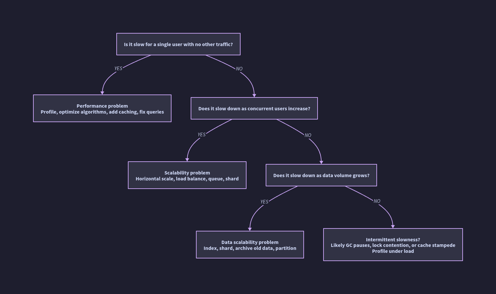

# Performance vs Scalability

## The Core Distinction

| | Performance | Scalability |
|---|---|---|
| **Definition** | How fast the system handles **one unit of work** | How well the system maintains performance as **load grows** |
| **Problem signal** | System is slow for a **single user** | System is fast for one user but **slow under heavy load** |
| **Measured by** | Latency (ms), throughput (req/s) at low load | Latency and throughput as concurrent users increase |
| **Optimized by** | Faster algorithms, caching, better queries | Horizontal scaling, load balancing, sharding, queues |
| **Scope** | Single request path | Entire system under load |

> **Key insight:** A system can be highly performant but not scalable. A system can be scalable but have mediocre per-request performance. You need both — but diagnose them separately.

---

## The Supermarket Analogy

This analogy maps cleanly to real distributed systems:

| Supermarket | Software Equivalent |
|---|---|
| Shopper | Incoming request |
| Shopping cart items | Request payload / work to be done |
| Cashier | Server / worker process |
| Checkout time | Request latency |
| Number of shoppers per minute | Throughput / traffic rate |
| Queue of shoppers | Message queue |
| Multiple cashiers | Horizontal scaling / multiple workers |
| Special receipt (pre-scanned cart) | Cache / precomputed result |

### What happens as load increases (single cashier, no caching):

| Shopper Arrival Rate | Wait Time for 1st Shopper | Wait Time for 4th Shopper |
|---|---|---|
| 1/min (cashier capacity) | 1 min | 1 min |
| 2/min (2× capacity) | 1 min | 3 min |
| 6/min (6× capacity) | 1 min | 6 min |

> **The cashier's speed (performance) didn't change. The wait time (experienced performance) exploded.** This is a scalability problem, not a performance problem.

---

## How Optimizations Interact

### Caching: Improves Both — With Trade-offs

- A shopper with a pre-scanned receipt (cached result) takes 10 sec instead of 60 sec → **10× throughput per cashier**
- **Cache miss penalty:** Checking the receipt AND scanning the cart = 70 sec → **worse than no cache**
- Caching helps scalability only when **hit rate is high** (stable, repeated data)

| Scenario | Hit Rate | Effect |
|---|---|---|
| Frequently accessed, rarely changing data | High | Major scalability gain |
| Highly personalized or unique data | Low | Cache misses hurt both performance and scalability |
| Cache data loss or expiry | Spike of misses | Thundering herd — DB overwhelmed |

---

### Adding More Workers: Improves Scalability, Can Slightly Hurt Per-Request Performance

- 6 cashiers handle 6×  the shoppers → **linear scalability gain**
- Shopper must decide which cashier to go to → 5-second overhead → **slight performance regression**
- In software: adding servers introduces load balancer round-trips, distributed tracing overhead, network hops

> **This is acceptable.** A 5ms overhead per request is worth handling 10× the load.

---

### Message Queues: Smooth Out Spikes at the Cost of Latency

- Single queue → shoppers processed in strict order → **no starvation, no confusion**
- Workers pick from the queue as they become free → no shopper stuck behind a slow one
- **Trade-off:** Shopper walks to the back of a long queue and may wait longer before service begins
- In software: async processing via a queue adds latency for the individual request but allows the system to stay responsive under burst load

---

## When Optimizing One Conflicts with the Other

| Optimization | Performance Impact | Scalability Impact |
|---|---|---|
| Distributed caching (Redis) | Adds ~1ms per cache read | Dramatically increases system capacity |
| Horizontal sharding | Adds cross-shard query complexity | Required for DB to scale beyond one machine |
| Load balancer | Adds a network hop (~1ms) | Essential for scaling beyond one server |
| Async message queue | Increases individual request latency | Decouples components, absorbs traffic spikes |
| Microservices | Adds inter-service network calls | Each service scales independently |

> **Rule of thumb:** Scalability improvements often trade a small amount of per-request performance for the ability to serve orders of magnitude more requests. This is almost always the right trade at scale.

---

## Proportional Scaling: The True Test

A system is **truly scalable** when:

```
2× resources → ≈2× throughput   (linear)
```

Real systems fall into these categories:

| Category | Behavior | Example |
|---|---|---|
| **Linear scaling** | 2× resources = 2× throughput | Stateless API behind load balancer |
| **Sub-linear scaling** | 2× resources < 2× throughput | Shared DB bottleneck, lock contention |
| **Super-linear scaling** | 2× resources > 2× throughput | Rare; usually caching effects |
| **Non-scaling** | Adding resources = no improvement | Single-threaded bottleneck, global lock |

> The goal is **linear or near-linear scaling**. Sub-linear is a sign of a bottleneck. Non-scaling means you've hit an architectural ceiling.

---

## Scalability Cannot Be an Afterthought

- Many algorithms perform fine at low load but **explode in cost** as data or request rate grows
- Examples:
  - O(n²) algorithm: fine at n=100, unusable at n=1,000,000
  - Missing index: fast at 10K rows, catastrophic at 100M rows
  - In-memory session store: works on one server, fails with 10 servers

- Heterogeneity compounds this: as you scale out, your hardware will not be uniform. Newer nodes are faster. Algorithms assuming equal nodes will either **underuse new capacity** or **break entirely**.

---

## Decision Framework

Use this to diagnose whether you have a performance or scalability problem:



---

## Summary

- **Performance** = speed of one request. Optimize with better code, caching, and efficient I/O.
- **Scalability** = system speed under growing load. Optimize with horizontal scale, queues, and partitioning.
- Scalability improvements often introduce small performance overheads — **this is the right trade**.
- A service is scalable if adding resources yields **proportional performance gains**.
- Scalability must be **architected in** — retrofitting is painful and expensive.
- Identify which axis your system needs to grow on (load, data volume, geography) and design accordingly.