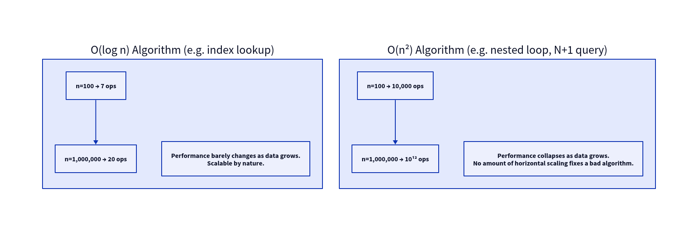
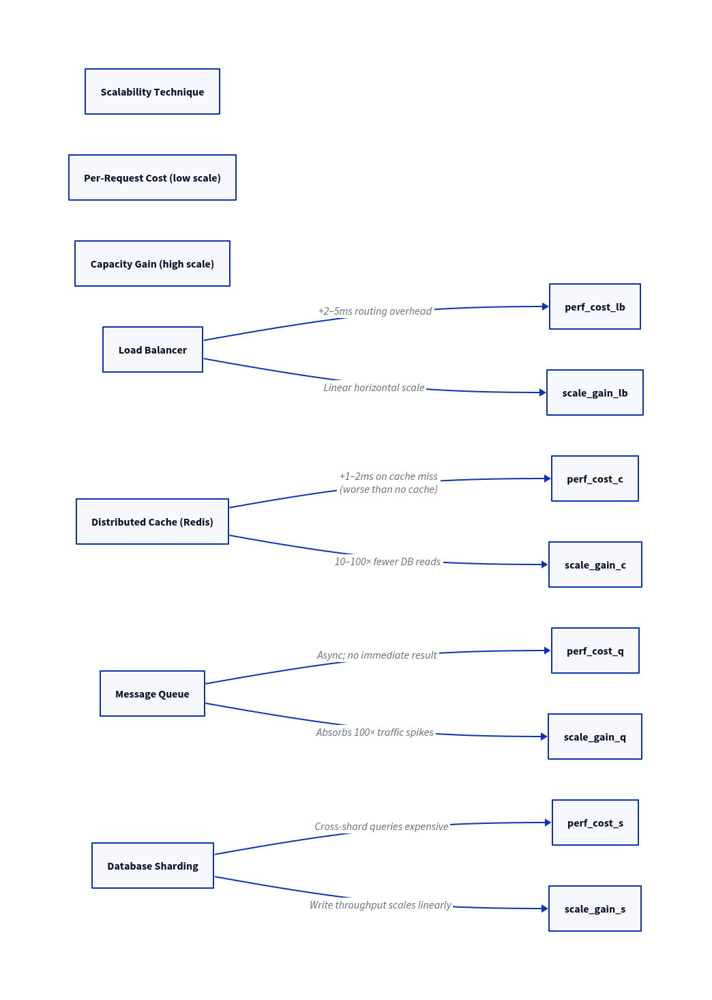
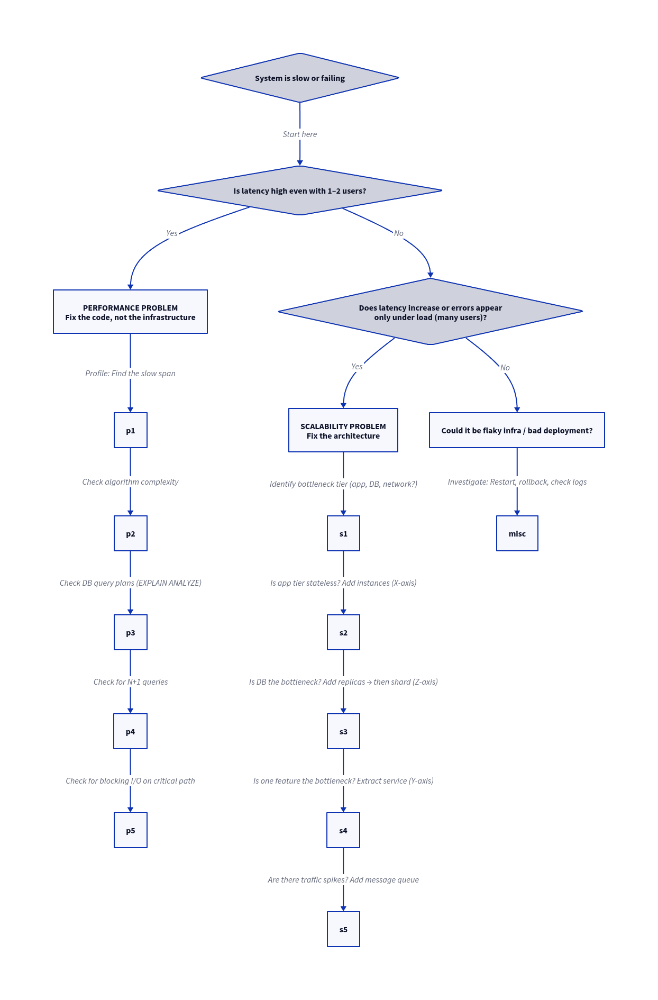
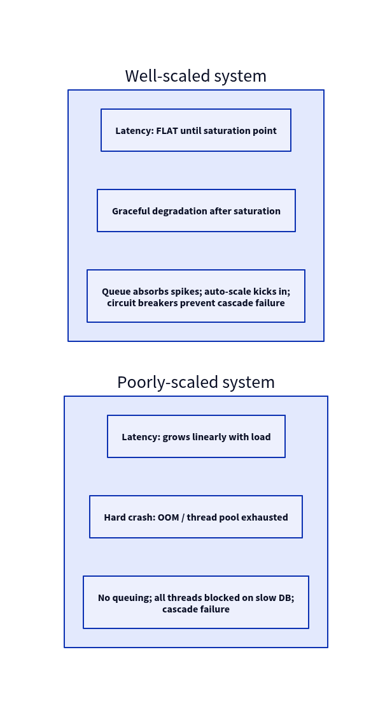
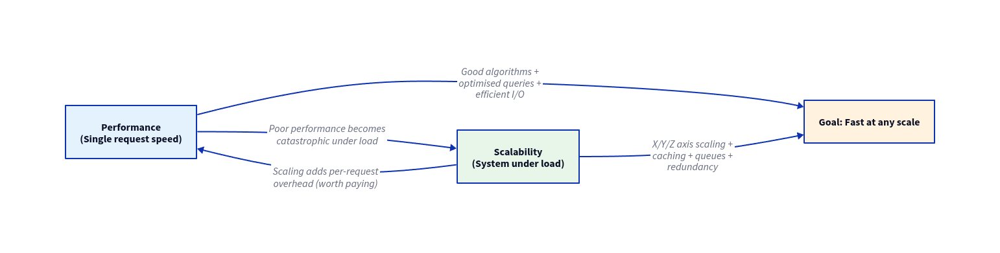

# System Design: Performance vs Scalability

> Two of the most conflated concepts in engineering. Misidentifying which problem you have leads to wasted effort, architectural mistakes, and systems that fail in production. This note breaks down the difference, the tension, and the decision framework.

---

## Definitions, Side by Side

| Dimension | **Performance** | **Scalability** |
|---|---|---|
| **Core question** | "How fast is *one* request?" | "How does the system behave as load grows?" |
| **Measured by** | Latency (p99), TTFB | Throughput at Nx load; latency degradation curve |
| **Degrades when** | Algorithm is slow; I/O is blocking; DB query unoptimised | System is under load beyond its capacity |
| **Visible in dev?** | Yes — dev machine mirrors the code path | **No** — dev has 1 user; scale problems only appear with N users |
| **Fixed by** | Better algorithms, caching, async I/O | X/Y/Z-axis scaling, sharding, queues |
| **Failure mode** | Slow responses for everyone, always | Timeouts and crashes specifically under high load |
| **When to care** | Always | When user/data/traffic growth is expected |

---

## The Supermarket Analogy (Full Breakdown)

| Supermarket Concept | Software Equivalent |
|---|---|
| Shopper | HTTP Request |
| Cashier | App server thread/process |
| Checkout time for one item | Latency of one DB query |
| Total checkout time for a cart | End-to-end request latency |
| Shoppers per minute | Requests per second (RPS/QPS) |
| Line forming behind a cashier | Request queue / thread pool filling up |
| All cashiers busy | Thread pool exhausted; new requests timeout |
| Opening more cashier lanes | X-axis scaling (adding more instances) |
| Giving regulars a preprinted receipt | Cache hit (skip computation) |
| Receipt check failing → scan cart anyway | Cache miss penalty (worse than no cache) |
| Dedicated express lane for 10-items-or-less | Y-axis scaling (separate service for simple requests) |
| Routing shoppers by last name to different stores | Z-axis scaling (data partitioning / sharding) |
| Single unified queue for all cashiers | Message queue (fair, orderly, no idle cashiers) |

**The key insight:**
- **Performance** = how long it takes one cashier to check out one shopper = **latency at no load**
- **Scalability** = how long the average shopper waits when 500 arrive per minute = **latency under load**
- Adding more cashier lanes (**scaling**) costs each shopper ~5 seconds to walk to their lane — **scaling adds per-request overhead**
- But it keeps **average wait time constant** regardless of how many shoppers arrive — **that is the point**

---

## How Poor Algorithmic Complexity Destroys Both

**Critical rule:** Scaling a system with a bad algorithm does not fix the algorithm. It just gives you more servers running the same bad code. An O(n²) algorithm that takes 10 seconds at n=1000 takes 100 seconds at n=10,000 — regardless of how many machines you add.

**Fix the algorithm first. Then scale.**

---

## The Core Tension: Scalability Techniques Hurt Single-Request Performance

> Mechanisms that enable scalability add overhead per request. This is intentional and worth it.

| Technique | Performance impact (low scale) | Scalability benefit (high scale) | Net verdict |
|---|---|---|---|
| Load balancer | +2–5ms per request | Enables unlimited horizontal scale | ✅ Always worth it |
| Distributed cache | +1ms on miss; slight worse than no-cache | 10–100× fewer DB reads | ✅ Worth it above moderate traffic |
| Message queue | Async; latency increases for user | Queue absorbs 100× traffic spikes | ✅ Worth it for non-real-time work |
| Read replicas | Replication lag (stale reads) | Read throughput scales linearly | ✅ Worth it for read-heavy workloads |
| Sharding | Cross-shard queries become hard | Write throughput scales linearly | ⚠️ Only when DB is the bottleneck |
| CDN | DNS lookup overhead (negligible) | Offloads 80%+ static traffic | ✅ Always worth it |
| Microservices (Y-axis) | Network hops between services | Independent scaling per service | ⚠️ Add when monolith is a bottleneck |

---

## Diagnosing the Right Problem

### The Decision Order

1. **Measure at low load first** — high p99 with 1 user = performance problem; fine with 1 user but fails under 1000 = scalability problem
2. **Fix performance before scaling** — scaling a slow system gives you more slow servers
3. **Identify the bottleneck tier** — is it app CPU? DB? A downstream service?
4. **Scale stateless tiers first** — app servers are trivial to scale (X-axis)
5. **Scale the database last and carefully** — read replicas first, sharding only when forced

---

## Metrics That Distinguish the Two

| Metric | High Value = Performance Problem | High Value = Scalability Problem |
|---|---|---|
| p99 latency at low load (< 10 RPS) | ✅ Yes — inherent code/query slowness | ❌ No |
| p99 latency at high load (1000+ RPS) | Partially — still a code issue | ✅ Yes — under-provisioned |
| Latency delta (high load p99 − low load p99) | ❌ No | ✅ Yes — big delta = poor scalability |
| CPU 100% at low load | ✅ Yes — inefficient algorithm | ❌ No |
| CPU 100% only at high load | ❌ No | ✅ Yes — need more instances |
| Queue depth grows unbounded | ❌ No | ✅ Yes — workers can't keep up |
| Error rate spikes under load | ❌ No | ✅ Yes — thread pool exhaustion |
| DB connection pool exhausted | Partially | ✅ Yes — too many app instances or slow queries |

---

## The Scalability Degradation Curve

A well-designed system maintains flat latency as load increases — until it hits its saturation point, then degrades gracefully.

A poorly-designed system shows latency growing proportionally with load (linear or worse).

**What causes linear latency growth under load:**
- Thread pool fills up; requests queue in OS socket buffer
- Each request waits for the one before it (Little's Law: L = λW)
- DB connection pool exhausted; requests wait for a free connection
- No circuit breakers; slow downstream makes every request slow

---

## Common Mistakes and How to Avoid Them

| Mistake | Why It Happens | Correct Approach |
|---|---|---|
| **Scaling a slow algorithm** | "We need more servers" — before profiling | Profile first; fix the O(n²) code; then scale |
| **Ignoring p99 latency** | "Average is fine" | Always instrument p95 and p99 |
| **Optimising in dev, ignoring prod** | Dev has 1 user; scale issues invisible | Load test at 10× expected traffic before launch |
| **Premature sharding** | "We should prepare for scale" | Start with single DB; add complexity only when forced |
| **Treating scalability as a feature** | "We'll add it later" | Scale axes must be designed in; cannot be retrofitted easily |
| **Adding more servers without fixing the DB** | App tier scales; DB melts | DB is the bottleneck in most systems; read replicas and caching first |
| **Cache without invalidation strategy** | Cache added for perf; serves stale data | Design invalidation before deploying cache |
| **No back-pressure** | Producers faster than consumers | Implement queue depth monitoring + alerts |

---

## The Unified Mental Model

### Summary Rules

- **Performance** is about *code quality*. No hardware solves a bad algorithm.
- **Scalability** is about *architecture*. No code optimisation replaces horizontal scale.
- **Both are required** for a production system. A fast but unscalable system breaks under load. A scalable but slow system is expensive and frustrating.
- **The goal** is a system that is fast at any scale: design for scale, optimise for speed, measure both continuously.
- **Never guess which problem you have.** Measure with APM traces, DB profiles, and load tests.