# System Design: Scalability

> **Scalability** = a system's ability to handle growing load — more users, more data, more traffic — by adding resources, while maintaining acceptable performance. A system is scalable if adding resources results in proportional capacity gains.

> **Scalability cannot be bolted on later.** It must be designed in from the start, along the axes the system is expected to grow.

---

## Why Scalability Is Hard

1. **Algorithms that work at small scale explode at large scale** — O(n²) is fine at n=100; catastrophic at n=1,000,000
2. **State is the enemy** — stateful systems are hard to clone; stateless systems are trivially scalable
3. **Heterogeneity grows** — as you add nodes over years, new hardware is faster than old; uniform-assumption algorithms underutilize new nodes or overload old ones
4. **Failure modes multiply** — at 1 server, failure is rare; at 10,000 servers, one fails every hour; design for failure, not against it
5. **Coordination cost** — distributed systems need consensus, locks, and coordination; these have inherent overhead that grows with node count

---

## The AKF Scale Cube (X / Y / Z Axes)

The **AKF Scale Cube** (from the book *The Art of Scalability*) provides a 3-dimensional framework for scaling any system. Each axis addresses a different dimension of growth.

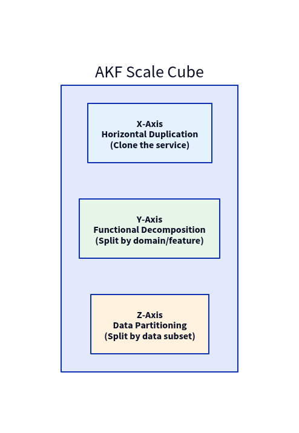

### X-Axis: Horizontal Duplication (Scale Out)

> **Clone the entire application. Run N identical copies behind a load balancer. Any instance can handle any request.**

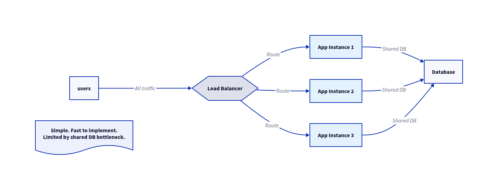

- **How:** Add more identical instances behind a load balancer
- **Prerequisite:** Service must be stateless (no local state) — session data stored externally in Redis or a DB
- **Solves:** Read-heavy CPU/memory bottlenecks on the application tier
- **Limitation:** The database becomes the bottleneck; all instances share one DB
- **Best first step for most web services**

### Y-Axis: Functional Decomposition (Microservices)

> **Split the monolith by business domain or feature. Each service owns its data, scales independently, and is deployed separately.**

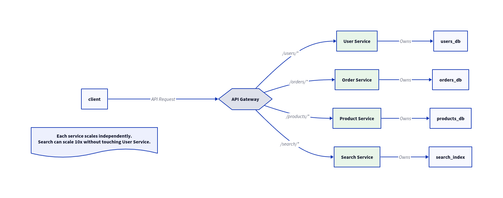

- **How:** Decompose by bounded context (DDD); each service has its own DB and deployment
- **Solves:** Different features have wildly different scale requirements; monolith can't scale them independently
- **Benefit:** Teams are decoupled; services fail independently; independent tech stacks possible
- **Cost:** Distributed systems complexity — network latency, eventual consistency, distributed tracing, service discovery
- **When to use:** When a specific feature (e.g. search, media processing) needs to scale differently from the rest

### Z-Axis: Data Partitioning (Sharding)

> **Run N copies of the service, but each instance handles only a subset of the data (a "shard"). Requests are routed to the correct shard by a routing layer.**

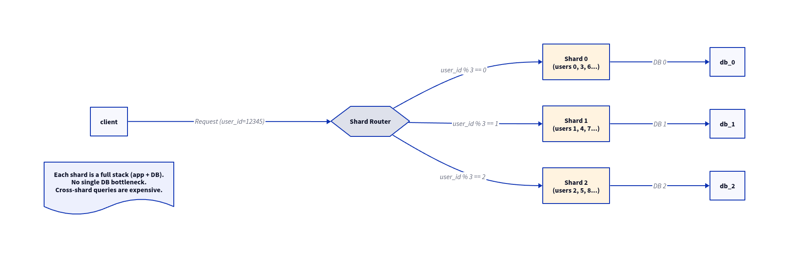

- **How:** Partition data by a shard key (user_id, tenant_id, geographic region); route all requests for a data subset to the same shard
- **Solves:** Single DB write bottleneck; data volume too large for one machine
- **Benefit:** Write throughput scales linearly with shard count
- **Cost:** Cross-shard queries require scatter-gather (fan-out to all shards + merge); resharding (changing shard count) is painful
- **Shard key selection is critical:**

| Shard Key Property | Good | Bad |
|---|---|---|
| **Cardinality** | High (user_id = millions) | Low (country = 200 values) |
| **Distribution** | Uniform write spread | Hotspots (celebrity problem) |
| **Mutability** | Never changes | Changes require re-routing |
| **Queryability** | Included in most queries | Not in query predicates |

### Using All Three Axes Together

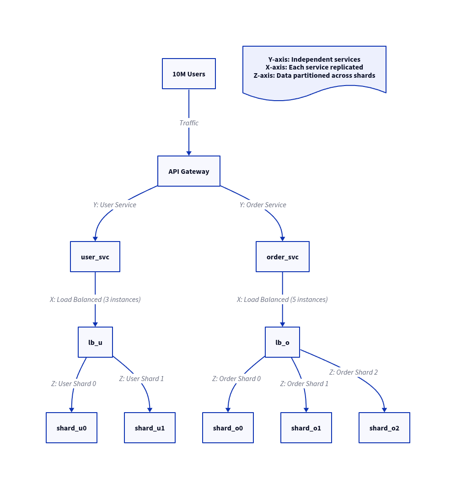

---

## Vertical vs Horizontal Scaling

| Dimension | **Vertical (Scale-Up)** | **Horizontal (Scale-Out)** |
|---|---|---|
| Approach | Bigger machine (more CPU/RAM) | More machines |
| Ceiling | Hardware limit (~192 cores, ~12TB RAM) | Virtually unlimited |
| Simplicity | No code changes needed | Requires stateless design |
| Cost | Exponentially expensive at top end | Linear; commodity hardware |
| SPOF | Yes — single machine | No — redundancy built in |
| Downtime | Yes — to resize | No — rolling deploys |
| Best for | Databases (initial stages) | Stateless app tier |

> **Rule:** Scale vertically first (it's simpler). When you hit a ceiling or a SPOF is unacceptable, scale horizontally.

---

## Database Scaling Patterns

The database is almost always the hardest tier to scale. Scale it last and carefully.

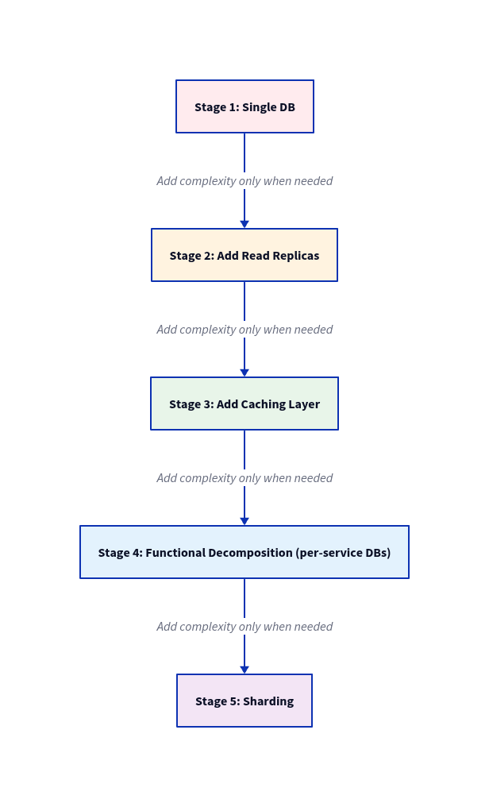

### Read Replicas

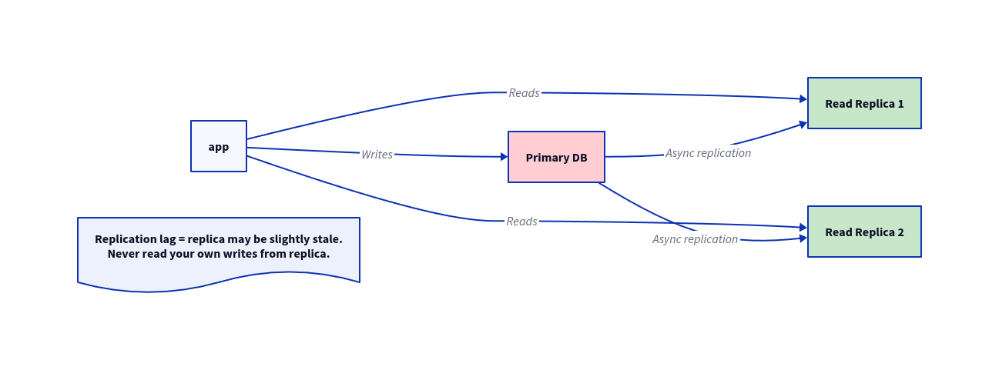

- Typically 70–90% of DB queries are reads — replicas handle all of them
- **Replication lag** is the key risk: replica data lags behind primary by milliseconds to seconds
- **Read-your-own-writes problem:** After a write, don't immediately read from replica (stale). Solutions: sticky read routing, read from primary for 1s after write

### Consistent Hashing (for Sharding and Caching)

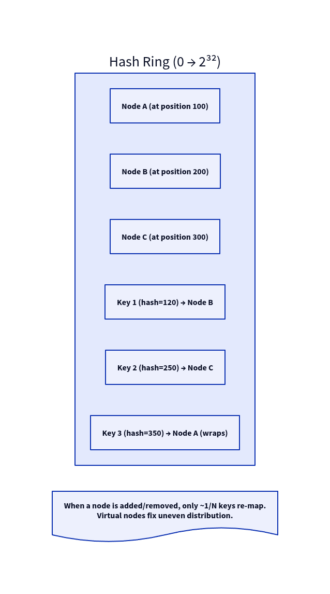

- Hash both nodes and keys onto the same circular ring
- Each key is owned by the first node clockwise from its hash
- **Adding a node:** only keys between the new node and its predecessor re-map (~1/N total keys)
- **Virtual nodes:** each physical node has K virtual positions on the ring; ensures even distribution even with heterogeneous hardware

### CQRS (Command Query Responsibility Segregation)

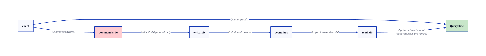

- Read and write models are separate — optimize each independently
- Write model: normalized, consistent, ACID
- Read model: denormalized, pre-aggregated, eventually consistent
- **Cost:** Synchronization complexity; eventual consistency between models

---

## Message Queues & Async Processing

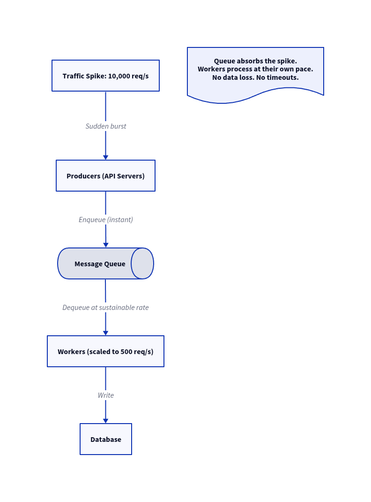

| Tool | Throughput | Durability | Use Case |
|---|---|---|---|
| **Kafka** | Millions/sec | Persistent (log) | Event streaming, audit log, replayable events |
| **RabbitMQ** | 100K+/sec | Optional | Complex routing, task queues |
| **SQS** | Unlimited (managed) | Persistent | AWS-native, simple queuing |
| **Redis Streams** | Very high | Configurable | Lightweight streaming within existing Redis setup |

**Queue failure modes:**
- **Dead letter queue (DLQ):** messages that fail N times are moved aside for inspection; never silently dropped
- **Message ordering:** most queues are at-least-once, unordered; Kafka partitions guarantee order within a partition
- **Back-pressure:** monitor queue depth; if growing, add workers or reduce producer rate

---

## Load Balancing

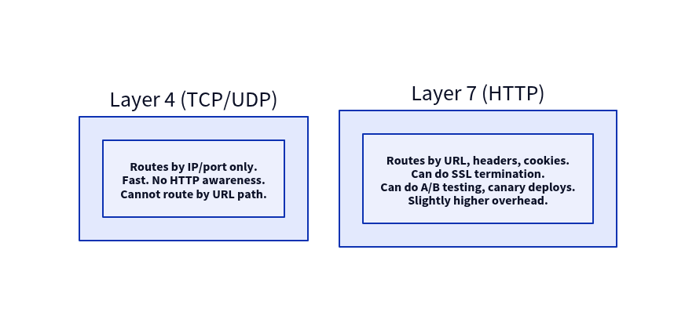

**Load balancing algorithms:**

| Algorithm | How It Works | Best For |
|---|---|---|
| **Round-robin** | Rotate through servers in order | Uniform request cost |
| **Weighted round-robin** | Proportion traffic by server capacity | Heterogeneous servers |
| **Least connections** | Route to server with fewest active connections | Variable-cost requests |
| **IP hash** | Hash client IP → always same server | Sticky sessions (stateful) |
| **Random** | Pick server randomly | Simple, good enough at scale |
| **Least response time** | Route to fastest-responding server | Latency-sensitive workloads |

---

## CDN (Content Delivery Network)

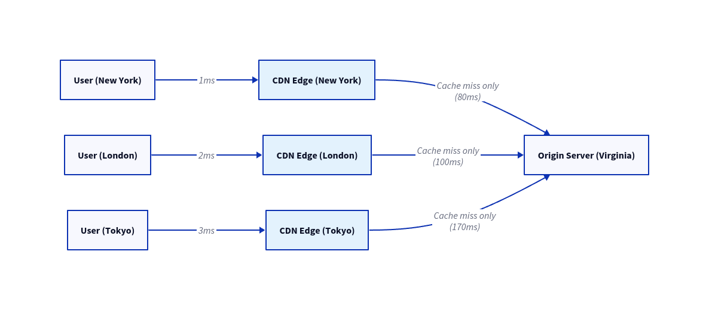

- **Pull CDN:** CDN fetches from origin on first miss, caches for TTL; zero config but first user pays the latency
- **Push CDN:** You proactively upload assets to CDN; first user gets full speed; more operational overhead
- **Cache-Control headers:** control how long CDN caches a response (`max-age`, `s-maxage`, `no-cache`)
- **CDN for dynamic content:** Some CDNs (Cloudflare Workers, Lambda@Edge) run compute at the edge — not just static assets

---

## Auto-Scaling

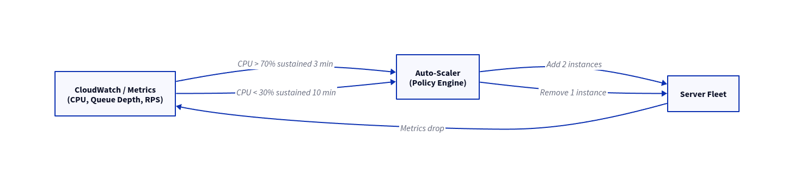

| Scaling Trigger | Metric | Notes |
|---|---|---|
| **CPU utilization** | > 70% for 3 min | Good for compute-heavy work |
| **Queue depth** | > N messages | Best for async workers |
| **RPS / concurrency** | > threshold | Good for web servers |
| **Custom metric** | Anything in CloudWatch | Most flexible |

- **Scale-out:** Fast; add capacity; usually triggered at 70% utilization
- **Scale-in:** Slow; remove capacity carefully; don't scale in during a sustained high period
- **Warm-up time:** New instances take 60–120s to be ready; pre-scale before known events (flash sales, marketing sends)
- **Cooldown period:** After scaling, wait before scaling again to avoid oscillation

---

## Reliability as a Prerequisite for Scalability

> Per the AKF definition: *"An always-on service is scalable if adding resources for redundancy does not result in a loss of performance."*

### Circuit Breaker Pattern

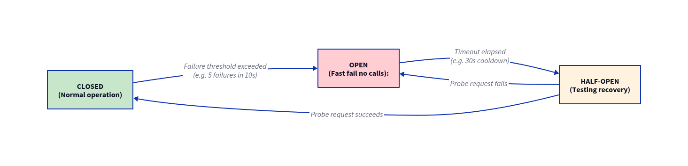

- **Closed:** normal; requests pass through
- **Open:** failures exceeded threshold; all calls fail immediately (no waiting); downstream gets breathing room
- **Half-open:** after timeout, let one probe request through; if it succeeds, close the circuit

### Graceful Degradation

- If the recommendation service is down, show popular items instead of crashing
- If the cache is unavailable, read from DB instead of returning errors
- If a non-critical downstream is slow, return a cached/default value and log the issue

---

## CAP Theorem

> In the presence of a **network partition**, a distributed system must sacrifice either **Consistency** or **Availability**.

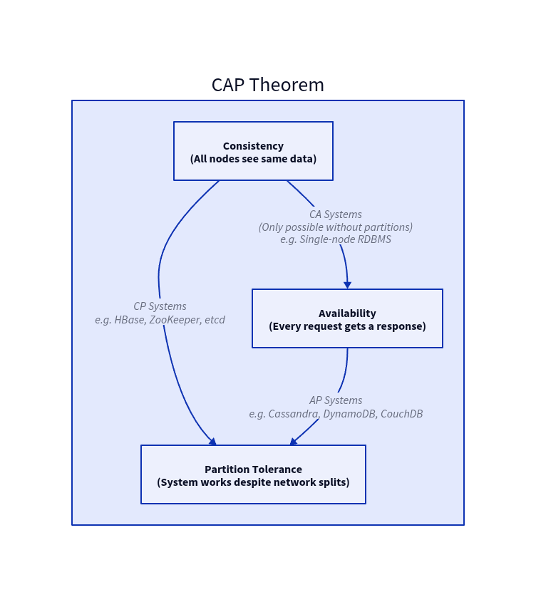

| System | Choice | Behaviour During Partition |
|---|---|---|
| **ZooKeeper / etcd** | CP | Rejects writes to maintain consistency |
| **Cassandra** | AP | Accepts writes; may return stale data |
| **DynamoDB (default)** | AP | Eventually consistent reads |
| **DynamoDB (strong read)** | CP | Higher latency; consistent reads |
| **Postgres (single node)** | CA | No partition (single node) |

> **PACELC extension:** Even when there's no partition (the "else" case), you still face a tradeoff between **Latency** (L) and **Consistency** (C). Most real systems prioritise low latency over strong consistency.

---

## Heterogeneity: The Scale-Out Problem No One Talks About

As a system grows over years, hardware diversity increases:
- Old nodes: 8 cores, 32GB RAM, HDD
- New nodes: 96 cores, 512GB RAM, NVMe SSD

Algorithms that assume uniform nodes:
- Send the same amount of work to each node → slow nodes become bottlenecks
- Divide data equally by node count → data imbalance after failures

**Solutions:**
- **Weighted load balancing** — route proportionally more traffic to more powerful nodes
- **Consistent hashing with virtual nodes** — each physical node claims K virtual slots on the hash ring proportional to its capacity; more powerful nodes get more slots
- **Work-stealing queues** — idle workers steal tasks from busy workers' queues (used in Go's scheduler, Java ForkJoinPool)

---

## Scalability Design Checklist

- [ ] **Stateless app tier** — can any instance handle any request without local state?
- [ ] **No SPOF** — every component has at least one redundant peer
- [ ] **DB read replicas** — reads and writes separated?
- [ ] **Caching layer** — Redis/Memcached in front of DB?
- [ ] **Message queue** — expensive/async work decoupled from request path?
- [ ] **Sharding plan** — what is the shard key? How will you reshard?
- [ ] **Circuit breakers** — all downstream calls wrapped?
- [ ] **Auto-scaling** — all stateless tiers configured with scale-out triggers?
- [ ] **Load tested** — validated at 10× expected peak traffic?
- [ ] **Graceful degradation** — what happens when each dependency fails?
- [ ] **Consistent hashing** — used for cache and shard routing?
- [ ] **Axis of growth identified** — X, Y, or Z? Have you chosen the right one for your bottleneck?